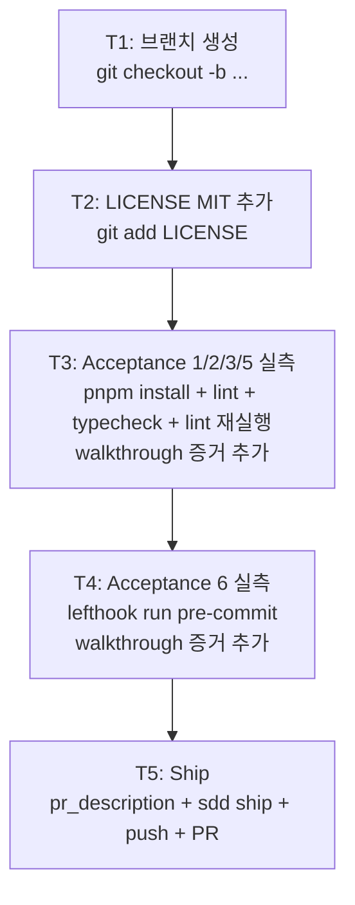

# Implementation Plan: spec-01-01

## 📋 Branch Strategy

- 신규 브랜치: `spec-01-01-root-files-and-lefthook-acceptance` (브랜치 이름 = spec 디렉토리 이름)
- 시작 지점: `main`
- 첫 task가 브랜치 생성을 수행

## 🛑 사용자 검토 필요 (User Review Required)

> [!IMPORTANT]
> - [ ] **`engines.node` 경고를 acceptance 1 통과로 해석**: `>=22 <23` 잠금 vs 머신 v24.14.1로 매 commit warning 발생. 본 spec은 ADR-0002 §3 잠금 의도 그대로 두고 *해석만 walkthrough에 명시*. 머신 정렬은 사용자 운영 차원.
> - [ ] **LICENSE author/year**: `LICENSE` MIT 본문에 `Copyright (c) 2026 dennis` 사용. GitHub 사용자명/회사명으로 변경 필요 시 plan accept 전에 알려줄 것.

> [!WARNING]
> - [ ] **변경 최소화 원칙**: 골격이 이미 ADR과 대체로 일치. *스타일/네이밍 정리는 금지* (별도 spec 후보). 본 spec은 명백한 불일치/누락만 fix.
> - [ ] **Acceptance 5 검증의 캐시 상태 의존성**: 두 번째 lint의 cache hit은 turbo cache가 비워지지 않은 상태에서 성립. 본 spec 시작 전 cache가 이미 warm일 수 있어 *첫 lint도 cache hit*일 가능성. walkthrough에 *clean turbo state*에서의 재검증(`--force` 후 일반)도 별도 1회 추가.

## 🎯 핵심 전략 (Core Strategy)

### 아키텍처 컨텍스트



### 주요 결정

| 컴포넌트 | 전략 | 이유 |
|:---:|:---|:---|
| LICENSE author | `dennis` (2026) | 사용자 본명 확정 시 변경. 단일 작성자 |
| acceptance 실측 단위 | Task 단위 그룹화 (T3 = 1/2/3/5 / T4 = 6) | 1/2/3/5는 turbo 실행 1세트로 묶임. 6은 별도 도구(lefthook) |
| commit 분할 | T2(LICENSE) / T3(검증+walkthrough) / T4(검증+walkthrough) / T5(ship) = 4 commit | §8 One Task = One Commit. T1은 commit 없음 |
| 검증 task의 commit type | `docs` (walkthrough 갱신) | 코드 변경 없는 검증 task. walkthrough가 결과물 |
| 변경 최소화 | 점검 결과 "변경 없음"이면 commit 없이 walkthrough만 갱신 | 의미 없는 commit 회피 |

### 📑 ADR 후보

- [x] 없음

## 📂 Proposed Changes

### 신규

#### [NEW] `LICENSE`

표준 MIT 본문 (2026년 dennis):

```text
MIT License

Copyright (c) 2026 dennis

Permission is hereby granted, free of charge, to any person obtaining a copy
of this software and associated documentation files (the "Software"), to deal
in the Software without restriction, including without limitation the rights
to use, copy, modify, merge, publish, distribute, sublicense, and/or sell
copies of the Software, and to permit persons to whom the Software is
furnished to do so, subject to the following conditions:

The above copyright notice and this permission notice shall be included in all
copies or substantial portions of the Software.

THE SOFTWARE IS PROVIDED "AS IS", WITHOUT WARRANTY OF ANY KIND, ...
```

(표준 SPDX MIT 텍스트 전문)

### 점검 (변경 없을 가능성 높음)

#### [INSPECT] 루트 파일 9종

`package.json` / `pnpm-workspace.yaml` / `turbo.json` / `lefthook.yml` / `.editorconfig` / `.nvmrc` / `.changeset/config.json` / `biome.json` / `README.md`

- ADR-0001/0002/0003/0004와 1:1 대조.
- 불일치 발견 시 *최소 변경* (T3 안에 별도 commit으로 분리).
- 대조 결과는 walkthrough.md `🔍 발견 사항`에 표로 기록.

### 검증 (walkthrough만 갱신)

#### [DOCUMENT] `specs/spec-01-01-root-files-and-lefthook-acceptance/walkthrough.md`

- Acceptance 1: `pnpm install` 출력 → `engines warning 1건 외 0건` 확인 + 해석 명시.
- Acceptance 2: `pnpm lint` → 그린.
- Acceptance 3: `pnpm typecheck` → 그린.
- Acceptance 5: `pnpm lint` × 2 (force clean 후 + 일반) → 두 번째 `>>> FULL TURBO` + `cache hit` 확인.
- Acceptance 6: `lefthook run pre-commit` → biome + typecheck 통과.

## 🧪 검증 계획 (Verification Plan)

### 단위 테스트

본 spec은 코드 추가 없음 (LICENSE 텍스트만). 별도 단위 테스트 추가 없음. 기존 `@repo/utils:test` (1 test PASS) 그대로 유지.

### 통합 테스트

해당 없음 (Integration Test Required = no).

### 수동 검증 시나리오 (= acceptance 실측)

각 시나리오의 로그는 walkthrough.md에 캡처.

1. **Acceptance 1 — pnpm install 무경고 (engines warning 제외)**
   - 명령: `pnpm install`
   - 기대: `engines warning 1건` 외 0 warning. 종료 코드 0.

2. **Acceptance 2 — turbo run lint 그린**
   - 명령: `pnpm lint`
   - 기대: `Tasks: N successful, N total`. 모든 패키지 PASS.

3. **Acceptance 3 — turbo run typecheck 그린**
   - 명령: `pnpm typecheck`
   - 기대: `Tasks: N successful, N total`. tsc --noEmit 모든 패키지 PASS.

4. **Acceptance 5 — turbo cache 100% hit**
   - 명령:
     ```bash
     pnpm exec turbo run lint --force   # 캐시 비우고 1회
     pnpm exec turbo run lint           # 2회째
     ```
   - 기대: 2회째 출력에 `>>> FULL TURBO` + 모든 task에 `cache hit, replaying logs`.

5. **Acceptance 6 — lefthook pre-commit**
   - 명령: `lefthook run pre-commit`
   - 기대: biome 통과 + typecheck 통과. 종료 코드 0.

## 🔁 Rollback Plan

- **LICENSE 추가**: PR 머지 후 문제 발견 시 단순 `git revert <commit>` — 영향 0 (텍스트 파일 1개).
- **walkthrough 갱신만**: PR 자체를 머지하지 않으면 영향 없음. 머지 후 acceptance 결과 정정이 필요하면 후속 spec에서 재측정.

## 📦 Deliverables 체크

- [ ] task.md 작성 (다음 단계)
- [ ] 사용자 Plan Accept 받음
- [ ] (실행 후) LICENSE 추가
- [ ] (실행 후) acceptance 5건 실측 + walkthrough.md 누적
- [ ] (실행 후) walkthrough.md / pr_description.md ship
