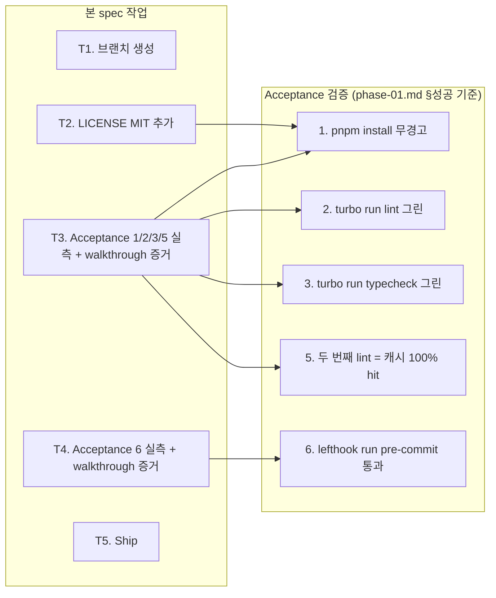

# spec-01-01: 루트 파일 정합성 + lefthook · turbo cache acceptance

## 📋 메타

| 항목 | 값 |
|---|---|
| **Spec ID** | `spec-01-01` |
| **Phase** | `phase-01` |
| **Branch** | `spec-01-01-root-files-and-lefthook-acceptance` |
| **상태** | Planning |
| **타입** | Chore |
| **Integration Test Required** | no |
| **작성일** | 2026-05-17 |
| **소유자** | dennis |

## 📋 배경 및 문제 정의

### 현재 상황

레포 루트에는 d3894b4 commit에서 작성된 골격이 이미 박혀 있다 (`package.json`, `pnpm-workspace.yaml`, `turbo.json`, `.gitignore`, `.editorconfig`, `.nvmrc`, `lefthook.yml`, `.changeset/config.json`, `README.md`, `biome.json`). 그러나:

1. **LICENSE 파일 부재** — `package.json`의 `"license": "MIT"` 선언과 일치하지 않음. ROADMAP §2 Phase 1의 Root files 명세에도 LICENSE (MIT) 포함됨.
2. **phase-01 acceptance 검증 부재** — 골격이 박혔지만 acceptance 1, 2, 3, 5, 6의 *실제 동작 증거*가 없음. 즉:
   - `pnpm install` 무경고 통과 미검증
   - `turbo run lint/typecheck` 그린 미검증
   - 두 번째 `turbo run lint`의 캐시 100% hit 미검증
   - `lefthook run pre-commit` 통과 미검증
3. **`engines.node` warning 정책 미확정** — `>=22.0.0 <23`(ADR-0002 §3) vs 실행 머신(v24.14.1)의 매 commit `[WARN] Unsupported engine` 발생.

### 문제점

- Phase 1 종료 조건이 *실측 가능한 acceptance*인데, 측정 결과 자체가 walkthrough/PR 어디에도 박혀 있지 않다. 따라서 phase-01 Done 판단이 불가.
- LICENSE 누락은 오픈소스 보일러플레이트로서의 minor 결함 (package.json만 보면 MIT인데 실제 파일 없음 — git release 시 audit 부적합).
- `engines` warning은 사용자 머신 운영 차원의 문제이지만 walkthrough에 *왜 acceptance 1이 통과로 판단되었는지*의 해석은 박혀야 한다.

### 해결 방안 (요약)

(a) 누락 파일 1건(LICENSE MIT) 추가, (b) Acceptance 1/2/3/5/6의 *실측 증거*를 walkthrough.md에 누적해 phase-01 Done 판단 근거를 박는다. `engines.node` warning은 ADR-0002 §3 잠금 의도에 따른 *의도된 경고*로 해석 — 머신 정렬은 별도(out of scope).

## 📊 개념도

Acceptance 4(`turbo run test` 그린)와 Acceptance 7(`dependency-cruiser violation 0건`)는 본 spec 범위 외 — spec-01-02 / spec-01-03 담당.

## 🎯 요구사항

### Functional Requirements

1. **LICENSE 파일 추가**: `LICENSE` (MIT, 2026, dennis) — `package.json`의 `"license": "MIT"`와 일치.
2. **루트 파일 ADR 정합성 점검**: `package.json` / `pnpm-workspace.yaml` / `turbo.json` / `lefthook.yml` / `.editorconfig` / `.nvmrc` / `.changeset/config.json` / `biome.json` / `README.md`를 ADR-0001/0002/0003/0004와 1:1 대조. 불일치 발견 시 *최소 변경*으로 보정. 변경 없으면 점검 결과만 walkthrough에 기록.
3. **Acceptance 1 실측**: `pnpm install` 실행 → 출력 캡처. `engines` warning 외 다른 warning 0건 확인. 해석: ADR-0002 §3 잠금에 따른 의도된 경고.
4. **Acceptance 2 실측**: `pnpm lint` (= `turbo run lint`) → 그린 + 캐시 hit 여부 모두 walkthrough에 기록.
5. **Acceptance 3 실측**: `pnpm typecheck` → 그린.
6. **Acceptance 5 실측**: `pnpm lint`를 두 번 연속 실행 → 두 번째에서 `>>> FULL TURBO` + 모든 task `cache hit, replaying logs` 출력 확인.
7. **Acceptance 6 실측**: `lefthook run pre-commit` 또는 *실제 commit 흐름*에서 hook 동작 확인 — biome 자동 포맷 + tsc --noEmit 통과.

### Non-Functional Requirements

1. **변경량 최소화**: 골격이 이미 ADR과 대체로 일치. ADR 결정과 명백히 불일치하는 부분만 보정. *스타일 차원의 갈무리는 금지*.
2. **walkthrough 증거**: 5개 acceptance의 실측 로그(또는 핵심 요약)를 walkthrough.md `🧪 검증 결과` 섹션에 누적. PR 리뷰어가 본 PR 하나로 phase-01 acceptance 5건 판단 가능해야 한다.
3. **State.json 영향 없음**: 본 spec은 SDD-P (phase-01의 spec-01-01). 정상 흐름이라 state 부작용 없음.

## 🚫 Out of Scope

- **`engines.node` 잠금 변경** — ADR-0002 §3 변경 동반. 본 spec은 *경고를 인지/해석*만 한다. 머신 정렬은 사용자 운영 차원.
- **`packages/config/*` preset 본문 변경** — spec-01-02 (`config-presets-finalize`) 범위.
- **dependency-cruiser 룰 본문 작성** — spec-01-03 (`depcruise-boundary-validation`) 범위.
- **스텁 `packages/shared/utils` 추가/변경** — 이미 존재 (Phase 2에서 본격 채움).
- **Acceptance 4 (`turbo run test` 그린)** — 현 시점 `@repo/utils:test`가 이미 PASS이나 본 spec의 *명시적* 검증 대상이 아님. spec-01-02의 `config-vitest` finalize에서 처리.
- **Acceptance 7 (depcruise)** — spec-01-03.
- **`pnpm-workspace.yaml` catalog 확장** — 본 phase 시점에 minimal로 충분. Phase 2/3에서 자연스럽게 추가.
- **README.md Quickstart 본격 갱신** — 본 spec 외 (필요 시 phase-04 진입 시점에 vertical-slice acceptance 갱신).

## 📑 ADR 후보 (Architecture Decision Records)

> 본 SPEC의 결정 중 *장기 자산* 으로 박을 가치 있는 것이 있는가?

- [ ] ADR 가치 있는 결정 있음
- [x] 없음 — 본 spec은 acceptance 실측이 핵심. 결정은 phase-01.md / ADR-0001~0004에 이미 박혀 있음.

## 🔍 Critique 결과 (선택)

미실행 (단순 chore + acceptance 실측이라 critique 가치 낮음).

## ✅ Definition of Done

- [ ] `LICENSE` (MIT) 추가됨
- [ ] 루트 파일 ADR 정합성 점검 결과가 walkthrough.md에 기록됨 (변경 없으면 "변경 없음" 명시)
- [ ] Acceptance 1/2/3/5/6 실측 로그가 walkthrough.md에 누적됨
- [ ] `engines` warning 해석이 walkthrough.md에 명시됨
- [ ] `walkthrough.md` / `pr_description.md` ship commit
- [ ] `spec-01-01-root-files-and-lefthook-acceptance` 브랜치 push 완료
- [ ] PR 생성 + 사용자 알림
