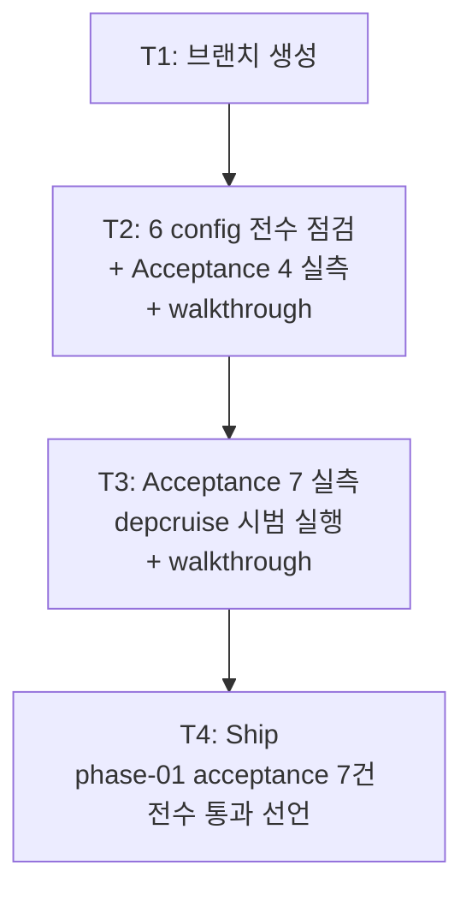

# Implementation Plan: spec-01-02

## 📋 Branch Strategy

- 신규 브랜치: `spec-01-02-config-and-depcruise-acceptance`
- 시작 지점: `main`
- 첫 task가 브랜치 생성을 수행

## 🛑 사용자 검토 필요 (User Review Required)

> [!IMPORTANT]
> - [ ] **변경 없음 시 처리**: 6 config 패키지 본문/`package.json`이 ADR과 일치할 경우 — *fix commit 없이 walkthrough만 갱신*. 의미 없는 commit 회피.
> - [ ] **depcruise 시범 실행 명령**: 우선 가장 단순한 형태(`pnpm exec depcruise --config packages/config/depcruise-config/base.cjs packages/`)로 시도. 실패 시 `--ts-config <path>` 추가 검토. 본 결정의 추적은 walkthrough에 박는다.

> [!WARNING]
> - [ ] **orphan rule false positive 가능성**: `depcruise-config/base.cjs`의 `no-orphans` 룰이 `severity: warn` + `pathNot`으로 예외 설정. 그러나 현재 1 스텁뿐인 상태에서 orphan warning이 나면 *룰 본문 보강* 또는 *예외 추가*가 필요. 발견 시 본 spec 안에서 처리할지 별 spec으로 분리할지 walkthrough에서 결정.
> - [ ] **depcruise 실행 시간 비용**: 시범 실행이 큰 부담은 아니나 1~3초 소요. lefthook pre-commit에 *현재* 들어 있지 않음 — phase-02 진입 시 wire up 결정.

## 🎯 핵심 전략 (Core Strategy)

### 아키텍처 컨텍스트



### 주요 결정

| 컴포넌트 | 전략 | 이유 |
|:---:|:---|:---|
| 6 config 본문 점검 후 변경 처리 | 변경 발견 시 별도 sub-commit / 없으면 commit 없음 | §8 One Task = One Commit + 의미 없는 commit 회피. spec-01-01과 동일 패턴 |
| depcruise 호출 방식 | 가장 단순한 형태 우선 → 실패 시 escalate | 보일러플레이트 사용자가 실제로 칠 명령과 동일해야 acceptance 의미 있음 |
| commit 분할 | T2(점검+A4) / T3(A7) / T4(ship) | 두 acceptance가 독립적 (test vs depcruise) — 분리해서 PR 리뷰 시 추적 용이 |
| 잠재 fix의 위치 | walkthrough §🔍 발견 사항 + 별 spec 후보 또는 본 spec sub-commit | 명백 불일치는 본 spec에서 fix. 룰 *추가/확장*은 별 spec |

### 📑 ADR 후보

- [x] 없음

## 📂 Proposed Changes

### 점검 (변경 없을 가능성 높음)

#### [INSPECT] 6 config 패키지

```
packages/config/
├── biome-config/{base.json, package.json}
├── typescript-config/{base.json, library.json, node-app.json, react-app.json, package.json}
├── vitest-config/{src/node.ts, src/react.ts, package.json, tsconfig.json}
├── tsup-config/{src/node-lib.ts, package.json, tsconfig.json}
├── knip-config/{base.json, package.json}
└── depcruise-config/{base.cjs, package.json}
```

- ADR-0001 (Biome / Knip / dependency-cruiser 결정), ADR-0004 (TS 전략 / tsup / JIT vs compiled)와 1:1 대조.
- 결과는 walkthrough.md `🔍 발견 사항`에 표로.
- 명백 불일치만 fix (T2 안 sub-commit).

### 검증 (walkthrough만 갱신)

#### [DOCUMENT] `specs/spec-01-02-config-and-depcruise-acceptance/walkthrough.md`

- Acceptance 4: `pnpm test` → 그린 + 출력. preset round-trip(`@repo/utils` → `@repo/vitest-config/node`) 확인.
- Acceptance 7: `pnpm exec depcruise --config packages/config/depcruise-config/base.cjs packages/` → violation 0건 + 출력. 호출 방식 결정 이유.

## 🧪 검증 계획 (Verification Plan)

### 단위 테스트

본 spec은 코드 추가 없음 (변경 없으면). 기존 `@repo/utils:test` 그대로 유지.

### 통합 테스트

해당 없음.

### 수동 검증 시나리오 (= acceptance 실측)

1. **Acceptance 4 — `turbo run test` 그린**
   - 명령: `pnpm test`
   - 기대: `Tasks: 1 successful, 1 total`. `@repo/utils` 1 test PASS (`identity` returns its argument unchanged).
   - 추가 검증: `cat packages/shared/utils/vitest.config.ts` → `export { default } from "@repo/vitest-config/node"` 확인 (preset round-trip).

2. **Acceptance 7 — depcruise violation 0건**
   - 명령: `pnpm exec depcruise --config packages/config/depcruise-config/base.cjs packages/`
   - 기대: `no dependency violations found` 또는 동등 메시지. error severity 0건. warn은 *해석*하여 통과 판정.
   - 실패 시 escalate: `--ts-config <path>` 옵션 추가, 또는 `--include-only` 인자로 범위 좁히기 등.

## 🔁 Rollback Plan

- **변경 없으면**: rollback 불필요.
- **명백 불일치 fix가 들어가면**: 단일 sub-commit 단위로 `git revert <commit>`.
- **walkthrough만 갱신**: PR 자체를 머지하지 않으면 영향 없음.

## 📦 Deliverables 체크

- [ ] task.md 작성 (다음 단계)
- [ ] 사용자 Plan Accept 받음
- [ ] (실행 후) 6 config 점검 결과 walkthrough 기록
- [ ] (실행 후) acceptance 4 + 7 실측 + walkthrough.md 누적
- [ ] (실행 후) walkthrough.md / pr_description.md ship
