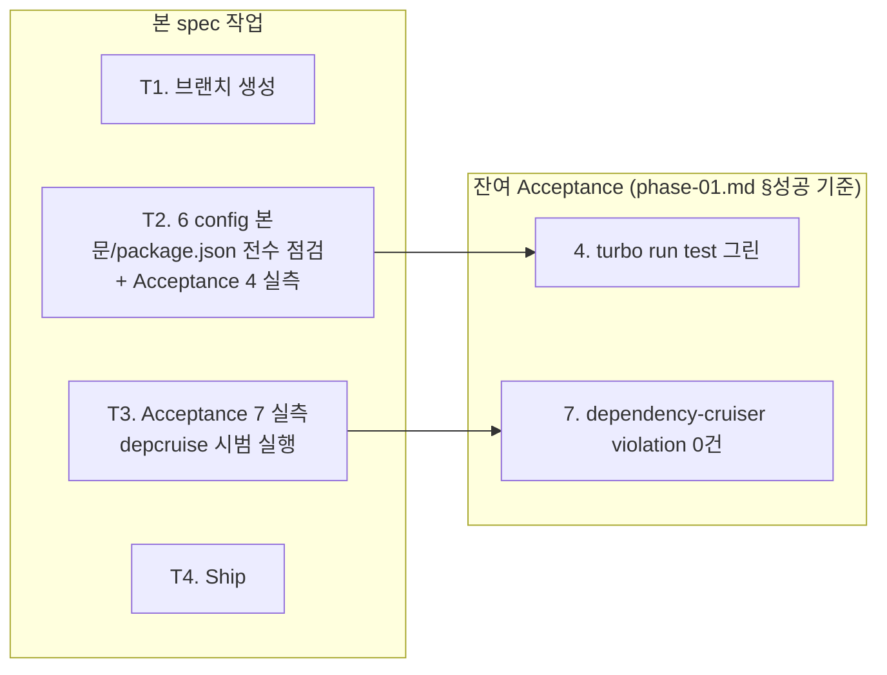

# spec-01-02: config preset 전수 점검 + Acceptance 4 · 7 (test + depcruise)

## 📋 메타

| 항목 | 값 |
|---|---|
| **Spec ID** | `spec-01-02` |
| **Phase** | `phase-01` |
| **Branch** | `spec-01-02-config-and-depcruise-acceptance` |
| **상태** | Planning |
| **타입** | Chore |
| **Integration Test Required** | no |
| **작성일** | 2026-05-17 |
| **소유자** | dennis |

## 📋 배경 및 문제 정의

### 현재 상황

spec-01-01에서 phase-01 acceptance 7개 중 5개(1/2/3/5/6)가 실측됐고, 잔여 2개(4 + 7)가 남아 있다. 6 config 패키지의 본문 + package.json 정찰 결과 **모두 ADR-0001/0004와 일치하는 완성 상태**:

- `biome-config/base.json` — vcs / formatter / linter (useImportType / useExportType / noConsole)
- `typescript-config/{base,library,node-app,react-app}.json` — strict + noUncheckedIndexedAccess + exactOptionalPropertyTypes + isolatedModules + verbatimModuleSyntax
- `vitest-config/src/{node,react}.ts` — coverage v8 + CI reporters
- `tsup-config/src/node-lib.ts` — ESM only + node22 + dts
- `knip-config/base.json` — 모든 workspace 카테고리 정의
- `depcruise-config/base.cjs` — **6 boundary 룰 본격 작성** (no-circular / no-orphans / packages-no-app-imports / shared-no-backend-imports / frontend-no-backend-imports / config-pure)

스텁 `@repo/utils`는 `vitest.config.ts`에서 `@repo/vitest-config/node`를 import하여 *preset 활용 검증 자체는 spec-01-01에서 부수적으로 통과*했다.

### 문제점

1. **Acceptance 4 (`turbo run test` 그린) 실측 증거가 walkthrough에 없다** — spec-01-01에서 부수 검증으로 본 결과는 본 phase의 *정식 acceptance 증거*가 아님.
2. **Acceptance 7 (depcruise violation 0건) 실측 증거가 없다** — 룰 본문은 박혔으나 시범 실행 자체가 한 번도 안 됨. `depcruise-config/base.cjs`의 `comment`에 "tsConfig intentionally omitted from base"로 명시되어 있어 호출 방식(`--config` + ts-config 옵션) 결정도 필요.
3. **6 config 패키지 본문의 ADR 정합성을 전수 점검한 증거가 없다** — spec-01-01에서는 *루트 파일 9종*만 점검했고 config 패키지는 본 spec 범위.

### 해결 방안 (요약)

(a) 6 config 패키지 본문 + package.json을 ADR-0001/0004와 1:1 대조 (변경 없을 가능성 높음, 점검 표만 walkthrough에 기록), (b) `turbo run test` 그린 + Vitest preset import 동작 실측 → walkthrough에 누적, (c) `depcruise` 시범 실행 호출 방식 결정 + violation 0건 실측 → walkthrough에 누적. 본 PR로 **phase-01 acceptance 7건 전수 검증 완료** 상태 달성.

## 📊 개념도

## 🎯 요구사항

### Functional Requirements

1. **6 config 패키지 본문 전수 점검**: `biome-config` / `typescript-config` / `vitest-config` / `tsup-config` / `knip-config` / `depcruise-config`의 *룰 본문* + `package.json` (exports / files / type / peerDependencies)을 ADR-0001/0004와 1:1 대조. 결과 표를 walkthrough.md에 기록. 변경 없으면 "변경 없음" 명시.
2. **Acceptance 4 실측**: `pnpm test` (= `turbo run test`) → 그린 + 출력 캡처. `@repo/utils`의 `vitest.config.ts`가 `@repo/vitest-config/node`를 import해 실제 동작함을 확인 (preset round-trip).
3. **Acceptance 7 실측**:
   - **호출 방식 결정**: `depcruise-config/base.cjs`의 comment에 따라 `--config` 인자와 ts-config 옵션을 어떻게 줄지 결정. 가장 단순한 명령으로 시도 — `pnpm exec depcruise --config packages/config/depcruise-config/base.cjs packages/`. 실패 시 `--ts-config <path>` 추가 검토.
   - **실행 + 결과 캡처**: violation 0건 확인. orphan warning이 있어도 spec/walkthrough에서 해석 명시.
4. **walkthrough 증거 누적**: 점검 표 + Acceptance 4 로그 + Acceptance 7 로그 + 발견 사항.

### Non-Functional Requirements

1. **변경량 최소화**: 6 config 패키지 본문이 이미 ADR과 일치. *명백 불일치만 fix*. 스타일/네이밍 정리 금지.
2. **호출 방식 결정의 추적성**: depcruise `--config` / `--ts-config` 결정 이유를 walkthrough에 박는다 (후속 `pnpm depcruise` turbo task 정의 시 참고).
3. **state.json 영향 없음**: SDD-P 정상 흐름.

## 🚫 Out of Scope

- **6 config 패키지 본문 *추가 기능 작성*** — 변경 발견 시에만 fix. 예: knip 룰 본문 보강, biome 룰 추가 등은 별도 spec.
- **`packages/config/*`에 `lint` script 추가** — Icebox 이슈. 본 spec은 *현 상태로 acceptance 통과*가 핵심. lint script 추가는 phase-02 진입 시 결정.
- **depcruise turbo task 정의** — 본 spec은 *시범 실행*만. turbo task 등록(`pnpm depcruise` script + turbo.json `tasks.depcruise`)은 phase-02 또는 phase-06(CI) 진입 시 처리.
- **`engines.node` 정책** — 변경 없음.
- **dependency-cruiser 룰 *추가/수정*** — 룰 본문이 이미 ARCHITECTURE.md §3.1 매핑 완성. 추가 룰은 Phase 2~4 진입 시 패키지 추가에 따라 별도 spec.

## 📑 ADR 후보 (Architecture Decision Records)

> 본 SPEC의 결정 중 *장기 자산* 으로 박을 가치 있는 것이 있는가?

- [ ] ADR 가치 있는 결정 있음
- [x] 없음 — 본 spec은 acceptance 실측이 핵심. 결정은 ADR-0001/0004에 이미 박혀 있음. depcruise 호출 방식은 *운영 detail*이며 ADR로 격상할 가치 낮음 (walkthrough만).

## 🔍 Critique 결과 (선택)

미실행.

## ✅ Definition of Done

- [ ] 6 config 패키지 본문 + package.json 전수 점검 결과가 walkthrough.md에 기록됨 (변경 없으면 "변경 없음" 명시)
- [ ] Acceptance 4 (`turbo run test` 그린) 실측 로그가 walkthrough.md에 누적됨
- [ ] Acceptance 7 (depcruise violation 0건) 실측 로그가 walkthrough.md에 누적됨
- [ ] depcruise 시범 실행 호출 방식이 walkthrough에 명시됨
- [ ] **phase-01 acceptance 7건 전수 통과** 상태 walkthrough 명시
- [ ] `walkthrough.md` / `pr_description.md` ship commit
- [ ] `spec-01-02-config-and-depcruise-acceptance` 브랜치 push 완료
- [ ] PR 생성 + 사용자 알림
