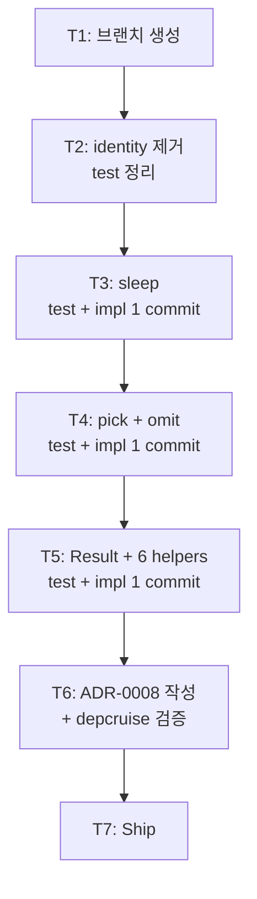

# Implementation Plan: spec-02-01

## 📋 Branch Strategy

- 신규 브랜치: `spec-02-01-shared-utils`
- 시작 지점: `main`
- 첫 task가 브랜치 생성을 수행

## 🛑 사용자 검토 필요 (User Review Required)

> [!IMPORTANT]
> - [ ] **`identity` 제거**: Phase 1 placeholder를 본 spec에서 *삭제* 결정. 사용처 없으나 *함수형 표준*이라 유지 의견 가능. 카운터: 새 유틸 4개가 들어오므로 placeholder 청소가 명료.
> - [ ] **Result 디자인 = discriminated union (함수 helper)**: class chaining `result.map(...).unwrap()` 대신 `isOk(r) / map(r, fn)` 함수형. `unwrap` 미제공 (throw 회피, 명시적 분기 강제). 선택 변경 시 plan accept 전 알려달라.
> - [ ] **ADR-0008 본 PR에 포함**: Result 디자인을 ADR로 박음. 별 PR 분리 가능하나 *결정과 구현이 한 PR*이 추적 용이.

> [!WARNING]
> - [ ] **TDD red-green 분리 안 함**: 각 함수의 test + impl을 *한 commit*으로 묶음. 너무 잘게 쪼개면 ceremony 비대. 본 spec은 함수 4건 × (test + impl) = 일반적으로 4 commit. 명시적 fail 단계는 *task.md 체크박스*로만 기록.
> - [ ] **번들 사이즈 모니터링 부재**: 본 spec은 함수 추가만. Phase 4 frontend 진입 시점에 번들 사이즈 분석 도구 평가 (Icebox 후보).

## 🎯 핵심 전략 (Core Strategy)

### 아키텍처 컨텍스트



### 주요 결정

| 컴포넌트 | 전략 | 이유 |
|:---:|:---|:---|
| `identity` 처리 | 제거 (T2) | placeholder 역할 완료. 사용처 없음 |
| Result 디자인 | discriminated union + 함수 helper (class 미사용) | zod 외 의존성 0 원칙 + tree-shaking 친화 + 명시적 분기 |
| `unwrap` 미제공 | helper에서 제외 | throw 회피, `isOk(r) ? r.value : default` 패턴이 안전 |
| 파일 분리 | `src/index.ts` 단일 파일 | 200줄 미만 예상. 분리는 YAGNI |
| commit 단위 | 함수당 1 commit (test + impl 합침) | TDD 정신 유지하면서 ceremony 절감 |
| ADR 작성 시점 | T6 (depcruise 검증과 함께) | 본 PR에 ADR 포함 = 결정 추적 용이 |
| `pick`/`omit` 묶기 | 한 commit | 동시 사용되는 쌍 함수, 의도 동일 |

### 📑 ADR 후보

- [x] `result-type-discriminated-union` (type: convention) → `docs/adr/0008-result-type.md` (T6)

## 📂 Proposed Changes

### packages/shared/utils

#### [MODIFY] `packages/shared/utils/src/index.ts`

- `identity` 제거.
- 4 함수군 추가: `sleep` / `pick` / `omit` / `Result` + helpers.
- 모두 `export`. 내부 helper 없음.

```ts
// 의사 코드 (실제 구현은 T3~T5)

export const sleep = (ms: number): Promise<void> =>
  new Promise((resolve) => setTimeout(resolve, ms));

export const pick = <T extends object, K extends keyof T>(
  obj: T,
  keys: readonly K[],
): Pick<T, K> => {
  const result = {} as Pick<T, K>;
  for (const key of keys) {
    if (key in obj) result[key] = obj[key];
  }
  return result;
};

export const omit = <T extends object, K extends keyof T>(
  obj: T,
  keys: readonly K[],
): Omit<T, K> => {
  const result = { ...obj } as Omit<T, K> & Partial<Pick<T, K>>;
  for (const key of keys) delete result[key];
  return result;
};

export type Result<T, E = Error> =
  | { readonly ok: true; readonly value: T }
  | { readonly ok: false; readonly error: E };

export const ok = <T>(value: T): Result<T, never> => ({ ok: true, value });
export const err = <E>(error: E): Result<never, E> => ({ ok: false, error });
export const isOk = <T, E>(r: Result<T, E>): r is Result<T, never> & { ok: true } => r.ok;
export const isErr = <T, E>(r: Result<T, E>): r is Result<never, E> & { ok: false } => !r.ok;
export const map = <T, U, E>(r: Result<T, E>, fn: (v: T) => U): Result<U, E> =>
  r.ok ? ok(fn(r.value)) : r;
export const flatMap = <T, U, E, F>(
  r: Result<T, E>,
  fn: (v: T) => Result<U, F>,
): Result<U, E | F> => (r.ok ? fn(r.value) : r);
```

#### [MODIFY] `packages/shared/utils/src/index.test.ts`

- `identity` 테스트 제거.
- 4 함수군 각각 단위 테스트 추가 (정상 + edge case ≥ 1).

### 신규

#### [NEW] `docs/adr/0008-result-type.md`

- 본 PR에 포함. Result 디자인 결정 + 대안(`Either` / class chaining / `unwrap` 제공) 분석 + `type: convention`.

## 🧪 검증 계획 (Verification Plan)

### 단위 테스트

```bash
pnpm --filter @repo/utils test
# 또는
pnpm test     # turbo run test
```

기대: 새 함수 4건 × 2~3 test ≈ 8~12 test PASS. 기존 identity 1 test 제거.

### 통합 테스트

해당 없음.

### 수동 검증 시나리오

1. **유틸 import + 호출**: vitest test 안에서 직접 검증.
2. **depcruise 회귀 없음**:
   ```bash
   pnpm exec depcruise --config packages/config/depcruise-config/base.cjs packages/
   # 기대: ✔ no dependency violations found
   ```
3. **번들 사이즈 sanity**: `wc -l packages/shared/utils/src/index.ts` → 100~200줄 예상.

## 🔁 Rollback Plan

- **함수 추가 commit revert**: 각 함수가 별 commit이라 `git revert <commit>`로 개별 제거 가능.
- **ADR-0008 revert**: 결정 자체를 되돌리면 후속 spec(errors/contracts)에서 Result 패턴 미사용 결정. 큰 ripple effect — 다만 본 PR이 phase-02 첫 spec이라 ripple 작음.

## 📦 Deliverables 체크

- [ ] task.md 작성 (다음 단계)
- [ ] 사용자 Plan Accept 받음
- [ ] (실행 후) `identity` 제거 + 4 함수군 추가
- [ ] (실행 후) ADR-0008 작성
- [ ] (실행 후) walkthrough.md / pr_description.md ship
