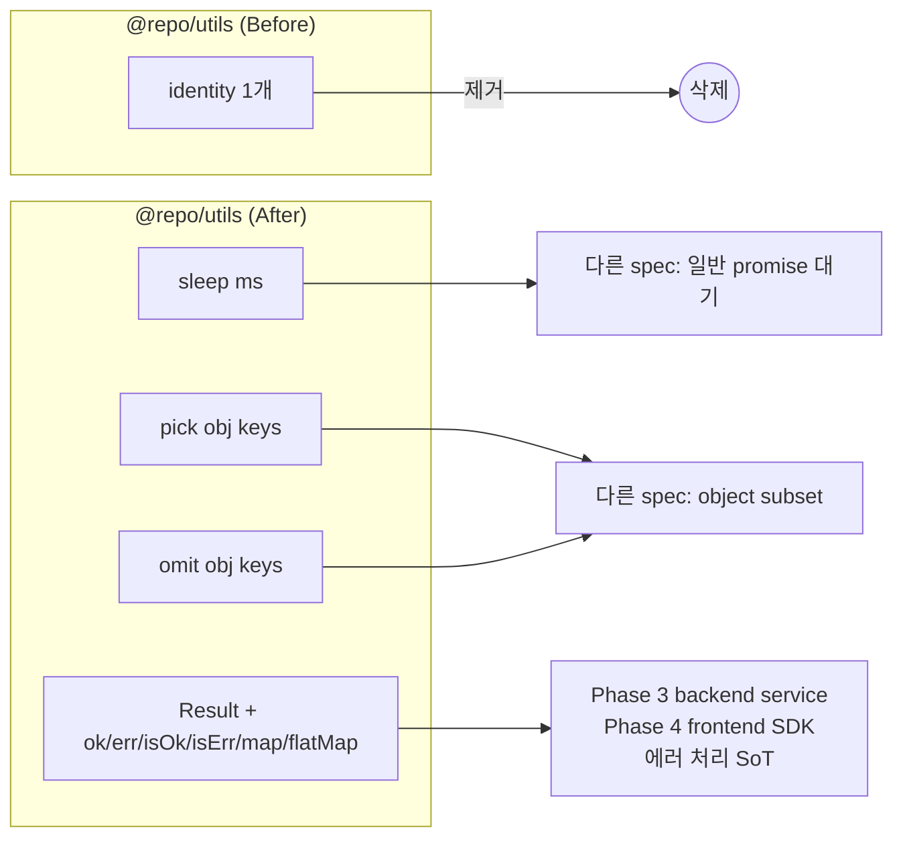

# spec-02-01: `@repo/utils` 핵심 유틸리티 작성 (sleep / pick / omit / Result)

## 📋 메타

| 항목 | 값 |
|---|---|
| **Spec ID** | `spec-02-01` |
| **Phase** | `phase-02` |
| **Branch** | `spec-02-01-shared-utils` |
| **상태** | Planning |
| **타입** | Feature |
| **Integration Test Required** | no |
| **작성일** | 2026-05-17 |
| **소유자** | dennis |

## 📋 배경 및 문제 정의

### 현재 상황

Phase 1에서 `packages/shared/utils`를 스텁으로 작성 (placeholder `identity` 함수 1개 + 테스트 1개). phase-01 acceptance 검증 통과 — turbo pipeline + lefthook + dependency-cruiser 모두 그린. 이제 phase-02 "shared primitives"의 *첫 spec*으로 실제 유틸리티를 채울 차례.

ARCHITECTURE.md §2.2 / ROADMAP §2 Phase 2의 `utils` 패키지 정의:

> Result, sleep, pick/omit 등 순수 유틸 (zod 외 런타임 의존성 0, Node-only API 금지)

### 문제점

1. **스텁만 있어 실용 가치 없음** — `identity`는 placeholder. 다른 spec(errors / contracts / backend)이 본격 의존할 유틸이 없음.
2. **FE/BE 공유 패턴이 검증 안 됨** — `packages/shared/*`는 FE 번들에 들어갈 수 있는 코드. *Node-only API 금지 + zod 외 의존성 0* 원칙을 *실제 코드*로 검증한 적이 없음.
3. **Result 타입 부재** — Phase 3+ backend service / Phase 4 frontend SDK가 의존할 *명시적 성공/실패 표현*이 없으면 에러 처리가 throw 일변도가 됨.

### 해결 방안 (요약)

`packages/shared/utils`에 4가지 핵심 유틸을 추가: `sleep` (Promise 기반) / `pick` / `omit` (Object subset) / `Result<T, E>` + helpers (ok / err / isOk / isErr / map / flatMap). 모두 TDD로 작성 (test → fail → impl → pass → commit). placeholder `identity`는 *제거* (역할 완료). 패키지의 `package.json`은 단일 entry export 유지 (sub-path 미사용 — tree-shaking으로 FE 번들 보호).

## 📊 개념도

## 🎯 요구사항

### Functional Requirements

1. **`sleep(ms: number): Promise<void>`**: `setTimeout` 기반 promise. Node + browser 양쪽 동작.
2. **`pick<T extends object, K extends keyof T>(obj: T, keys: readonly K[]): Pick<T, K>`**: 지정 키만 새 object로. readonly array 입력 허용.
3. **`omit<T extends object, K extends keyof T>(obj: T, keys: readonly K[]): Omit<T, K>`**: 지정 키 제외 새 object로.
4. **`Result<T, E = Error>`**: discriminated union `{ ok: true; value: T } | { ok: false; error: E }`.
5. **Result helpers**:
   - `ok<T>(value: T): Result<T, never>`
   - `err<E>(error: E): Result<never, E>`
   - `isOk<T, E>(r: Result<T, E>): r is { ok: true; value: T }`
   - `isErr<T, E>(r: Result<T, E>): r is { ok: false; error: E }`
   - `map<T, U, E>(r: Result<T, E>, fn: (v: T) => U): Result<U, E>`
   - `flatMap<T, U, E, F>(r: Result<T, E>, fn: (v: T) => Result<U, F>): Result<U, E | F>`
6. **`identity` 제거**: placeholder 역할 완료. 본 spec에서 삭제 + 관련 테스트도 제거.
7. **각 함수 단위 테스트**: 정상 케이스 + edge case (예: `pick` with empty keys / `Result.map` on err) 최소 1건씩.
8. **`package.json` exports**: 현재 단일 entry (`./src/index.ts`) 유지. sub-path 분리 미사용.

### Non-Functional Requirements

1. **zod 외 런타임 의존성 0**: 본 spec은 zod도 사용 안 함. `package.json` `dependencies` 빈 채 유지.
2. **Node-only API 금지**: `node:fs` / `node:path` / `process` 등 import 금지. depcruise 룰(`shared-no-backend-imports`)이 *간접 검증*하지만 본 spec에서도 명시적 자기 점검.
3. **strict TS**: 모든 함수는 `strict: true` + `noUncheckedIndexedAccess` + `exactOptionalPropertyTypes` 통과.
4. **공개 API 표면 최소화**: `index.ts`에서 export하는 것만 *공개*. 내부 helper는 export 안 함.
5. **번들 사이즈**: 본 spec 종료 시 패키지 source 약 100~200줄 예상. FE 번들 부담 무시 가능.

## 🚫 Out of Scope

- **Result class** (Rust-style with method chaining `result.map(...).unwrap()`) — 함수 helper로 충분. class는 *추가 추상화 비용* 정당화 안 됨.
- **`zip` / `partition` / `groupBy` / `chunk` 등 추가 유틸** — YAGNI. 본 spec은 *4개 핵심 유틸*만. 후속 spec에서 필요 시 추가.
- **`Result.unwrap` / `Result.unwrapOr`** — throw 유발이라 *명시적 분기*가 더 안전. `isOk` / `isErr` + early return 패턴이 표준.
- **`AppError` 통합** — spec-02-02 (shared-errors)에서. 본 spec의 `Result<T, E>` 기본은 `E = Error`로 두고, errors spec에서 `E = AppError`로 narrow.
- **vitest config preset 확장** — `@repo/vitest-config/node` 그대로 사용. 변경 없음.
- **codegen / build 단계** — JIT (ADR-0004). 본 패키지는 `src/index.ts` 직접 export.
- **각 함수의 별도 파일 분리** — `index.ts` 단일 파일에 모두 정의 (현재 규모). 200줄 초과 시 분리 검토.

## 📑 ADR 후보 (Architecture Decision Records)

> 본 SPEC의 결정 중 *장기 자산* 으로 박을 가치 있는 것이 있는가?

- [x] ADR 가치 있는 결정 있음 → 후보 한 줄 요약: `result-type-discriminated-union` (type: **convention**)
- [ ] 없음

**근거**:
- Result는 phase-02 의 모든 후속 spec(errors / contracts) + phase-3 backend + phase-4 frontend가 의존할 *공통 어휘*.
- discriminated union vs class vs Either monad 등 *대안이 있는 결정*이며 6개월 이상 유지 가능성 높음.
- 본 spec ship 시점에 `docs/adr/0008-result-type.md` 작성. 본 spec 외 결정도 함께(`Result.unwrap` 미제공 / `E = Error` 기본값) 박는다.

## 🔍 Critique 결과 (선택)

미실행. 본 spec은 표준 함수형 유틸로 critique 가치 낮음. ADR-0008 작성 시점에 *Result 디자인*만 별도 검토 가능.

## ✅ Definition of Done

- [ ] `sleep` / `pick` / `omit` / `Result` + 6 helpers 구현 + 단위 테스트
- [ ] `identity` 제거 (test 포함)
- [ ] `pnpm test` 그린 (총 테스트 ≥ 4, 새 함수마다 ≥ 1)
- [ ] `pnpm lint` 그린
- [ ] `pnpm typecheck` 그린
- [ ] `pnpm exec depcruise --config packages/config/depcruise-config/base.cjs packages/` violation 0건 유지
- [ ] ADR-0008 (`docs/adr/0008-result-type.md`) 작성 및 본 PR에 포함
- [ ] `walkthrough.md` / `pr_description.md` ship commit
- [ ] `spec-02-01-shared-utils` 브랜치 push 완료
- [ ] PR 생성 + 사용자 알림
