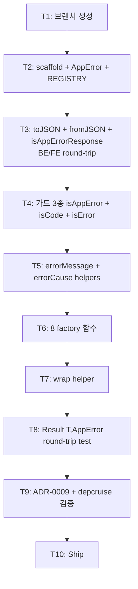

# Implementation Plan: spec-02-02

## 📋 Branch Strategy

- 신규 브랜치: `spec-02-02-shared-errors`
- 시작 지점: `main`
- 첫 task가 브랜치 생성을 수행

## 🛑 사용자 검토 필요 (User Review Required)

> [!IMPORTANT]
> - [ ] **AppError = class extends Error** (vs plain object / union type) — `instanceof Error` 호환 + stack trace + `e.cause`(ES2022) 자연. 카운터: tree-shaking 불리이나 errors는 항상 사용.
> - [ ] **8 standard codes (v2 격상)** — 벤치마킹 후 *production-ready* 카탈로그로 격상. Stripe/GitHub API 참고. 더 추가 시 spec scope 폭주.
> - [ ] **RFC 7807 (Problem Details) 본 spec 비채택** — 별 spec 후보. type URI 관리 부담 + 본 spec은 프레임워크 무관 데이터 모델. HTTP 응답 변환은 Phase 3 backend.
> - [ ] **subclass 계층 (NestJS HttpException 패턴) 비채택** — flat code로 충분. 사용자 도메인 확장은 *코드 추가*. 서브클래스 = 추상화 비용 정당화 안 됨.
> - [ ] **`toJSON`에 `cause` 미포함** — BE→FE 노출 시 내부 정보 leak 회피.
> - [ ] **`wrap(e, code?, message?)` helper 추가** — try-catch 패턴에서 매우 자주 사용. 없으면 호출자가 직접 instanceof 분기.
> - [ ] **다중 에러: `details.errors[]` 컨벤션만, 별 type 미생성** — YAGNI. validation aggregation 빈번해지면 spec-02-03에서 도입.

> [!WARNING]
> - [ ] **`Error.captureStackTrace`는 V8 only** — Bun / 다른 엔진은 native stack 사용.
> - [ ] **lefthook typecheck quirk 재발 주의** — spec-02-01 발견. 재발 시 RCA-001 작성 + ship 직전 `pnpm typecheck` 수동 재확인.
> - [ ] **벤치마킹 trade-off 명시** — `@hapi/boom`의 `output.headers`(WWW-Authenticate 등) 자동 처리는 본 spec에 없음. backend HTTP middleware에서 별도 처리 필요.

## 🎯 핵심 전략 (Core Strategy)

### 아키텍처 컨텍스트 (v3)



### 주요 결정 (v2 격상 — 벤치마킹 후)

| 컴포넌트 | 전략 | 이유 |
|:---:|:---|:---|
| AppError 디자인 | class extends Error | instanceof 호환 + stack trace + cause 자연 |
| Error code | string literal union (`StandardErrorCode` + 사용자 확장) | tree-shaking + 사용자 확장 친화. enum 비채택(불변 보장 잃지만 확장이 더 중요) |
| 표준 코드 개수 | **8개** (VALIDATION/UNAUTHENTICATED/FORBIDDEN/NOT_FOUND/CONFLICT/RATE_LIMIT/INTERNAL/BAD_GATEWAY) | 산업 표준 HTTP 4xx/5xx 핵심. Stripe/GitHub API 참고. 더 많으면 scope 폭주 / 더 적으면 사용자 자체 정의 부담 |
| 매핑 방식 | `STANDARD_ERROR_REGISTRY` const record (code → { statusCode, title }) | type-safe + tree-shakable. enum + switch 비채택 |
| Subclass 계층 | 만들지 않음 (flat code, NestJS HttpException 패턴 비채택) | tree-shaking + 사용자 도메인 확장이 *코드 추가*로 충분. subclass = 추상화 비용 |
| toJSON 직렬화 | code/message/statusCode/details 포함, cause 제외 | BE→FE 노출 안전성. cause는 로깅에서 직접 접근 |
| RFC 7807 (Problem Details) | **본 spec 비채택** | type URI 관리 부담. 본 spec은 *프레임워크 무관 데이터 모델*. HTTP 응답 변환은 Phase 3 backend |
| `wrap(unknownError, code?)` | 추가 | 매우 자주 사용 패턴 (`try { ... } catch (e) { wrap(e) }`). 호출자는 *대부분 wrap만 알면 됨* |
| **양방향 round-trip** | `fromJSON` + `isAppErrorResponse` 추가 | toJSON만으론 반쪽. BE→wire→FE 복원이 SDK 구현 표준 |
| **TS unknown narrowing 어휘** | `isError` + `errorMessage` + `errorCause` 추가 | catch(e: unknown) boilerplate 표준화. wrap의 building block + raw 에러 처리 시 |
| **라이브러리 specific 가드** | 본 spec 비포함 (axios/fetch는 Phase 4 SDK) | shared/errors 의존성 원칙: zod 외 dep 0. axios 의존 가드는 SDK 영역 |
| 다중 에러 (multi-error) | 별 type 미생성, `details: { errors: [...] }` 컨벤션만 박음 | YAGNI. validation aggregation 빈번해지면 spec-02-03에서 도입 |
| Scaffold 패턴 | `@repo/utils` 그대로 복제 | 일관성 |
| `@repo/utils` 의존 | devDep (테스트용) | Result round-trip test에 필요. 런타임 dep 0 유지 |
| ADR 시점 | T7 | 본 PR에 결정 포함 |

### 📑 ADR 후보

- [x] `app-error-design` (type: convention) → `docs/adr/0009-app-error-design.md` (T7)
  - 5개 결정 포함: class extends Error / flat code / toJSON cause 제외 / 코드 네이밍 컨벤션 / RFC 7807 미채택 이유

## 📂 Proposed Changes

### packages/shared/errors (신규)

#### [NEW] `packages/shared/errors/package.json`

```json
{
  "name": "@repo/errors",
  "version": "0.0.0",
  "private": true,
  "type": "module",
  "exports": {
    ".": { "types": "./src/index.ts", "default": "./src/index.ts" },
    "./package.json": "./package.json"
  },
  "files": ["src"],
  "scripts": { "lint": "biome check .", "typecheck": "tsc --noEmit", "test": "vitest run" },
  "devDependencies": {
    "@repo/biome-config": "workspace:*",
    "@repo/typescript-config": "workspace:*",
    "@repo/vitest-config": "workspace:*",
    "@repo/utils": "workspace:*",
    "@biomejs/biome": "catalog:",
    "typescript": "catalog:",
    "vitest": "catalog:"
  }
}
```

#### [NEW] `packages/shared/errors/tsconfig.json`

```json
{
  "extends": "@repo/typescript-config/base",
  "include": ["src/**/*.ts"]
}
```

> DOM lib 불필요 (timer/Fetch API 미사용).

#### [NEW] `packages/shared/errors/biome.json`

```json
{
  "$schema": "https://biomejs.dev/schemas/2.4.15/schema.json",
  "extends": ["@repo/biome-config/base"]
}
```

#### [NEW] `packages/shared/errors/vitest.config.ts`

```ts
export { default } from "@repo/vitest-config/node";
```

#### [NEW] `packages/shared/errors/src/index.ts`

- `class AppError extends Error` (code/statusCode/details/cause)
- `STANDARD_ERROR_REGISTRY` const record (8 코드 → { statusCode, title })
- `StandardErrorCode` type (`keyof typeof STANDARD_ERROR_REGISTRY`)
- `toJSON()` 메서드
- `isAppError` + `isCode<C>` 타입 가드 2종
- 8 factory: `validationError` / `unauthenticatedError` / `forbiddenError` / `notFoundError` / `conflictError` / `rateLimitError` / `internalError` / `badGatewayError`
- `wrap(e, code?, message?)` helper

#### [NEW] `packages/shared/errors/src/index.test.ts`

- AppError construction + 필드 접근 (3 test)
- toJSON 직렬화 (3 test: cause 제외 / 모든 필드 / 빈 details)
- isAppError 타입 가드 (2 test)
- isCode 타입 가드 (3 test: 정확 match / mismatch / non-AppError)
- 8 factory × 2 test (statusCode/title/code 확인 + details/cause 보존)
- wrap helper (4 test: AppError pass-through / Error preservation / string / object)
- Result<T, AppError> round-trip (4 test: ok/err narrow / map / flatMap short-circuit)
- 총 약 25 test

### 신규

#### [NEW] `docs/adr/0009-app-error-design.md`

- `type: convention`
- AppError class extends Error / string literal union code / toJSON cause 제외 / flat code 결정 + 대안 분석

## 🧪 검증 계획 (Verification Plan)

### 단위 테스트

```bash
pnpm --filter @repo/errors test
# 또는
pnpm test
```

기대: 12~15 test PASS.

### 통합 테스트

해당 없음.

### 수동 검증 시나리오

1. **AppError round-trip**:
   ```ts
   const e = validationError("invalid", { field: "email" });
   const json = JSON.stringify(e);
   // → {"code":"VALIDATION","message":"invalid","statusCode":400,"details":{"field":"email"}}
   ```
2. **Result<T, AppError>**: vitest 내부 검증.
3. **depcruise 회귀**: `pnpm exec depcruise --config packages/config/depcruise-config/base.cjs packages/` → violation 0건.

## 🔁 Rollback Plan

- **패키지 자체 revert**: `git revert <commit>`로 scaffold + 구현 모두 제거.
- **ADR-0009 revert**: AppError 디자인 결정 무효 — 후속 spec 큰 ripple. 다만 본 spec이 phase-02의 두 번째이므로 ripple 작음.

## 📦 Deliverables 체크

- [ ] task.md 작성 (다음 단계)
- [ ] 사용자 Plan Accept 받음
- [ ] (실행 후) 패키지 scaffold + AppError 구현
- [ ] (실행 후) 3 factory + 3 standard codes
- [ ] (실행 후) Result round-trip test
- [ ] (실행 후) ADR-0009 작성
- [ ] (실행 후) walkthrough.md / pr_description.md ship
