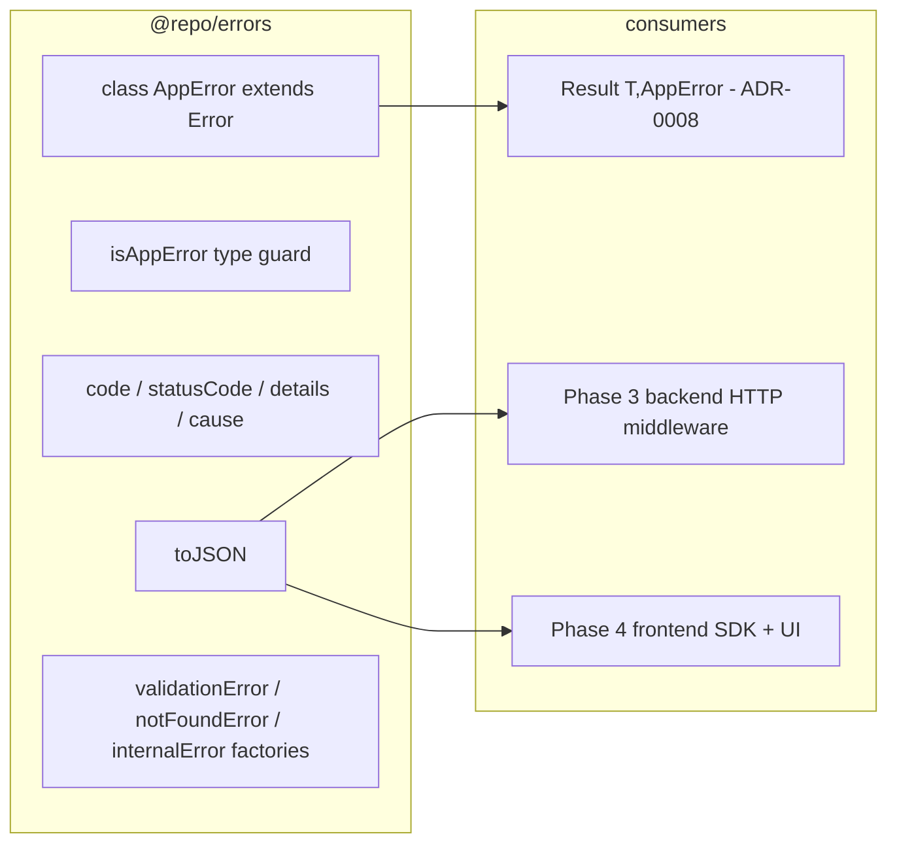

# spec-02-02: `@repo/errors` — AppError 계층 + JSON 직렬화

## 📋 메타

| 항목 | 값 |
|---|---|
| **Spec ID** | `spec-02-02` |
| **Phase** | `phase-02` |
| **Branch** | `spec-02-02-shared-errors` |
| **상태** | Planning |
| **타입** | Feature |
| **Integration Test Required** | no |
| **작성일** | 2026-05-17 |
| **소유자** | dennis |

## 📋 배경 및 문제 정의

### 현재 상황

spec-02-01에서 `Result<T, E = Error>`를 박았다 (ADR-0008). 그러나 *E*가 표준 `Error`라 도메인 정보(에러 코드 / HTTP status / 직렬화 가능 여부)가 없다. 후속 spec(`shared-validation` / `shared-contracts` / Phase 3 backend / Phase 4 frontend)이 *공통 에러 표현*을 의존하려면 **AppError 계층**이 필요. ARCHITECTURE.md §2.2가 `errors = AppError 계층 + JSON 직렬화 (BE/FE 공유)`로 정의.

`./packages/shared/errors` 디렉토리는 *없음* — 본 spec에서 신규 생성.

### 문제점

1. **표준 `Error`로는 부족**: stack trace / message만 있고 *code / statusCode / details*가 없음. HTTP API 응답 / 사용자 메시지 / 로깅 / 클라이언트 분기 모두 어려움.
2. **직렬화 불가**: 표준 `Error`는 `JSON.stringify(e)` → `{}` 빈 객체. BE → FE 전송 시 정보 손실.
3. **타입 가드 부재**: `instanceof Error`로는 *어떤 도메인 에러인지* 구별 안 됨.
4. **`Result<T, AppError>` narrow 패턴 부재**: ADR-0008의 첫 실제 사용처 — 본 spec에서 검증.

### 해결 방안 (요약)

`@repo/errors` 신규 패키지: `class AppError extends Error` (code / statusCode / details / cause), `toJSON()` 직렬화, `isAppError` 타입 가드, common error codes 3종 (`VALIDATION` / `NOT_FOUND` / `INTERNAL`) + factory 함수. 패키지 scaffold는 `@repo/utils` 패턴 그대로. Result<T, AppError> round-trip 테스트로 ADR-0008 패턴 검증.

## 📊 개념도



## 🎯 요구사항 (v3 — round-trip + TS unknown narrowing 통합)

### Functional Requirements

1. **`./packages/shared/errors` 신규 패키지** (`@repo/errors`): `@repo/utils` 동일 scaffold.

2. **`class AppError extends Error`** 필드:
   - `code: string` (string literal union 확장 가능)
   - `statusCode: number` (HTTP 4xx/5xx)
   - `details?: unknown` (도메인 컨텍스트)
   - `cause?: unknown` (ES2022 Error.cause)
   - 생성자: `new AppError({ code, message, statusCode, details?, cause? })`

3. **표준 에러 카탈로그 — 8개 코드 + 매핑 record**:
   ```ts
   export const STANDARD_ERROR_REGISTRY = {
     VALIDATION:      { statusCode: 400, title: "Validation Failed" },
     UNAUTHENTICATED: { statusCode: 401, title: "Authentication Required" },
     FORBIDDEN:       { statusCode: 403, title: "Forbidden" },
     NOT_FOUND:       { statusCode: 404, title: "Not Found" },
     CONFLICT:        { statusCode: 409, title: "Conflict" },
     RATE_LIMIT:      { statusCode: 429, title: "Too Many Requests" },
     INTERNAL:        { statusCode: 500, title: "Internal Error" },
     BAD_GATEWAY:     { statusCode: 502, title: "Bad Gateway" },
   } as const;
   export type StandardErrorCode = keyof typeof STANDARD_ERROR_REGISTRY;
   ```

4. **8 factory 함수** (각 standard code별):
   - `validationError(message, details?)`, `unauthenticatedError(message)`, `forbiddenError(message)`, `notFoundError(message, details?)`, `conflictError(message, details?)`, `rateLimitError(message, details?)`, `internalError(message, cause?)`, `badGatewayError(message, cause?)`
   - 각 factory는 `STANDARD_ERROR_REGISTRY`에서 statusCode 자동 조회.

5. **`toJSON(): { code, message, statusCode, details? }`**: 직렬화 메서드. `cause`는 *제외* (BE/FE round-trip 보안/노이즈 회피).

6. **타입 가드 2종**:
   - `isAppError(e): e is AppError` — 일반 가드
   - `isCode<C extends string>(e: unknown, code: C): e is AppError & { code: C }` — code별 narrow

7. **`wrap(e, code?, message?): AppError`** — try-catch에서 catch한 unknown을 AppError로 변환. cause 보존. 매우 자주 사용 패턴:
   ```ts
   try { ... } catch (e) { return err(wrap(e, "INTERNAL", "DB query failed")); }
   ```
   - 이미 AppError면 그대로 반환
   - Error면 message + cause 보존
   - 그 외(string/object)면 stringify → AppError

8. **BE→FE round-trip — `fromJSON` + `isAppErrorResponse`**:
   - `AppErrorResponse = ReturnType<AppError["toJSON"]>` type
   - `isAppErrorResponse(json: unknown): json is AppErrorResponse` — JSON shape 가드
   - `fromJSON(json: unknown): AppError` — JSON → AppError class 복원. 무효 shape면 `wrap(json, "INTERNAL", "Invalid error response shape")` fallback.
   - 흐름: `BE throw → toJSON → JSON wire → FE fromJSON → Result<T, AppError>`

9. **TS unknown narrowing 어휘 — 3 helper**:
   - `isError(e: unknown): e is Error` — cross-realm 안전 (`instanceof Error` + `Object.prototype.toString` fallback)
   - `errorMessage(e: unknown): string` — 어떤 unknown에서든 message 추출 (AppError / Error / string / object / 그 외)
   - `errorCause(e: unknown): unknown` — ES2022 `e.cause` 안전 추출 (AppError.cause 우선)
   - 호출자는 *대부분* `wrap(e)`만 사용. 본 3 helper는 raw 에러 직접 처리(로깅 등) 시 building block.

10. **`Result<T, AppError>` round-trip test**: `@repo/utils`의 6 helpers와 결합 (4~6 test).

11. **단위 테스트**: 총 ~38 test 예상.
    - AppError 생성/필드 (3)
    - toJSON (3) + fromJSON (4) + isAppErrorResponse (3)
    - isAppError (2) + isCode (3) + isError (3)
    - errorMessage (5 — AppError / Error / string / object / null+undefined)
    - errorCause (3)
    - 8 factory × 2 ≈ 16
    - wrap (4)
    - Result round-trip (4)

> **라이브러리 specific 가드 (axios / fetch 등) 비포함**: 본 spec은 *환경 무관*. axios 의존하는 가드는 Phase 4 `@repo/frontend/sdk`에서. SDK는 catch한 axios 에러를 `wrap(e)` 호출해 AppError로 변환만 하면 됨.

### Non-Functional Requirements

1. **zod 외 런타임 의존성 0**: `@repo/utils` devDep으로 추가(테스트용). type-only import는 자유.
2. **Node-only API 금지**: `node:*` import 금지. depcruise 룰이 보호.
3. **`toJSON` 안정성**: 직렬화 결과가 BE→FE round-trip에서 정보 손실 없도록.
4. **확장성**: 사용자가 자체 도메인 코드 추가 가능 (`new AppError({ code: "ORDER_FROZEN", ... })`). standard codes는 *시작점*.
5. **stack trace 보존**: `Error.captureStackTrace` 적용 (V8) — non-V8 환경은 polyfill 없음 (browser는 stack 자동).

## 🚫 Out of Scope

- **도메인별 subclass** (`UserError` / `OrderError` 등) — flat code 기반으로 충분 (NestJS HttpException 계층 패턴 비채택, 비교 결과 ADR-0009에 박음).
- **RFC 7807 `toProblemDetails(instance?)` 변환** — 표준 호환성 좋으나 (a) type URI 관리 부담, (b) 본 spec은 *프레임워크 무관* 데이터 모델, (c) HTTP API 응답은 Phase 3 backend HTTP middleware에서 변환. **별 spec 후보** (Phase 3 진입 시 평가).
- **HTTP middleware integration**: Phase 3 backend의 framework adapter에서.
- **i18n / 사용자 메시지 변환**: Phase 4 frontend에서.
- **`fromZodError` / `fromPrismaError` 등 라이브러리별 변환 helper**: 본 spec은 `wrap`(unknown → AppError)만. zod 변환은 spec-02-03 (zod 의존 필요), Prisma 변환은 phase-03 진입 시.
- **`tryAsync(fn): Promise<Result<T, AppError>>` Promise 래퍼**: YAGNI. 호출자가 `try/catch + wrap`로 충분. 자주 사용되면 추후 추가.
- **에러 로깅 통합**: `@repo/backend/logger`에서.
- **`cause`를 toJSON에 포함**: 보안/노이즈 회피. 로깅에서는 `e.cause` 직접 접근.
- **`expose` flag (production stack 노출 여부)**: `http-errors` 패턴이나 본 spec은 *환경 무관 데이터 모델*. stack 노출 결정은 응답 변환 레이어(Phase 3 backend middleware)에서.
- **severity / retryable / userFacing 메타 필드**: YAGNI. 실사용 패턴 본 후 추가.
- **다중 에러 자동 aggregation API** (multi-error type): 단순히 `details: { errors: Array<{ path, message }> }` 컨벤션만 ADR-0009에 박고 *별 데이터 타입은 만들지 않음*. validation aggregation이 빈번해지면 spec-02-03에서 도입.

## 📑 ADR 후보 (Architecture Decision Records)

> 본 SPEC의 결정 중 *장기 자산* 으로 박을 가치 있는 것이 있는가?

- [x] ADR 가치 있는 결정 있음 → 후보 한 줄 요약: `app-error-class-design` (type: **convention**)
- [ ] 없음

**근거**:
- AppError는 모든 후속 spec + Phase 3 backend / Phase 4 frontend 공통 의존.
- class extends Error vs plain object vs union type 등 *대안 있는 결정*.
- `toJSON`에 `cause` 미포함, code = string literal union (vs enum) 등 *micro-decision*도 ADR에 박을 가치.
- 본 spec ship 시점에 `docs/adr/0009-app-error-design.md` 작성.

## 🔍 Critique 결과 (선택)

미실행.

## ✅ Definition of Done

- [ ] `./packages/shared/errors` 신규 패키지 scaffold
- [ ] `AppError` class + 4 필드 + `toJSON`
- [ ] `STANDARD_ERROR_REGISTRY` 8 코드 + `StandardErrorCode` type
- [ ] 8 factory 함수
- [ ] **양방향**: `fromJSON` + `isAppErrorResponse` + `AppErrorResponse` type
- [ ] **타입 가드 3종**: `isAppError` + `isCode<C>` + `isError`
- [ ] **TS narrow helper 2종**: `errorMessage(e)` + `errorCause(e)`
- [ ] `wrap(e, code?, message?)` helper
- [ ] `Result<T, AppError>` round-trip 테스트 PASS
- [ ] `pnpm test` 그린 (~38 test)
- [ ] `pnpm lint` / `pnpm typecheck` 그린
- [ ] depcruise violation 0건 유지
- [ ] **ADR-0009** (`./docs/adr/0009-app-error-design.md`) 작성 + 본 PR 포함. 7 결정 박음:
  - class extends Error (vs plain object / union)
  - flat code (vs NestJS HttpException 계층)
  - toJSON에 cause 미포함
  - 코드 네이밍 컨벤션 (SCREAMING_SNAKE / 도메인 prefix)
  - 다중 에러 컨벤션 (`details.errors[]` — 별 type 미생성)
  - RFC 7807 미채택 이유 (Phase 3 후보)
  - **라이브러리 specific 가드(axios/fetch)는 본 spec 외** (Phase 4 SDK 영역)
- [ ] `walkthrough.md` / `pr_description.md` ship commit
- [ ] `spec-02-02-shared-errors` 브랜치 push
- [ ] PR 생성 + 사용자 알림
