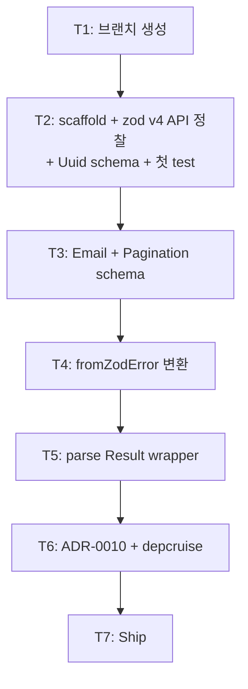

# Implementation Plan: spec-02-03

## 📋 Branch Strategy

- 신규 브랜치: `spec-02-03-shared-validation`
- 시작 지점: `main`
- 첫 task가 브랜치 생성

## 🛑 사용자 검토 필요 (User Review Required)

> [!IMPORTANT]
> - [ ] **zod v4 API 사용** (catalog `^4.4.3`). v3 호환 코드 안 씀. `z.uuid()` / `z.email()` 같은 standalone vs `z.string().uuid()` chain은 *T2 정찰 후 결정* (실제 v4 API 확인).
> - [ ] **공통 schema 3개로 시작** (Uuid / Email / Pagination). 더 추가하면 scope 폭주. 도메인 spec에서 필요 시 추가.
> - [ ] **`fromZodError`가 zod 기본 message 보존** (i18n 변환 안 함). 사용자 메시지는 `parse(schema, data, "도메인 메시지")` override로.
> - [ ] **ADR-0010 본 PR 포함**. validation + Result 통합 패턴을 cross-spec convention으로 박음.

> [!WARNING]
> - [ ] **`@repo/typescript-config/env-agnostic` 변형 추가는 본 spec 외**: DOM lib 2회째 적용이라 격상 후보지만 별 spec-x로 분리 (Icebox 격상). 본 spec은 *적용*만.
> - [ ] **lefthook race 해결 후 첫 spec** — 차단 동작 정상 검증 가치. typecheck 실수 commit 시 정상 차단되어야.

## 🎯 핵심 전략 (Core Strategy)

### 아키텍처 컨텍스트



### 주요 결정

| 컴포넌트 | 전략 | 이유 |
|:---:|:---|:---|
| zod 버전 | catalog v4 (`^4.4.3`) | ADR-0002. v3 호환 회피 |
| API 스타일 | T2에서 정찰 후 v4 표준 채택 | v4가 `z.uuid()` 도입 — chain보다 short. 실제 import 후 결정 |
| 공통 schema 개수 | 3 (Uuid / Email / Pagination) | YAGNI. 도메인 spec에서 확장 |
| `parse` 시그니처 | `<T>(schema, data, msg?) → Result<T, AppError>` | safeParse → Result 변환. msg는 도메인 override |
| `fromZodError` 시그니처 | `(error, msg?) → AppError` | issues → details.errors[] (ADR-0009 컨벤션) |
| Subclass `ValidationError` | 없음 | flat code 원칙 유지 (ADR-0009) |
| Pagination 기본값 | page=1 / perPage=20 / perPage max=100 | 산업 표준 (REST API). cursor는 후속 |
| 의존성 | `zod` + `@repo/errors` + `@repo/utils` (devDep) | shared/* 의존성 0 원칙 — zod 외 외부 lib 0 |
| ADR 시점 | T6 | 본 PR에 결정 포함 |

### 📑 ADR 후보

- [x] `validation-zod-result-integration` (type: convention) → `docs/adr/0010-validation-zod-result-integration.md` (T6)

## 📂 Proposed Changes

### packages/shared/validation (신규)

#### [NEW] `packages/shared/validation/package.json`

```json
{
  "name": "@repo/validation",
  "version": "0.0.0",
  "private": true,
  "type": "module",
  "exports": { ".": { "types": "./src/index.ts", "default": "./src/index.ts" } },
  "files": ["src"],
  "scripts": { "lint": "biome check .", "typecheck": "tsc --noEmit", "test": "vitest run" },
  "dependencies": {
    "@repo/errors": "workspace:*",
    "zod": "catalog:"
  },
  "devDependencies": {
    "@repo/biome-config": "workspace:*",
    "@repo/typescript-config": "workspace:*",
    "@repo/vitest-config": "workspace:*",
    "@repo/utils": "workspace:*",
    ...
  }
}
```

> zod / @repo/errors는 **dependencies**(런타임 의존). @repo/utils는 *test에서만 사용*해 devDep.

#### [NEW] `tsconfig.json` / `vitest.config.ts`

`@repo/errors` 동일 패턴. tsconfig는 DOM lib 포함.

#### [NEW] `src/index.ts`

```ts
import { type ZodError, type ZodType, z } from "zod";
import { type AppError, validationError } from "@repo/errors";
import { type Result, err, ok } from "@repo/utils";

// 공통 schema 3종
export const Uuid = /* v4: z.uuid() or z.string().uuid() */;
export const Email = /* v4: z.email() or z.string().email() */;
export const Pagination = z.object({
  page: z.number().int().min(1).default(1),
  perPage: z.number().int().min(1).max(100).default(20),
});
export type PaginationInput = z.input<typeof Pagination>;
export type PaginationOutput = z.output<typeof Pagination>;

// 변환
export const fromZodError = (error: ZodError, message = "Validation failed"): AppError => {
  const errors = error.issues.map((issue) => ({
    path: issue.path.map(String).join("."),
    message: issue.message,
  }));
  return validationError(message, { errors });
};

// Result wrapper
export const parse = <T>(schema: ZodType<T>, data: unknown, message?: string): Result<T, AppError> => {
  const result = schema.safeParse(data);
  return result.success ? ok(result.data) : err(fromZodError(result.error, message));
};
```

#### [NEW] `src/index.test.ts`

`parse` / `fromZodError` / `Uuid` / `Email` / `Pagination` 각각 unit test.

### 신규 ADR

#### [NEW] `docs/adr/0010-validation-zod-result-integration.md`

- frontmatter `type: convention`, status: accepted
- 7 결정: parse Result wrapper / fromZodError 컨벤션 / 공통 schema 3 / flat code 유지 / Pagination 기본값 / async parseAsync 미제공 / zod-validation-error 미채택
- Alternatives: valibot / yup / superstruct / io-ts / zod-validation-error — 비채택 이유

## 🧪 검증 계획 (Verification Plan)

### 단위 테스트

```bash
pnpm --filter @repo/validation test
```

기대: ~20 test PASS.

### 통합 테스트

해당 없음.

### 수동 검증 시나리오

1. **parse 성공/실패**:
   ```ts
   const r1 = parse(Email, "u@example.com");  // ok("u@example.com")
   const r2 = parse(Email, "bad");            // err(AppError { code: "VALIDATION", details: { errors: [...] } })
   ```
2. **fromZodError 경로**:
   ```ts
   const schema = z.object({ user: z.object({ email: Email }) });
   const r = schema.safeParse({ user: { email: "bad" } });
   if (!r.success) {
     const app = fromZodError(r.error);
     // details.errors[0].path === "user.email"
   }
   ```
3. **depcruise**: 0 violations 유지.
4. **lefthook 차단 동작**: 임의 type error commit 시도 → 차단 확인 (RCA-001 fix 효과 검증).

## 🔁 Rollback Plan

- **패키지 자체 revert**: `git revert <commit>`.
- **ADR-0010 revert**: 후속 spec에서 *parse / fromZodError 패턴 안 씀* 결정 — 큰 ripple.

## 📦 Deliverables 체크

- [ ] task.md 작성 (다음 단계)
- [ ] 사용자 Plan Accept
- [ ] (실행 후) 패키지 + 3 schema + 2 helper
- [ ] (실행 후) ADR-0010
- [ ] (실행 후) walkthrough / pr_description ship
