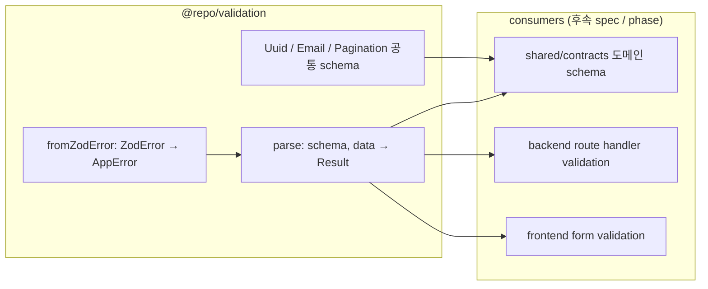

# spec-02-03: `@repo/validation` — zod 통합 + 공통 schema + parse/fromZodError

## 📋 메타

| 항목 | 값 |
|---|---|
| **Spec ID** | `spec-02-03` |
| **Phase** | `phase-02` |
| **Branch** | `spec-02-03-shared-validation` |
| **상태** | Planning |
| **타입** | Feature |
| **Integration Test Required** | no |
| **작성일** | 2026-05-18 |
| **소유자** | dennis |

## 📋 배경 및 문제 정의

### 현재 상황

- spec-02-01에서 `Result<T, E>` (ADR-0008), spec-02-02에서 `AppError + details.errors[]` 컨벤션 (ADR-0009) 박음.
- zod은 catalog (`^4.4.3`)에 *박혀 있지만 어떤 패키지도 의존 안 함* — 본 spec이 *첫 사용자*.
- ARCHITECTURE.md §2.2: `validation = zod helper + 공통 schema (UUID, Email, Pagination 등)`.
- ADR-0009 §Related: "후속 spec(spec-02-03)에서 zod 변환 패턴 정의."
- `packages/shared/validation` 디렉토리는 *없음* — 본 spec에서 신규.

### 문제점

1. **`safeParse` ↔ Result 변환 매번 작성**: 호출자가 매번 `result.success ? ok(...) : err(validationError(...))` 패턴 작성 → boilerplate.
2. **`ZodError → AppError` 변환 컨벤션 부재**: ADR-0009 `details.errors[]` 컨벤션이 *문서로만 있고 코드 변환 없음*. zod issues array → details schema 표준화 필요.
3. **공통 schema 분산 위험**: UUID / Email / Pagination을 각 도메인 패키지가 *자체 정의*하면 검증 룰 drift (예: email regex 차이). 단일 SoT 필요.
4. **zod 4.x API 안정성 확인 미흡**: catalog는 ^4.4.3이나 *실제 사용 검증 안 됨*. 본 spec이 첫 사용자라 v4 API 동작 확인 책임.

### 해결 방안 (요약)

`@repo/validation` 신규 패키지: (a) `parse<T>(schema, data, msg?): Result<T, AppError>` wrapper — `safeParse`를 우리 Result 어휘로 변환, (b) `fromZodError(zodError, msg?): AppError` — issues → `details.errors[]` 컨벤션 실현, (c) 공통 schema 3종(`Uuid` / `Email` / `Pagination`) — 도메인 패키지가 import. zod 4.x API 검증 + shared/* DOM lib 패턴 적용.

## 📊 개념도

## 🎯 요구사항

### Functional Requirements

1. **`packages/shared/validation` 신규 패키지** (`@repo/validation`): `@repo/utils` / `@repo/errors` 패턴 scaffold + `zod` catalog dep + `@repo/errors` workspace dep.

2. **`fromZodError(error: ZodError, message?: string): AppError`**:
   - `error.issues` array → `details.errors: Array<{ path: string; message: string }>` (ADR-0009 컨벤션 실현)
   - `path`: zod의 `(string | number)[]`를 `.` join (예: `user.email` 또는 `items.0.name`)
   - 기본 message: `"Validation failed"` (호출자가 override 가능)
   - 결과: `validationError(message, { errors })`

3. **`parse<T>(schema, data, message?): Result<T, AppError>`**:
   - 성공: `ok(result.data)`
   - 실패: `err(fromZodError(result.error, message))`
   - zod의 `safeParse`를 *우리 어휘로 일관 변환*

4. **공통 schema 3종**:
   - `Uuid: ZodType<string>` — v4 `z.uuid()` 또는 `z.string().uuid()` (API 확인 후 결정)
   - `Email: ZodType<string>` — v4 `z.email()` 또는 `z.string().email()`
   - `Pagination`: `z.object({ page: z.number().int().min(1).default(1), perPage: z.number().int().min(1).max(100).default(20) })` — offset 기반 시작

5. **zod 4.x API 검증**: 본 spec 진행 중 zod v4 API 확인. v3 호환 케이스 발견 시 walkthrough에 기록.

6. **shared/* DOM lib 패턴 (2회째 적용)**: `packages/shared/validation/tsconfig.json`에 `lib: ["ES2023", "DOM"]` 추가.

7. **단위 테스트**: ~20 test 예상.

### Non-Functional Requirements

1. **zod 외 런타임 의존성 0**: 본 spec은 *zod + @repo/errors + @repo/utils*만. 외부 lib(neverthrow / zod-validation-error 등) 미사용.
2. **Node-only API 금지**.
3. **tree-shaking 친화**: 공통 schema는 *named export*.
4. **확장성**: 사용자가 자체 schema에 `parse` / `fromZodError`를 그대로 사용 가능.
5. **lefthook race 해결 후 첫 spec** — race 재발 없음 확인.

## 🚫 Out of Scope

- **추가 공통 schema** (`Url`, `Iso8601Date`, `PhoneNumber`, `Slug` 등) — YAGNI. 도메인 spec에서 필요 시 추가.
- **Pagination cursor 기반 변형** — offset 기반만. cursor 기반은 spec-02-04(contracts) 또는 phase-03/04에서.
- **`zod-validation-error` 라이브러리 통합** — 우리 `fromZodError`가 동일 역할. 라이브러리 의존 회피.
- **i18n 메시지 변환** — `fromZodError`는 zod의 기본 메시지 그대로 보존. 사용자가 *override message*로 도메인 메시지 전달.
- **`parseAsync<T>` Promise wrapper** — async refinement는 phase-03 backend에서 필요 시 추가.
- **react-hook-form / formik 통합** — Phase 4 frontend 영역.
- **OpenAPI 변환** — Phase 4 `@repo/frontend/sdk`에서.
- **`zod` v3 fallback** — catalog가 v4.
- **`@repo/typescript-config/env-agnostic` 변형 추가** — 2회째 DOM lib 패턴이라 격상 후보지만 본 spec scope 폭주 회피. **별 spec-x** 후보로 Icebox.

## 📑 ADR 후보 (Architecture Decision Records)

> 본 SPEC의 결정 중 *장기 자산* 으로 박을 가치 있는 것이 있는가?

- [x] ADR 가치 있는 결정 있음 → `validation-zod-result-integration` (type: **convention**)
- [ ] 없음

**근거**:
- `parse<T>` + `fromZodError` 패턴이 모든 후속 spec(contracts / auth-contracts / Phase 3 backend / Phase 4 frontend)의 *공통 validation 어휘*.
- 대안 (zod-validation-error / valibot / yup / superstruct / io-ts) 분석 + 비채택 이유 박을 가치.
- ADR-0009의 `details.errors[]` 컨벤션의 *코드 구체화* — ADR-0010로 짝.

## 🔍 Critique 결과 (선택)

미실행.

## ✅ Definition of Done

- [ ] `packages/shared/validation` 신규 패키지 scaffold
- [ ] zod catalog dep 추가 + v4 API 동작 검증
- [ ] `parse<T>` + `fromZodError` 구현
- [ ] 공통 schema 3종 (Uuid / Email / Pagination)
- [ ] `pnpm test` 그린 (~20 test 추가)
- [ ] `pnpm lint` / `pnpm typecheck` 그린 (**lefthook race 해결 후 첫 spec — 정상 차단 동작 검증**)
- [ ] depcruise violation 0건 유지
- [ ] **ADR-0010** (`docs/adr/0010-validation-zod-result-integration.md`) 작성 + 본 PR 포함
- [ ] `walkthrough.md` / `pr_description.md` ship commit
- [ ] `spec-02-03-shared-validation` 브랜치 push
- [ ] PR 생성 + 사용자 알림
