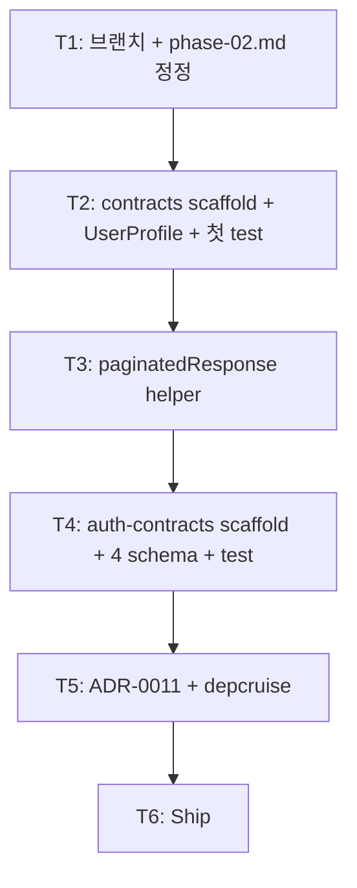

# Implementation Plan: spec-02-04

## 📋 Branch Strategy

- 신규 브랜치: `spec-02-04-shared-contracts`
- 시작 지점: `main` (HEAD `d074ced` post-merge sync 직후)
- 첫 task가 브랜치 생성

## 🛑 사용자 검토 필요 (User Review Required)

> [!IMPORTANT]
> - [ ] **두 패키지 한 spec에 박음** (spec-02-04 + spec-02-05 통합). 패키지 분리는 ADR-0003 §6 유지. spec/PR 단위만 합침.
> - [ ] **`@repo/auth-contracts`는 핵심 4 schema만** (`Role` / `User` / `Session` / `JwtPayload`). ADR-0006 보류 상태 — 확장은 별 spec.
> - [ ] **예시 도메인 1개** (`UserProfile`) — boilerplate 컨벤션 전달용. 추가 도메인(Order/Product 등)은 사용자 fork 후 자체.
> - [ ] **ADR-0011 본 PR 포함**: contracts 패키지 분할 + 도메인 범위 컨벤션.
> - [ ] **phase-02.md 갱신**: spec-02-05 정의 제거 + 흡수 결정 기록.

> [!WARNING]
> - [ ] **lefthook race fix 후 2번째 spec** — 정상 차단 동작 재검증.
> - [ ] **`@repo/utils` 분류 plan 정정 (spec-02-03 교훈)** — `paginatedResponse`가 ok/err를 *런타임* 안 씀 (그저 schema 정의)이라 *@repo/utils는 본 spec에서 dep 없음*. validation만 의존.

## 🎯 핵심 전략 (Core Strategy)

### 아키텍처 컨텍스트



### 주요 결정

| 컴포넌트 | 전략 | 이유 |
|:---:|:---|:---|
| spec 수 | **1** (spec-02-04로 통합) | 두 spec 모두 *얇은 schema* — ceremony 비용 > 결정 부담 |
| 패키지 수 | **2** (`@repo/contracts` + `@repo/auth-contracts`) | ADR-0003 §6 유지 (auth 불확실성 격리) |
| contracts 도메인 | `UserProfile` 1개 + `paginatedResponse<T>` helper | 컨벤션 전달 충분. 사용자 fork 시 확장 |
| auth-contracts schema | **핵심 4개** (`Role` / `User` / `Session` / `JwtPayload`) | ADR-0006 보류 — 확장은 별 spec |
| sub-path export | `@repo/contracts/user` 등 (`exports` 필드에 명시) | tree-shaking + 도메인 단위 import. ARCHITECTURE.md §3.3 |
| 의존성 | `zod` + `@repo/validation` (런타임). `@repo/utils` 없음 | 본 spec은 schema 정의만 — ok/err 런타임 미사용 |
| ADR 시점 | T5 | 본 PR에 결정 포함 |

### 📑 ADR 후보

- [x] `contracts-package-layout` (type: convention) → `docs/adr/0011-contracts-package-layout.md` (T5)

## 📂 Proposed Changes

### packages/shared/contracts (신규)

#### [NEW] `packages/shared/contracts/package.json`

```json
{
  "name": "@repo/contracts",
  "version": "0.0.0",
  "private": true,
  "type": "module",
  "exports": {
    ".": { "types": "./src/index.ts", "default": "./src/index.ts" },
    "./user": { "types": "./src/user.ts", "default": "./src/user.ts" },
    "./package.json": "./package.json"
  },
  "files": ["src"],
  "scripts": { ... },
  "dependencies": {
    "@repo/validation": "workspace:*",
    "zod": "catalog:"
  },
  "devDependencies": { ... }
}
```

#### [NEW] `src/index.ts` (re-export + helper)

```ts
export * from "./user.js";
export * from "./pagination.js";
```

#### [NEW] `src/user.ts`

```ts
import { z } from "zod";
import { Email, Uuid } from "@repo/validation";

export const UserProfile = z.object({
  id: Uuid,
  email: Email,
  displayName: z.string().min(1).max(100),
  createdAt: z.iso.datetime(),
});
export type UserProfile = z.output<typeof UserProfile>;
```

#### [NEW] `src/pagination.ts`

```ts
import { type ZodType, z } from "zod";

export const paginatedResponse = <T>(itemSchema: ZodType<T>) =>
  z.object({
    items: z.array(itemSchema),
    page: z.number().int().min(1),
    perPage: z.number().int().min(1).max(100),
    total: z.number().int().min(0),
  });
```

### packages/shared/auth-contracts (신규)

#### [NEW] `packages/shared/auth-contracts/package.json`

동일 패턴. exports `.` only (sub-path는 schema 적을 때는 불필요 — 확장 시 추가).

```json
{
  "name": "@repo/auth-contracts",
  "dependencies": {
    "@repo/validation": "workspace:*",
    "zod": "catalog:"
  }
}
```

#### [NEW] `src/index.ts`

```ts
import { z } from "zod";
import { Email, Uuid } from "@repo/validation";

export const Role = z.enum(["user", "admin"]);
export type Role = z.output<typeof Role>;

export const User = z.object({
  id: Uuid,
  email: Email,
  role: Role,
  createdAt: z.iso.datetime(),
});
export type User = z.output<typeof User>;

export const Session = z.object({
  userId: Uuid,
  expiresAt: z.iso.datetime(),
});
export type Session = z.output<typeof Session>;

export const JwtPayload = z.object({
  sub: Uuid,
  role: Role,
  iat: z.number().int(),
  exp: z.number().int(),
});
export type JwtPayload = z.output<typeof JwtPayload>;
```

### 신규 ADR

#### [NEW] `docs/adr/0011-contracts-package-layout.md`

- frontmatter `type: convention`, status: accepted
- Decisions: 두 패키지 분리 유지 / sub-path export 컨벤션 / `paginatedResponse` 패턴 / 호스팅 앱의 자체 schema 패키지 가이드 / spec-02-05 흡수 기록
- Alternatives: 단일 contracts 통합 / OpenAPI codegen 우선 / valibot / Prisma → zod 변환

### phase-02.md 갱신

- §spec-02-05 정의 *제거*
- 결정 기록 추가
- Phase Done 조건: spec-02-01 ~ spec-02-04

## 🧪 검증 계획 (Verification Plan)

### 단위 테스트

```bash
pnpm --filter @repo/contracts test
pnpm --filter @repo/auth-contracts test
```

기대: contracts 4~5 + auth-contracts 4~5 = ~10 test.

### 통합 테스트

해당 없음 (Phase Ship 시점에 round-trip 시연 가능).

### 수동 검증 시나리오

1. **sub-path export 동작**:
   ```ts
   import { UserProfile } from "@repo/contracts/user";   // works
   import { UserProfile } from "@repo/contracts";        // also works (re-export)
   ```
2. **parse 통합 (spec-02-03)**:
   ```ts
   import { parse } from "@repo/validation";
   import { UserProfile } from "@repo/contracts";
   const r = parse(UserProfile, raw);  // Result<UserProfile, AppError>
   ```
3. **depcruise**: 0 violations 유지.
4. **lefthook 차단**: 임의 type error commit 시도 → 차단 확인.

## 🔁 Rollback Plan

- **패키지 자체 revert**: `git revert <commit>`.
- **ADR-0011 revert**: 후속 spec에서 *contracts 통합 또는 sub-path 패턴 변경* — 큰 ripple.
- **spec-02-05 부활**: phase-02.md 정정 revert + 새 spec 생성.

## 📦 Deliverables 체크

- [ ] task.md 작성 (다음 단계)
- [ ] 사용자 Plan Accept
- [ ] (실행 후) 두 패키지 + 5 schema + 1 helper
- [ ] (실행 후) ADR-0011
- [ ] (실행 후) phase-02.md 정정
- [ ] (실행 후) walkthrough / pr_description ship
