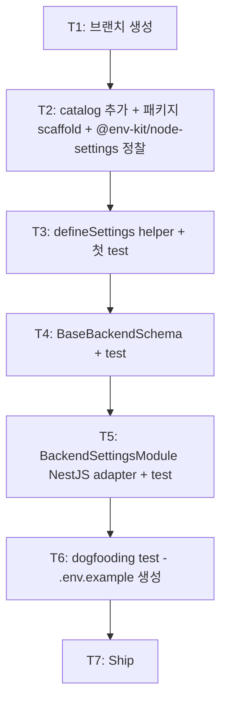

# Implementation Plan: spec-03-01

## 📋 Branch Strategy

- 신규 브랜치: `spec-03-01-backend-settings`
- 시작 지점: `main` (HEAD `a71937d` post-merge sync 직후)
- 첫 task가 브랜치 생성
- **Phase Base Branch 모드**: 본 spec PR base = `phase-03-backend-foundation` (sdd가 첫 ship 시점에 자동 생성)

## 🛑 사용자 검토 필요 (User Review Required)

> [!IMPORTANT]
> - [ ] **`@env-kit/node-settings@1.0.2`** npm catalog 추가 — 사용자 본인 라이브러리. 향후 backend 전체가 본 catalog 사용.
> - [ ] **NestJS 4 패키지 catalog 추가** (`@nestjs/common` / `@nestjs/config` / `@nestjs/core` + `reflect-metadata` / `rxjs`) — 후속 backend 패키지 공통 의존.
> - [ ] **`BackendSettingsModule.forRoot(schema)` 패턴** 채택 — NestJS DynamicModule 표준. 다른 ConfigModule wrapper(`nestjs-zod-config` 등) 미채택.
> - [ ] **dogfooding 1건만** (`.env.example` 생성) — K8s manifest / Markdown docs 검증은 후속 spec.
> - [ ] **ADR 신규 없음** — 결정 부담 작음. 후속 spec에서 패턴 반복 시 격상.

> [!WARNING]
> - [ ] **Phase Base Branch 모드 첫 spec** — 첫 ship 시 `phase-03-backend-foundation` branch 자동 생성. 동작 검증 필요.
> - [ ] **NestJS 도입 첫 spec** — runtime DI / decorator metadata 등 NestJS-specific 검증 (reflect-metadata 의존 등).
> - [ ] **`@env-kit/node-settings` API 실제 검증** — npm 발행 라이브러리지만 본 boilerplate에서 *첫 사용*. T2 정찰에서 실제 API 확인.

## 🎯 핵심 전략 (Core Strategy)

### 아키텍처 컨텍스트



### 주요 결정

| 컴포넌트 | 전략 | 이유 |
|:---:|:---|:---|
| 의존 방식 | npm catalog (`@env-kit/node-settings: catalog:`) | 본 라이브러리 npm 발행됨 (v1.0.2). git URL 불필요 |
| 패키지 위치 | `packages/backend/settings` | ADR-0003 layout — backend 카테고리 |
| 패키지 이름 | `@repo/backend-settings` | `@repo/<flat-name>` 컨벤션 (ADR-0003 §6 flat import) |
| DOM lib | 미포함 | backend Node-only |
| NestJS Module 패턴 | `forRoot(schema)` DynamicModule | NestJS 표준. `forRootAsync` 도 검토 가능 (T5에서 결정) |
| BACKEND_SETTINGS token | symbol vs string | symbol (typed) — NestJS 권장 |
| base schema scope | NODE_ENV / PORT / LOG_LEVEL 3개 | 다른 backend 패키지가 *최소 공통* — 추가는 phase-09 |
| dogfooding test scope | `.env.example` 생성 1건 | YAGNI. K8s manifest / Markdown docs는 phase-10 |
| ADR 시점 | 없음 (spec-03-02+에서 패턴 반복 시 격상) | YAGNI |

### 📑 ADR 후보

- [ ] 없음 (본 spec은 결정 적용만)

## 📂 Proposed Changes

### `pnpm-workspace.yaml` — catalog 추가

```yaml
catalog:
  # runtime (기존)
  zod: ^4.4.3
  pino: ^10.3.1

  # runtime (신규 — 본 spec)
  "@env-kit/node-settings": ^1.0.2
  "@nestjs/common": ^11.x.x  # T2 정찰에서 최신 버전 확정
  "@nestjs/config": ^4.x.x
  "@nestjs/core": ^11.x.x
  "reflect-metadata": ^0.2.x
  "rxjs": ^7.x.x
  # ...
```

> T2 정찰에서 NestJS 11 vs 10 결정 + 정확한 버전 pin.

### `packages/backend/settings/package.json` (신규)

```json
{
  "name": "@repo/backend-settings",
  "version": "0.0.0",
  "private": true,
  "type": "module",
  "exports": {
    ".": { "types": "./src/index.ts", "default": "./src/index.ts" },
    "./package.json": "./package.json"
  },
  "files": ["src"],
  "scripts": {
    "lint": "biome check .",
    "typecheck": "tsc --noEmit",
    "test": "vitest run"
  },
  "dependencies": {
    "@env-kit/node-settings": "catalog:",
    "@nestjs/common": "catalog:",
    "@nestjs/config": "catalog:",
    "@repo/errors": "workspace:*",
    "@repo/utils": "workspace:*",
    "reflect-metadata": "catalog:",
    "rxjs": "catalog:",
    "zod": "catalog:"
  },
  "devDependencies": {
    "@repo/biome-config": "workspace:*",
    "@repo/typescript-config": "workspace:*",
    "@repo/vitest-config": "workspace:*",
    "@biomejs/biome": "catalog:",
    "@nestjs/core": "catalog:",
    "@nestjs/testing": "catalog:",
    "typescript": "catalog:",
    "vitest": "catalog:"
  }
}
```

### `packages/backend/settings/src/index.ts` (신규)

```ts
import { type ZodType, z } from "zod";
import { type AppError, validationError } from "@repo/errors";
import { /* @env-kit/node-settings API */ } from "@env-kit/node-settings";

// 1. defineSettings helper
export const defineSettings = <T>(schema: ZodType<T>, source?: NodeJS.ProcessEnv): T => {
  const result = schema.safeParse(source ?? process.env);
  if (!result.success) {
    throw validationError("Settings validation failed", { errors: /* zod issues */ });
  }
  return result.data;
};

// 2. Base schema
export const BaseBackendSchema = z.object({
  NODE_ENV: z.enum(["development", "test", "staging", "production"]),
  PORT: z.coerce.number().int().min(1).max(65535).default(3000),
  LOG_LEVEL: z.enum(["trace", "debug", "info", "warn", "error", "fatal"]).default("info"),
});

// 3. NestJS adapter
export const BACKEND_SETTINGS = Symbol("BACKEND_SETTINGS");

export class BackendSettingsModule {
  static forRoot<T>(schema: ZodType<T>) {
    return {
      module: BackendSettingsModule,
      providers: [{
        provide: BACKEND_SETTINGS,
        useValue: defineSettings(schema),
      }],
      exports: [BACKEND_SETTINGS],
      global: true,
    };
  }
}
```

> 실제 `@env-kit/node-settings` API는 T2 정찰에서 확인 후 *적절히 활용*. 위는 *최소 wrap*. 라이브러리가 더 풍부한 기능을 제공하면 *직접 노출 또는 wrap*.

### `packages/backend/settings/src/index.test.ts` (신규)

```ts
describe("defineSettings", () => { /* 성공 / 실패 / merge */ });
describe("BaseBackendSchema", () => { /* valid / invalid */ });
describe("BackendSettingsModule", () => { /* forRoot DynamicModule 구조 */ });
describe("dogfooding", () => { /* .env.example 생성 */ });
```

## 🧪 검증 계획 (Verification Plan)

### 단위 테스트

```bash
pnpm --filter @repo/backend-settings test
```

기대: ~6 test PASS.

### 통합 테스트

해당 없음 (spec-03-07 apps/api scaffold에서 wire-up 검증).

### 수동 검증 시나리오

1. **`defineSettings` round-trip**:
   ```ts
   const settings = defineSettings(BaseBackendSchema, { NODE_ENV: "development" });
   // settings.PORT === 3000, settings.LOG_LEVEL === "info"
   ```
2. **NestJS Module 주입**:
   ```ts
   @Module({ imports: [BackendSettingsModule.forRoot(MySchema)] })
   class AppModule {}
   ```
3. **depcruise**: 0 violations 유지.
4. **lefthook**: 정상 통과 (typecheck glob 매칭).

## 🔁 Rollback Plan

- **패키지 revert**: `git revert <commit>`. 후속 spec(logger / database 등) 진입 전이면 ripple 없음.
- **catalog 추가 revert**: pnpm-workspace.yaml 정정.
- `@env-kit/node-settings` 채택 변경 시: 별 spec-x로 진행 (memory 정정 + 본 패키지 재작성).

## 📦 Deliverables 체크

- [ ] task.md 작성 (다음 단계)
- [ ] 사용자 Plan Accept
- [ ] (실행 후) 패키지 + 3 export (defineSettings / BaseBackendSchema / BackendSettingsModule)
- [ ] (실행 후) ~6 test
- [ ] (실행 후) walkthrough / pr_description ship
- [ ] (실행 후) `phase-03-backend-foundation` base branch 자동 생성 검증
