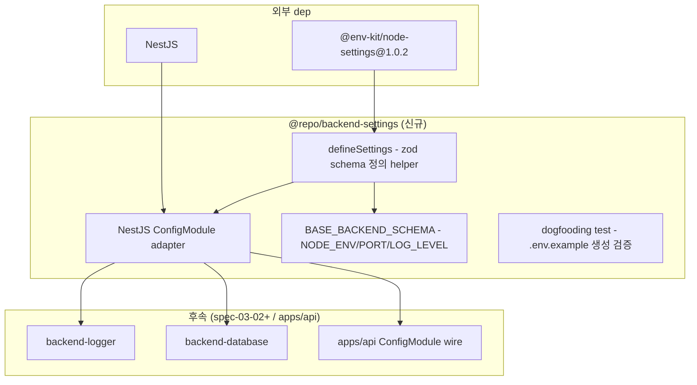

# spec-03-01: `@repo/backend-settings` — `@env-kit/node-settings` wrap + NestJS ConfigModule

## 📋 메타

| 항목 | 값 |
|---|---|
| **Spec ID** | `spec-03-01` |
| **Phase** | `phase-03` (Backend Foundation, Phase Base Branch 모드) |
| **Branch** | `spec-03-01-backend-settings` |
| **PR Target** | `phase-03-backend-foundation` (Phase base branch, 첫 ship 시 자동 생성) |
| **상태** | Planning |
| **타입** | Feature |
| **Integration Test Required** | no |
| **작성일** | 2026-05-18 |
| **소유자** | dennis |

## 📋 배경 및 문제 정의

### 현재 상황

- phase-02 (Shared Primitives) 완료. `@repo/utils` / `@repo/errors` / `@repo/validation` / `@repo/contracts` / `@repo/auth-contracts` 박힘.
- **ADR-0005 Accepted** (spec-x-auth-foundation-prep): NestJS + Drizzle. 본 phase-03 진입 가능.
- phase-03 *non-auth 기반*. 7 spec 중 첫 spec.
- `packages/backend/settings`는 *다른 모든 backend 패키지가 의존하는 기반* — env validation + runtime config + dogfooding 차별화 포인트.
- **`@env-kit/node-settings@1.0.2`** npm 발행되어있음 (사용자 본인 라이브러리). Schema-first (Zod) + cascading config + monorepo extends + `.env.example` / Markdown docs / Kubernetes manifest 생성 + CLI 제공.
- memory `project_boilerplate_locked_stack`: *"backend/settings 하나로 통합하고 안에서 `@env-kit/node-settings`를 dep으로 받아 wrap (dogfooding)"*.

### 문제점

1. **직접 `process.env` 접근의 위험**: typed 검증 없이 env 사용 → 런타임 실패 위험 + 개발자가 *어떤 env가 있는지 모름*.
2. **env 문서화 부담**: `.env.example` 수동 작성 → 실제 env와 drift → onboarding 비용.
3. **K8s manifest drift**: settings schema vs ConfigMap/Secret manifest 불일치 → 배포 후 fail.
4. **NestJS ConfigModule과의 통합**: NestJS 기본 ConfigModule은 *zod-first가 아님*. zod schema 기반 type-safe config 주입 패턴 필요.
5. **monorepo 컨벤션**: `apps/api`만 settings 쓰는 게 아니라 phase-09 `apps/worker` / `apps/admin` 등이 *동일 패턴* 따라야 함. wrap이 *컨벤션 강제*.

### 해결 방안 (요약)

`packages/backend/settings` 신규 패키지 (`@repo/backend-settings`):

1. **`@env-kit/node-settings` wrap** — runtime config loader + zod schema 정의 helper.
2. **NestJS ConfigModule adapter** — `BackendSettingsModule.forRoot(schema)` 패턴. `@Inject(BACKEND_SETTINGS)` decorator로 typed config 주입.
3. **표준 schema 부분** — backend 공통 env (NODE_ENV / PORT / LOG_LEVEL 등) base schema.
4. **dogfooding 검증 1건**: `.env.example` 자동 생성 동작 확인 (test에서 generator 호출 + output 검증).
5. **K8s manifest drift 검출 / Markdown docs 자동 생성은 본 spec scope 밖** — 후속 spec(spec-03-02 또는 phase-10 Ops)에서.

## 📊 개념도

## 🎯 요구사항

### Functional Requirements

1. **`packages/backend/settings` 신규 패키지** (`@repo/backend-settings`):
   - scaffold (package.json / tsconfig.json / vitest.config.ts) — phase-02 패턴 답습 (단, DOM lib는 *불필요* — backend Node-only).
   - `dependencies`: `@env-kit/node-settings: catalog:` + `@nestjs/common` + `@nestjs/config` + `zod: catalog:`.
   - `devDependencies`: 표준 (@repo/biome-config / typescript-config / vitest-config + biome / typescript / vitest).

2. **catalog 추가**: `pnpm-workspace.yaml`의 `catalog:`에 `@env-kit/node-settings: ^1.0.2` + NestJS 관련 (`@nestjs/common` / `@nestjs/config` / `@nestjs/core` / `reflect-metadata` / `rxjs`) 등록 — 후속 backend 패키지가 동일 catalog 사용.

3. **`defineSettings(schema)` helper**:
   - `@env-kit/node-settings`의 schema 정의 패턴 wrap
   - zod schema 받아 *typed config 객체* 반환
   - 검증 실패 시 `AppError({ code: "VALIDATION", details })` throw (ADR-0009/0010 일관)

4. **`BackendSettingsModule.forRoot(schema)` NestJS adapter**:
   - NestJS `DynamicModule` 패턴
   - `BACKEND_SETTINGS` injection token 제공
   - `@Inject(BACKEND_SETTINGS) settings: T` 형태로 주입

5. **`BaseBackendSchema` 표준 schema 일부**:
   - `NODE_ENV: z.enum(["development", "test", "staging", "production"])`
   - `PORT: z.coerce.number().int().min(1).max(65535).default(3000)`
   - `LOG_LEVEL: z.enum(["trace", "debug", "info", "warn", "error", "fatal"]).default("info")`
   - 사용자 schema와 *merge* 패턴 — 호출자가 `defineSettings(BaseBackendSchema.merge(userSchema))` 사용

6. **dogfooding test 1건**:
   - test에서 sample schema 정의
   - `@env-kit/node-settings` CLI 또는 API로 `.env.example` 문자열 생성
   - 출력에 정의된 모든 env key 포함 확인

7. **단위 테스트**: ~6 test 예상 (defineSettings 성공/실패 / Module instantiation / BaseBackendSchema valid/invalid / dogfooding 1).

### Non-Functional Requirements

1. **`@env-kit/node-settings` + NestJS + zod 외 런타임 의존성 0**.
2. **DOM lib 미포함** — backend Node-only.
3. **catalog 통일**: 후속 backend 패키지가 동일 NestJS / `@env-kit/node-settings` 버전 사용.
4. **NestJS Module 컨벤션**: `BackendSettingsModule` 이름 + `.forRoot(schema)` static method (NestJS 표준 패턴).
5. **direct `process.env` 접근 금지** (memory `project_boilerplate_locked_stack` §How to apply).

## 🚫 Out of Scope

- **K8s manifest drift 검출 dogfooding** — `@env-kit/node-settings`의 K8s manifest 생성 기능을 *실제 K8s manifest와 diff*하는 검증은 후속 spec 또는 phase-10 (Ops & Tooling).
- **Markdown docs 자동 생성** — 동일 이유로 후속.
- **CI/CD에서 .env.example drift 검출** — phase-11 CI/CD.
- **apps/api wire-up** — spec-03-07 (apps-api-scaffold)에서 본 패키지 사용.
- **logger / database / observability schema** — 각 후속 spec(spec-03-02/04/05)에서 본 패키지 사용 + 자체 schema 정의.
- **secret 관리** (Vault / AWS Secrets Manager) — `@env-kit/node-settings` API에 포함되어 있으면 활용, 아니면 phase-09 admin.
- **dynamic config reload** — 본 spec은 *startup 시점 load*만.

## 📑 ADR 후보

> 본 SPEC의 결정 중 *장기 자산* 으로 박을 가치 있는 것이 있는가?

- [ ] ADR 가치 있는 결정 있음
- [x] **없음** — 본 spec은 *결정 적용*만. `@env-kit/node-settings` 채택은 memory `project_boilerplate_locked_stack`에 박혀있고 ADR-0005는 NestJS + Drizzle만 결정. 본 spec은 wrap 패턴 적용 + NestJS adapter — *컨벤션 자체*는 후속 spec(logger / database 등)에서 *반복*되면 그때 ADR로 격상.

**근거**:
- `defineSettings` / `BackendSettingsModule` 패턴은 *NestJS + zod 통합의 표준* — 결정 부담 작음.
- 단, *후속 spec에서 동일 패턴이 반복*되면 ADR로 격상 가능 (예: spec-03-02 backend-logger가 `defineLoggerSettings` 같은 패턴 만들면).

## 🔍 Critique 결과 (선택)

미실행. 본 spec은 *어휘 적용*이라 결정 부담 작음.

## ✅ Definition of Done

- [ ] `packages/backend/settings` 신규 패키지 scaffold
- [ ] `@env-kit/node-settings` catalog 추가 + NestJS 관련 catalog 추가
- [ ] `defineSettings` helper + `BackendSettingsModule.forRoot()` + `BaseBackendSchema` 구현
- [ ] `pnpm test` 그린 (~6 test 추가)
- [ ] `pnpm lint` / `pnpm typecheck` 그린
- [ ] depcruise violation 0건 유지
- [ ] `walkthrough.md` / `pr_description.md` ship commit
- [ ] `spec-03-01-backend-settings` 브랜치 push
- [ ] PR 생성 (base = `phase-03-backend-foundation` — 첫 ship 시 자동 생성)
- [ ] 사용자 알림
