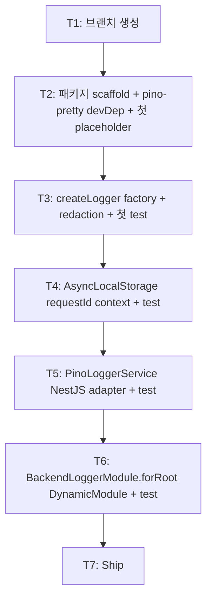

# Implementation Plan: spec-03-02

## 📋 Branch Strategy

- 신규 브랜치: `spec-03-02-backend-logger`
- 시작 지점: `phase-03-backend-foundation` (Phase Base Branch 모드 — main 아님)
- 첫 task가 브랜치 생성
- **PR Target**: `phase-03-backend-foundation`

## 🛑 사용자 검토 필요 (User Review Required)

> [!IMPORTANT]
> - [ ] **pino + AsyncLocalStorage 조합**: Node 16+ 표준 API. `pino.child({ reqId })`를 *함수 인자 통과* 없이 호출자 컨텍스트에서 자동 적용.
> - [ ] **`pino-pretty` peer/optional**: dev에서만 dynamic load. prod bundle에서 제외 가능 (사용자가 prod에서 안 설치 가능).
> - [ ] **기본 redaction 6 paths** (password / token / authorization / cookie / secret / api_key): 산업 표준 + 사용자 추가 가능.
> - [ ] **NestJS adapter 패턴 spec-03-01 답습**: 객체 리터럴 DynamicModule + symbol injection token. 3 spec 반복 후 ADR 격상 검토.

> [!WARNING]
> - [ ] **시작 지점이 main이 아닌 phase branch** — Phase Base Branch 모드 일관.
> - [ ] **`@repo/backend-settings` workspace dep** — spec-03-01의 BaseBackendSchema.LOG_LEVEL 직접 활용.

## 🎯 핵심 전략 (Core Strategy)

### 아키텍처 컨텍스트



### 주요 결정

| 컴포넌트 | 전략 | 이유 |
|:---:|:---|:---|
| Logger 라이브러리 | pino | catalog locked (ADR-0002) |
| Pretty printer | pino-pretty (devDep, dynamic load) | prod bundle 제외 가능 + dev human-readable |
| request-id 생성 | `crypto.randomUUID()` (Node 표준) | 외부 dep 0. ULID 등 *후속*에서 검토 |
| context propagation | AsyncLocalStorage | Node 16+ 표준. 함수 인자 통과 안 함 |
| header 이름 | `X-Request-Id` | 산업 표준 (Stripe / Heroku / Cloudflare 등) |
| redaction 기본 paths | 6 (password / token / authorization / cookie / secret / api_key) | 산업 표준 OWASP |
| NestJS adapter | DynamicModule 객체 리터럴 + symbol token | spec-03-01 패턴 답습 |
| `BackendLoggerModule` global | yes | 모든 backend service에서 inject 가능해야 함 |
| ADR 시점 | 없음 (3 spec 패턴 반복 후 검토) | YAGNI |

### 📑 ADR 후보

- [ ] 없음 (본 spec은 결정 적용)

## 📂 Proposed Changes

### `packages/backend/logger/package.json` (신규)

```json
{
  "name": "@repo/backend-logger",
  "dependencies": {
    "@nestjs/common": "catalog:",
    "@repo/backend-settings": "workspace:*",
    "@repo/errors": "workspace:*",
    "pino": "catalog:",
    "reflect-metadata": "catalog:"
  },
  "devDependencies": {
    "@types/node": "catalog:",
    "pino-pretty": "^11.x.x",  // T2 정찰에서 최신 버전 확정
    ...
  },
  "peerDependenciesMeta": {
    "pino-pretty": { "optional": true }
  }
}
```

### `src/index.ts` 핵심 구조

```ts
import { AsyncLocalStorage } from "node:async_hooks";
import { randomUUID } from "node:crypto";
import pino, { type Logger, type LoggerOptions } from "pino";

// === 1. createLogger factory ===
export const DEFAULT_REDACT_PATHS = [
  "password", "*.password",
  "token", "*.token",
  "authorization", "headers.authorization",
  "cookie", "headers.cookie",
  "secret", "*.secret",
  "api_key", "apiKey", "*.api_key", "*.apiKey",
];

export interface CreateLoggerOptions {
  level: "trace" | "debug" | "info" | "warn" | "error" | "fatal";
  redact?: string[];
  pretty?: boolean;
}

export const createLogger = (options: CreateLoggerOptions): Logger => {
  const redact = [...DEFAULT_REDACT_PATHS, ...(options.redact ?? [])];
  const transport = options.pretty
    ? { target: "pino-pretty", options: { colorize: true } }
    : undefined;
  return pino({ level: options.level, redact, ...(transport && { transport }) });
};

// === 2. AsyncLocalStorage context ===
const als = new AsyncLocalStorage<{ requestId: string }>();

export const runWithRequestId = <T>(requestId: string, fn: () => T): T =>
  als.run({ requestId }, fn);

export const getCurrentRequestId = (): string | undefined =>
  als.getStore()?.requestId;

export const generateRequestId = (): string => randomUUID();

// === 3. requestIdMiddleware (Express/Fastify 호환) ===
export interface RequestIdMiddlewareOptions {
  header?: string;  // default "X-Request-Id"
}

export const requestIdMiddleware = (opts: RequestIdMiddlewareOptions = {}) => {
  const header = opts.header ?? "X-Request-Id";
  return (req: { headers: Record<string, unknown> }, _res: unknown, next: () => void) => {
    const incoming = req.headers[header.toLowerCase()];
    const requestId =
      typeof incoming === "string" && incoming.length > 0
        ? incoming
        : generateRequestId();
    als.run({ requestId }, next);
  };
};

// === 4. PinoLoggerService (NestJS LoggerService impl) ===
import type { LoggerService } from "@nestjs/common";

export class PinoLoggerService implements LoggerService {
  constructor(private readonly logger: Logger) {}

  private withReqId(context?: string) {
    const reqId = getCurrentRequestId();
    return this.logger.child({ ...(context && { context }), ...(reqId && { reqId }) });
  }

  log(message: unknown, context?: string) { this.withReqId(context).info(message); }
  error(message: unknown, trace?: string, context?: string) {
    this.withReqId(context).error({ trace }, String(message));
  }
  warn(message: unknown, context?: string) { this.withReqId(context).warn(message); }
  debug(message: unknown, context?: string) { this.withReqId(context).debug(message); }
  verbose(message: unknown, context?: string) { this.withReqId(context).trace(message); }
  fatal(message: unknown, context?: string) { this.withReqId(context).fatal(message); }
}

// === 5. BackendLoggerModule DynamicModule ===
export const BACKEND_LOGGER = Symbol("BACKEND_LOGGER");

export const BackendLoggerModule = {
  forRoot(options: CreateLoggerOptions) {
    const logger = createLogger(options);
    const service = new PinoLoggerService(logger);
    return {
      module: BackendLoggerModule,
      providers: [
        { provide: BACKEND_LOGGER, useValue: logger },
        { provide: PinoLoggerService, useValue: service },
      ],
      exports: [BACKEND_LOGGER, PinoLoggerService],
      global: true,
    };
  },
};
```

## 🧪 검증 계획 (Verification Plan)

### 단위 테스트 (~10)

```bash
pnpm --filter @repo/backend-logger test
```

기대:
- `createLogger`: level 적용 / redaction 동작 (password masking) / dev pretty option (3 test)
- AsyncLocalStorage: runWithRequestId / getCurrentRequestId / 외부 컨텍스트 undefined (3 test)
- `requestIdMiddleware`: header 사용 / 미존재 시 generate / 내부에서 getCurrentRequestId 접근 가능 (2 test)
- `PinoLoggerService`: NestJS 메서드 6개 호출 동작 (1 test로 묶음 — pino mock)
- `BackendLoggerModule.forRoot()`: DynamicModule 구조 (1 test)

### 통합 테스트

해당 없음. spec-03-07 apps/api scaffold에서 wire-up 검증.

### 수동 검증

1. **redaction 동작**:
   ```ts
   const logger = createLogger({ level: "info" });
   logger.info({ password: "secret123", user: "alice" });
   // → JSON에서 password 값 "[Redacted]"
   ```
2. **AsyncLocalStorage 전파**:
   ```ts
   runWithRequestId("abc-123", () => {
     someInnerFunction(); // 내부에서 getCurrentRequestId() === "abc-123"
   });
   ```

## 🔁 Rollback Plan

- 패키지 revert. 후속 spec(03-03/05/07) 진입 전이면 ripple 없음.

## 📦 Deliverables 체크

- [ ] task.md 작성 (다음 단계)
- [ ] 사용자 Plan Accept
- [ ] (실행 후) 패키지 + 5 핵심 export (createLogger / runWithRequestId / requestIdMiddleware / PinoLoggerService / BackendLoggerModule)
- [ ] (실행 후) ~10 test
- [ ] (실행 후) walkthrough / pr_description ship
