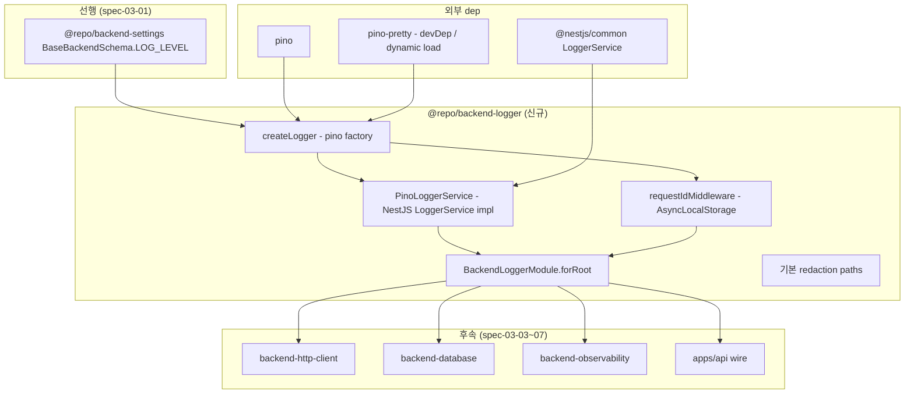

# spec-03-02: `@repo/backend-logger` — pino + request-id + redaction + NestJS interceptor

## 📋 메타

| 항목 | 값 |
|---|---|
| **Spec ID** | `spec-03-02` |
| **Phase** | `phase-03` (Backend Foundation, Phase Base Branch 모드) |
| **Branch** | `spec-03-02-backend-logger` |
| **PR Target** | `phase-03-backend-foundation` |
| **상태** | In Progress (Review 후 force-push) |
| **타입** | Feature |
| **Integration Test Required** | no |
| **작성일** | 2026-05-18 (2026-05-19 platform-agnostic 정정) |
| **소유자** | dennis |

> **2026-05-19 Scope 정정**: 본래 spec에 박힌 NestJS 어댑터 (`PinoLoggerService` / `BackendLoggerModule`)를 **별도 패키지 `@repo/backend-logger-nestjs`로 분리**. 사용자 발화 *"packages 에서는 어느 플렛폼에 붙을지는 몰라"* → memory `feedback_platform_agnostic_packages` 박힘. 본 spec scope = pure logger + NestJS 어댑터 (2 패키지).

## 📋 배경 및 문제 정의

### 현재 상황

- phase-03 spec-03-01 완료. `@repo/backend-settings`가 박힘 — `BaseBackendSchema.LOG_LEVEL` (pino 6단계) 제공.
- catalog에 `pino: ^10.3.1` 박혀있음 (phase-01부터 locked).
- ARCHITECTURE.md §2.3 / locked stack memory: *"Logger: pino"*. NestJS interceptor adapter는 본 spec scope.
- pino *직접 사용*은 흔하나 *boilerplate 컨벤션*(request-id 자동 부여 / secret redaction / dev pretty / production JSON)이 박혀야 *모든 backend 패키지가 동일 로그 형식* 보장.

### 문제점

1. **`console.log` / `process.stdout.write` 직접 사용**: 구조화 안 됨 + redaction 안 됨 + level filter 안 됨 → production 로그 품질 저하.
2. **request-id 부재**: 분산 로그(여러 request 동시 처리)에서 *trace 어려움*. 표준 패턴: 각 HTTP request에 unique ID 부여 + 모든 로그에 *자동 포함*.
3. **secret redaction**: password / token / authorization header가 *로그에 그대로 박히면* 보안 사고. pino redaction API 활용.
4. **dev vs production 출력**: dev는 *human-readable* (pino-pretty), production은 *JSON line* (수집 시스템 연동) — 환경별 자동 전환 컨벤션 필요.
5. **NestJS 통합**: NestJS는 기본 `LoggerService` interface 제공 — pino를 *adapter로 wrap*해서 `Logger.error()` 같은 NestJS 어휘로 호출 가능해야 함.

### 해결 방안 (요약)

**2 패키지 분리** (platform-agnostic 원칙):

**A. `@repo/backend-logger` (pure, framework agnostic)**:
1. **pino 인스턴스 factory** — `createLogger(options, destination?)` — pino 6단계 level + dev pretty + 기본 redaction paths.
2. **request-id middleware** — Node `crypto.randomUUID()` + AsyncLocalStorage로 *함수 호출 context 통과* 없이 reqId 접근. Express/Fastify/Hono 호환 (req.headers + next() 만 의존).
3. **export**: createLogger / DEFAULT_REDACT_PATHS / LogLevel / Logger (pino 재export) / runWithRequestId / getCurrentRequestId / generateRequestId / requestIdMiddleware. **NestJS 어휘 0**.

**B. `@repo/backend-logger-nestjs` (NestJS 어댑터)**:
1. **NestJS LoggerService adapter** — `PinoLoggerService implements LoggerService`로 NestJS *6 log method*을 pino로 전달.
2. **NestJS module** — `BackendLoggerModule.forRoot(options)` DynamicModule (객체 리터럴 + `BACKEND_LOGGER` symbol injection token).
3. **의존**: `@repo/backend-logger` (workspace) + `@nestjs/common` (catalog). 다른 framework (Fastify/Hono) 어댑터 필요 시 동일 패턴 별도 패키지.

## 📊 개념도

## 🎯 요구사항

### Functional Requirements

1. **`packages/backend/logger` 신규 패키지** (`@repo/backend-logger`, **pure**):
   - scaffold (package.json / tsconfig.json (types: ["node"]) / vitest.config.ts)
   - `dependencies`: `pino: catalog:` **만** (framework dep 0)
   - `devDependencies`: 표준 + `@types/node: catalog:` + `pino-pretty: catalog:`
   - `pino-pretty`는 *peer / optional* — dev에서만 dynamic require, prod에서는 부재 가능

2. **`createLogger(options, destination?)` factory**:
   - 시그니처: `createLogger({ level, redact?, pretty? }, destination?): Logger`
   - `level`: pino 6단계 (`trace` / `debug` / `info` / `warn` / `error` / `fatal`)
   - `redact`: 기본 paths 14개 (`DEFAULT_REDACT_PATHS`) 자동 적용 + 사용자 추가
   - `pretty`: true → pino-pretty transport (dev)
   - `destination`: 옵셔널 pino DestinationStream — test 캡처 / 후속 OTel transport 연계

3. **request-id middleware + AsyncLocalStorage context**:
   - `requestIdMiddleware({ header? })`: Express/Fastify/Hono 호환. `X-Request-Id` (case-insensitive) header 존재 시 사용, 없으면 `crypto.randomUUID()`.
   - `runWithRequestId(id, fn)`: AsyncLocalStorage로 context 통과 없이 *내부 함수에서 getCurrentRequestId()* 호출 가능.
   - `getCurrentRequestId(): string | undefined` — context 외부에서는 undefined.
   - `generateRequestId(): string` — `crypto.randomUUID()` 직접 호출.

4. **`packages/backend/logger-nestjs` 신규 어댑터 패키지** (`@repo/backend-logger-nestjs`):
   - scaffold (package.json / tsconfig.json (decorators + node types) / vitest.config.ts)
   - `dependencies`: `@nestjs/common: catalog:` + `@repo/backend-logger: workspace:*` + `pino: catalog:` (Logger 타입) + `reflect-metadata: catalog:`

5. **`PinoLoggerService` (NestJS LoggerService impl)** — 어댑터 패키지 안:
   - `log` / `error` / `warn` / `debug` / `verbose` / `fatal` 6 method
   - context 인자 → pino `child({ context })`
   - `getCurrentRequestId()` 자동 attach (값 있을 때만)

6. **`BackendLoggerModule.forRoot(options)` NestJS adapter** — 어댑터 패키지 안:
   - DynamicModule 객체 리터럴
   - `BACKEND_LOGGER` symbol injection token
   - global module

7. **단위 테스트**: ~11 test (logger 7 + logger-nestjs 4).

### Non-Functional Requirements

1. **`pino` + NestJS + `@repo/backend-settings` 외 런타임 의존성 0**.
2. **`pino-pretty`는 *optional* / dev에서만**: prod bundle에서 *제외 가능* — `try/catch dynamic import` 패턴.
3. **DOM lib 미포함** — backend Node-only.
4. **performance**: pino는 *zero-cost when disabled* — level 필터 작동 검증.
5. **redaction**: 기본 paths 6개 + 사용자 추가 가능.

## 🚫 Out of Scope

- **로그 수집 / 전송** (Datadog / Loki / CloudWatch) — phase-10 Ops에서.
- **OTel trace correlation** — phase-03 spec-03-05 (observability)에서 *trace_id + span_id 자동 attach*.
- **log sampling / rate-limit** — phase-09+ 운영 시점에 필요 시.
- **structured query syntax** (예: GraphQL log query) — out of scope.
- **frontend logger** — frontend는 별도 (phase-04+).
- **direct file logging** — pino transport로 stdout만 (수집은 외부 도구).

## 📑 ADR 후보

- [ ] ADR 가치 있는 결정 있음
- [x] **없음** — 본 spec은 *결정 적용*. pino 채택은 memory + ADR-0002에 박혀있음. NestJS adapter 패턴은 spec-03-01에서 박힌 패턴 반복 (객체 리터럴 + symbol token). 같은 패턴이 *3 spec 반복*되면 ADR 격상 후보 (phase-03 중후반).

## 🔍 Critique 결과 (선택)

미실행.

## ✅ Definition of Done

- [x] `packages/backend/logger` 신규 패키지 scaffold (**pure, framework-agnostic**)
- [x] `createLogger` + redaction + pretty option + destination 인자
- [x] `requestIdMiddleware` + `runWithRequestId` + `getCurrentRequestId` AsyncLocalStorage 패턴
- [x] `packages/backend/logger-nestjs` 어댑터 패키지 scaffold
- [x] `PinoLoggerService` NestJS LoggerService impl — *어댑터 패키지 안*
- [x] `BackendLoggerModule.forRoot()` DynamicModule — *어댑터 패키지 안*
- [x] `pnpm test` 그린 (11 test: logger 7 + logger-nestjs 4)
- [x] `pnpm lint` / `pnpm typecheck` 그린
- [x] depcruise violation 0건 (41 modules / 53 deps)
- [ ] `walkthrough.md` / `pr_description.md` ship commit (정정 반영)
- [ ] PR #10 force-push (또는 정정 commit)
- [ ] 사용자 알림
