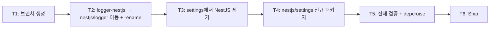

# Implementation Plan: spec-03-03

## 📋 Branch Strategy

- 신규 브랜치: `spec-03-03-relocate-nestjs-adapters`
- 시작 지점: `phase-03-backend-foundation` (sync 완료 — main의 ADR-0015 룰 박혀있음, c0da559)
- 첫 task가 브랜치 생성
- **PR Target**: `phase-03-backend-foundation`

## 🛑 사용자 검토 필요 (User Review Required)

> [!IMPORTANT]
> - [x] **API 변경 0**: 본 spec은 *재배치 + rename* 만. `createLogger` / `defineSettings` / `BackendSettingsModule.forRoot` 등 모든 export 시그니처 그대로 — *use sites 영향 없음* (현재 use sites 없음, 후속 spec/apps 진입 시 새 import path 사용).
> - [x] **두 패키지 작업 한 spec에 통합**: spec-03-01 settings 정정 + spec-03-02 logger 이동을 한 spec에서. 이유: 같은 ADR-0015 적용 + scope 일관 (platform-agnostic 정정).

> [!WARNING]
> - [x] **lockfile 갱신**: 패키지 이름 / 위치 변경 → pnpm-lock.yaml 대규모 변경. PR diff에서 크게 보일 수 있음.
> - [x] **NestJS dep 이동 (settings)**: `@nestjs/common` / `@nestjs/core` / `@nestjs/testing` / `reflect-metadata` / `rxjs` 가 `@repo/backend-settings` → `@repo/nestjs-settings` 로 이동. allowBuilds 설정은 그대로 유지.

## 🎯 핵심 전략 (Core Strategy)

### 아키텍처 컨텍스트



### 주요 결정

| 컴포넌트 | 전략 | 이유 |
|:---:|:---|:---|
| 작업 단위 | 한 spec에 logger 이동 + settings 정정 | ADR-0015 적용 일관 + 사용자 합의 *"본 phase 안에서"* |
| 디렉토리 이동 | `git mv` | history 보존 (diff에서 *이동* 으로 인식) |
| 패키지 rename | package.json `name` + 모든 import grep | 한 commit에 *atomic* — 부분 적용 시 깨짐 |
| `BackendSettingsModule` 이동 | 코드 그대로 + dep 이동 | 본 spec은 *재배치*. 동작 변경 0. |
| settings tsconfig | decorator 옵션 제거 (pure에서 불필요) | NestJS decorator 사용 안 함 → cleanup |
| depcruise | 룰 그대로 (PR #11) + 0 violations 기대 | 본 spec ship 후 *임시 위반 해소* — 룰이 즉시 정적 보장 |
| test 이동 | 재작성 없음, 원본 그대로 | rollback 용이 + diff 최소 |
| 우선순위 | T2 logger 먼저 / T3-T4 settings | logger는 *이동만* (간단) — 검증 후 settings 진입 |

### 📑 ADR 후보

- [x] **없음** — 본 spec은 ADR-0015 적용. 추가 ADR 가치 없음.

## 📂 Proposed Changes

### `packages/backend/logger-nestjs/` → `packages/nestjs/logger/` (이동)

#### [MOVE] 전체 디렉토리

```bash
mkdir -p packages/nestjs
git mv packages/backend/logger-nestjs packages/nestjs/logger
```

#### [MODIFY] `packages/nestjs/logger/package.json`

```diff
{
-  "name": "@repo/backend-logger-nestjs",
+  "name": "@repo/nestjs-logger",
   ...
}
```

`dependencies` / `devDependencies` 그대로 유지.

#### [GREP] import / workspace dep 갱신

```bash
grep -rn "@repo/backend-logger-nestjs" --include='*.ts' --include='*.tsx' --include='*.json' packages/ apps/ 2>/dev/null
# 발견되면 일괄 치환 → @repo/nestjs-logger
# 본 spec 시점에 use sites 없을 가능성 높음 (apps/api 미존재)
```

### `packages/backend/settings/` (정정 — NestJS 제거)

#### [MODIFY] `packages/backend/settings/src/index.ts`

```diff
- export const BACKEND_SETTINGS = Symbol("BACKEND_SETTINGS");
- export const BackendSettingsModule = {
-   forRoot<TSettings>(loader, env?) { ... },
- };
```

#### [MODIFY] `packages/backend/settings/src/index.test.ts`

```diff
- describe("BackendSettingsModule", () => { /* 2 test */ });
```

#### [MODIFY] `packages/backend/settings/package.json`

```diff
{
   "dependencies": {
-    "@nestjs/common": "catalog:",
     "@env-kit/node-settings": "catalog:",
     "@repo/errors": "workspace:*",
     "@repo/utils": "workspace:*",
-    "reflect-metadata": "catalog:",
-    "rxjs": "catalog:",
     "zod": "catalog:"
   },
   "devDependencies": {
     ...
-    "@nestjs/core": "catalog:",
-    "@nestjs/testing": "catalog:",
     ...
   }
}
```

> [!NOTE]
> `reflect-metadata` / `rxjs` 도 NestJS 전용 — 제거 검증 필요 (사용 site grep). 안 쓰이면 제거.

#### [MODIFY] `packages/backend/settings/tsconfig.json`

```diff
{
   "compilerOptions": {
-    "experimentalDecorators": true,
-    "emitDecoratorMetadata": true,
     "types": ["node"]
   }
}
```

### `packages/nestjs/settings/` (신규)

#### [NEW] `packages/nestjs/settings/package.json`

```json
{
  "name": "@repo/nestjs-settings",
  "version": "0.0.0",
  "private": true,
  "type": "module",
  "exports": { ... },
  "scripts": { ... },
  "dependencies": {
    "@nestjs/common": "catalog:",
    "@repo/backend-settings": "workspace:*",
    "reflect-metadata": "catalog:"
  },
  "devDependencies": {
    "@biomejs/biome": "catalog:",
    "@nestjs/core": "catalog:",
    "@nestjs/testing": "catalog:",
    "@repo/biome-config": "workspace:*",
    "@repo/typescript-config": "workspace:*",
    "@repo/vitest-config": "workspace:*",
    "@types/node": "catalog:",
    "rxjs": "catalog:",
    "typescript": "catalog:",
    "vitest": "catalog:"
  }
}
```

#### [NEW] `packages/nestjs/settings/tsconfig.json`

```json
{
  "extends": "@repo/typescript-config/base",
  "compilerOptions": {
    "experimentalDecorators": true,
    "emitDecoratorMetadata": true,
    "types": ["node"]
  },
  "include": ["src/**/*.ts"]
}
```

#### [NEW] `packages/nestjs/settings/src/index.ts`

`BACKEND_SETTINGS` + `BackendSettingsModule.forRoot()` 이동. 단, *generic loader 시그니처 보존*.

#### [NEW] `packages/nestjs/settings/src/index.test.ts`

기존 `BackendSettingsModule` test 2개 이동.

## 🧪 검증 계획 (Verification Plan)

### 단위 테스트

```bash
pnpm install                                                              # lockfile 갱신
pnpm --filter @repo/backend-logger test                                  # 7 test (변경 없음)
pnpm --filter @repo/nestjs-logger test                                   # 4 test (이동)
pnpm --filter @repo/backend-settings test                                # 6 test (BackendSettingsModule 2개 제거)
pnpm --filter @repo/nestjs-settings test                                 # 2 test (이동)
```

총 19 test (이전 19 test 동일, 위치만 이동).

### 통합 검증

```bash
pnpm lint && pnpm typecheck && pnpm test                                 # 전체 그린
pnpm exec depcruise --config packages/config/depcruise-config/base.cjs packages/
# 기대: 0 violations (41 modules / 53 deps — logger-nestjs 이름만 바뀌므로 module 수 동일)
```

### 수동 검증

1. `grep -rn "@nestjs" packages/backend/ --include='*.json' --include='*.ts'` → **0 hit**
2. `grep -rn "BACKEND_SETTINGS\|BackendSettingsModule" packages/backend/ --include='*.ts'` → **0 hit**
3. `ls packages/backend/logger-nestjs/ 2>&1` → "No such file or directory"
4. `ls packages/nestjs/logger/ packages/nestjs/settings/` → 정상 디렉토리

## 🔁 Rollback Plan

- 본 spec은 *재배치 + rename*. revert 시 git history (이동 추적) 로 즉시 복구 가능.
- 후속 spec (03-04 http-client 등) 이 본 spec의 새 import path 의존 안 함 (use sites 0) — rollback 시 ripple 없음.

## 📦 Deliverables 체크

- [ ] task.md 작성 (다음 단계)
- [ ] 사용자 Plan Accept
- [ ] (실행 후) `packages/nestjs/logger/` + `packages/nestjs/settings/` 존재
- [ ] (실행 후) `packages/backend/settings/` 에 NestJS 흔적 0
- [ ] (실행 후) test 19 (7 + 4 + 6 + 2) 그린
- [ ] (실행 후) depcruise 0 violations
- [ ] (실행 후) walkthrough / pr_description ship
