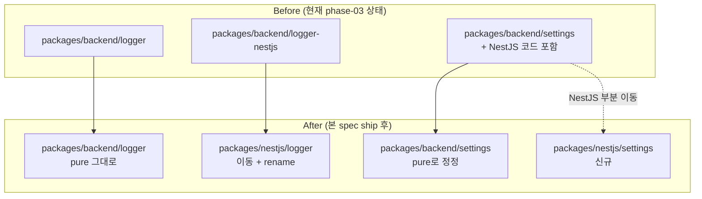

# spec-03-03: NestJS 어댑터 재배치 — `nestjs/logger` + `nestjs/settings` 신규 카테고리 적용

## 📋 메타

| 항목 | 값 |
|---|---|
| **Spec ID** | `spec-03-03` |
| **Phase** | `phase-03` (Backend Foundation, Phase Base Branch 모드) |
| **Branch** | `spec-03-03-relocate-nestjs-adapters` |
| **PR Target** | `phase-03-backend-foundation` |
| **상태** | Planning |
| **타입** | Refactor (ADR-0015 적용 — 코드 이동/rename + spec-03-01 정정) |
| **Integration Test Required** | no |
| **작성일** | 2026-05-19 |
| **소유자** | dennis |

## 📋 배경 및 문제 정의

### 현재 상황

ADR-0015 채택 (PR #11 머지) 후 main 룰을 phase-03-backend-foundation 브랜치에 sync 완료 (`c0da559`).

phase-03 현재 *임시 위반* 상태:

1. **`@repo/backend-logger-nestjs`** (`packages/backend/logger-nestjs/`) — spec-03-02에서 박힌 suffix 패턴, ADR-0015 위반
2. **`@repo/backend-settings`** (`packages/backend/settings/`) 안에 `BackendSettingsModule` / `BACKEND_SETTINGS` / `@nestjs/common` dep — spec-03-01에서 박힌 *packages/backend/* 안 NestJS 어휘*, ADR-0015 위반

### 문제점

1. 룰은 박혔으나 코드는 위반 상태 — 후속 backend 패키지 (spec-03-04~07) 진입 시 *같은 패턴 답습 위험*.
2. depcruise 룰은 *internal package 간 의존 방향*만 검증 — `packages/backend/*` 안에 `@nestjs/common` 외부 dep 박힌 건 직접 catch 못 함. *구조적 위반*은 본 spec에서 해소해야 함.
3. *boilerplate 단계 마무리* — 사용자 발화 *"아직 프로젝트 초기이고 룰이 없어서 그랬더라서 지금 재정의 하고 최적의 환경으로 반영하고"* — 본 spec이 그 마무리.

### 해결 방안 (요약)

**2 패키지 재배치 + 1 패키지 정정**:

| 변경 | 영향 |
|---|---|
| `packages/backend/logger-nestjs/` → `packages/nestjs/logger/` | dir 이동 |
| `@repo/backend-logger-nestjs` → `@repo/nestjs-logger` | pkg name rename + 모든 import 갱신 |
| `packages/backend/settings/`에서 NestJS 코드 제거 | `BackendSettingsModule` / `BACKEND_SETTINGS` / `@nestjs/common` dep / `@nestjs/core` 등 NestJS deps 모두 제거 |
| `packages/nestjs/settings/` 신규 패키지 | 제거한 NestJS 코드 + 신규 어댑터 책임 |

**테스트 이동**:
- `@repo/backend-logger` (pure): 7 test (변경 없음)
- `@repo/backend-logger-nestjs` 4 test → `@repo/nestjs-logger` 4 test (이동)
- `@repo/backend-settings` 8 test → 6 test (`BackendSettingsModule` 2개 제거)
- `@repo/nestjs-settings` 2 test (이동)

## 📊 개념도

## 🎯 요구사항

### Functional Requirements

1. **`packages/backend/logger-nestjs/` → `packages/nestjs/logger/` 이동**:
   - 디렉토리 이동 (`git mv`)
   - `package.json` name: `@repo/backend-logger-nestjs` → `@repo/nestjs-logger`
   - 내부 import / workspace dep 일괄 grep & update
   - test 그대로 (4 test, 코드는 본질 동일)

2. **`@repo/backend-settings` 에서 NestJS 코드 제거**:
   - `BACKEND_SETTINGS` symbol 제거
   - `BackendSettingsModule.forRoot()` 제거
   - `dependencies` 에서 `@nestjs/common` 제거
   - `devDependencies` 에서 `@nestjs/core` / `@nestjs/testing` / `reflect-metadata` / `rxjs` 제거 (NestJS 전용)
   - `tsconfig.json` 의 `experimentalDecorators` / `emitDecoratorMetadata` 제거 (decorator는 NestJS 전용)
   - test 2개 제거 (BackendSettingsModule 관련) → 6 test 남음

3. **`packages/nestjs/settings/` 신규 어댑터 패키지**:
   - scaffold (package.json / tsconfig.json / vitest.config.ts)
   - deps: `@nestjs/common: catalog:` + `@repo/backend-settings: workspace:*` + `reflect-metadata: catalog:`
   - `BACKEND_SETTINGS` symbol + `BackendSettingsModule.forRoot(loader, env?)` 이동
   - test 2개 (이동)

4. **검증**:
   - `pnpm install` 정상
   - `pnpm lint` / `pnpm typecheck` / `pnpm test` 전체 그린
   - `pnpm exec depcruise --config packages/config/depcruise-config/base.cjs packages/` → 0 violations
   - 직접 검증: `packages/backend/*` 의 `package.json` 어디에도 `@nestjs/*` 없음

### Non-Functional Requirements

1. **기능 변경 0**: 본 spec은 *순수 재배치/rename* — API/동작 변경 없음.
2. **test 수 같음**: 11 (logger) + 8 (settings 본래) → 11 (logger) + 8 (settings: 6 pure + 2 nestjs) — *위치 이동만*.
3. **rollback 용이**: 코드 이동/rename — 단일 commit 또는 task 단위로 split하여 rollback 가능.

## 🚫 Out of Scope

- **신규 기능 추가**: 본 spec은 *재배치* 만.
- **API 변경**: `createLogger` / `defineSettings` / `BackendSettingsModule.forRoot` 등 모든 export signature 변경 0.
- **frontend adapter (react/*)**: 본 spec scope 밖 — phase-04+.
- **다른 framework adapter (fastify/* 등)**: 본 spec scope 밖.
- **`packages/shared/*` 도입**: 별 spec-x 추후.

## 📑 ADR 후보

- [x] **없음** — 본 spec은 ADR-0015 적용. 추가 ADR 가치 없음.

## ✅ Definition of Done

- [ ] `packages/nestjs/logger/` 존재 (이동 완료) + `@repo/nestjs-logger`
- [ ] `packages/backend/logger-nestjs/` 삭제됨
- [ ] `packages/nestjs/settings/` 신규 존재 + `@repo/nestjs-settings`
- [ ] `packages/backend/settings/` 에 NestJS 코드 / dep / decorator 흔적 0
- [ ] `pnpm install` 정상 + lockfile 갱신
- [ ] `pnpm lint` / `pnpm typecheck` / `pnpm test` 그린 (11 logger + 8 settings)
- [ ] `pnpm exec depcruise` 0 violations
- [ ] `walkthrough.md` / `pr_description.md` ship commit
- [ ] PR 생성 (base = `phase-03-backend-foundation`)
- [ ] 사용자 알림
