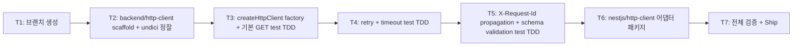

# Implementation Plan: spec-03-04

## 📋 Branch Strategy

- 신규 브랜치: `spec-03-04-backend-http-client`
- 시작 지점: `phase-03-backend-foundation` (spec-03-03 머지 + sync commit `457a4fc` 반영된 상태)
- 첫 task가 브랜치 생성
- **PR Target**: `phase-03-backend-foundation`

## 🛑 사용자 검토 필요 (User Review Required)

> [!IMPORTANT]
> - [x] **undici locked** (ADR-0002 catalog) — axios / got / ky 등 다른 옵션 *고려 안 함*.
> - [x] **AsyncLocalStorage reqId propagation 패턴 — backend-logger 의존**: `@repo/backend-http-client` → `@repo/backend-logger` workspace dep. 후속 spec (database / observability) 도 같은 패턴 답습 가능 — *3회 적용 후 ADR 격상 검토*.
> - [x] **ADR-0015 적용 일관**: pure (`backend/http-client`) + 어댑터 (`nestjs/http-client`) 분리 — spec-03-02 / spec-03-03 패턴 답습.

> [!WARNING]
> - [x] **retry 적용 범위**: idempotent methods (GET/PUT/DELETE/HEAD) 만 — POST/PATCH는 default 비-retry. POST를 retry 하려면 명시적 `retries` 옵션. 잘못 적용 시 *중복 결제* 같은 사고 위험.
> - [x] **`AppError` 도메인 코드 추가**: NETWORK / TIMEOUT / UPSTREAM / BAD_REQUEST / VALIDATION — 본 spec에서 *처음 박힘*. ADR-0009 (AppError 디자인) 일관 검증 필요.

## 🎯 핵심 전략 (Core Strategy)

### 아키텍처 컨텍스트



### 주요 결정

| 컴포넌트 | 전략 | 이유 |
|:---:|:---|:---|
| HTTP 라이브러리 | undici (locked) | ADR-0002 catalog locked / Node 진영 최고 성능 / Fetch API 호환 |
| undici primitive | `Pool` / `Agent` keepalive | 외부 API 호출 시 connection 재사용 — production 성능 |
| retry library | 자체 구현 (간단) | 외부 dep 0. exponential backoff 단순 — pino 식으로 inline |
| retry idempotent 룰 | GET / PUT / DELETE / HEAD만 default retry | RFC 9110 idempotent semantics. POST는 *명시적* `retries` 옵션 |
| timeout | `AbortController` | Node 표준 + undici 호환 |
| reqId propagation | `getCurrentRequestId()` (workspace dep `@repo/backend-logger`) | 패턴 일관 (AsyncLocalStorage) — *별도 ALS instance 만들지 않음* |
| schema validation | zod (optional `schema` 인자) | 외부 API response 신뢰 0 → zod parse로 *typed + 검증 동시* |
| AppError 코드 | NETWORK / TIMEOUT / UPSTREAM / BAD_REQUEST / VALIDATION | ADR-0009 일관. 4xx별 subdivide 없이 status 보존 |
| MockAgent (test) | undici 내장 `MockAgent` | 외부 dep 0 + undici native pattern |
| NestJS adapter | 객체 리터럴 DynamicModule (ADR-0015 패턴) | spec-03-02/03 답습 (3회째) — ADR-0015 confirm |
| HTTP_CLIENT 토큰 | symbol | NestJS 권장 + 유일성 |

### 📑 ADR 후보

- [ ] **부분 후보**: AsyncLocalStorage reqId propagation 패턴 (logger 외 http-client에 적용) — 후속 spec (database / observability) 1회 더 적용 시 ADR 격상.
- [x] **없음 (본 spec)** — 결정 적용.

## 📂 Proposed Changes

### `packages/backend/http-client/` (신규, pure)

```
packages/backend/http-client/
├── package.json
├── tsconfig.json   (types: ["node"])
├── vitest.config.ts
└── src/
    ├── index.ts
    └── index.test.ts
```

#### `package.json` 핵심:

```json
{
  "name": "@repo/backend-http-client",
  "dependencies": {
    "@repo/backend-logger": "workspace:*",
    "@repo/errors": "workspace:*",
    "undici": "catalog:",
    "zod": "catalog:"
  }
}
```

#### `src/index.ts` 핵심 구조:

```ts
import { getCurrentRequestId } from "@repo/backend-logger";
import { AppError } from "@repo/errors";
import { fetch, Pool } from "undici";
import type { ZodSchema } from "zod";

export interface CreateHttpClientOptions {
  baseUrl: string;
  timeoutMs?: number;        // default 10_000
  retries?: number;          // default 3
  retryBackoffMs?: number;   // default 100 (then *2, *4)
  headers?: Record<string, string>;
}

export interface HttpRequestOptions<TSchema extends ZodSchema = ZodSchema> {
  method: "GET" | "POST" | "PUT" | "DELETE" | "PATCH" | "HEAD";
  path: string;
  body?: unknown;
  headers?: Record<string, string>;
  schema?: TSchema;
  retries?: number;          // override per-request
  timeoutMs?: number;
}

export interface HttpClient {
  request<T>(opts: HttpRequestOptions): Promise<T>;
  get<T>(path: string, opts?: Partial<HttpRequestOptions>): Promise<T>;
  post<T>(path: string, body?: unknown, opts?: Partial<HttpRequestOptions>): Promise<T>;
  put<T>(path: string, body?: unknown, opts?: Partial<HttpRequestOptions>): Promise<T>;
  delete<T>(path: string, opts?: Partial<HttpRequestOptions>): Promise<T>;
  patch<T>(path: string, body?: unknown, opts?: Partial<HttpRequestOptions>): Promise<T>;
}

export const createHttpClient = (options: CreateHttpClientOptions): HttpClient => {
  // ... undici Pool + retry/timeout loop + reqId attach
};
```

### `packages/nestjs/http-client/` (신규, 어댑터)

```
packages/nestjs/http-client/
├── package.json
├── tsconfig.json   (decorators + node types)
├── vitest.config.ts
└── src/
    ├── index.ts
    └── index.test.ts
```

```ts
// src/index.ts
import { createHttpClient, type CreateHttpClientOptions, type HttpClient } from "@repo/backend-http-client";

export const HTTP_CLIENT = Symbol("HTTP_CLIENT");

export const HttpClientModule = {
  forRoot(options: CreateHttpClientOptions) {
    const client = createHttpClient(options);
    return {
      module: HttpClientModule,
      providers: [{ provide: HTTP_CLIENT, useValue: client }],
      exports: [HTTP_CLIENT],
      global: true,
    };
  },
};
```

## 🧪 검증 계획 (Verification Plan)

### 단위 테스트 (~12)

```bash
pnpm --filter @repo/backend-http-client test
pnpm --filter @repo/nestjs-http-client test
```

분포:
- `createHttpClient` (3): baseUrl 적용 / default headers / 기본 GET 성공
- `retry policy` (3): 5xx retry → 성공 / network error retry / max retries 초과 → AppError UPSTREAM
- `timeout` (2): 정상 응답 / timeout 시 AppError TIMEOUT
- `X-Request-Id propagation` (2): runWithRequestId 안에서 outbound header 자동 / 밖에서 header 없음
- `schema validation` (1): zod parse 성공 + 실패 시 AppError VALIDATION
- `HttpClientModule` (1, 어댑터): DynamicModule 구조

### 통합 검증

```bash
pnpm lint && pnpm typecheck && pnpm test
pnpm exec depcruise --config packages/config/depcruise-config/base.cjs packages/
# 기대: 0 violations (backend/* → nestjs/* 금지 등 ADR-0015 룰 유지)
```

### 수동 검증

```ts
// X-Request-Id propagation 실제 동작
import { runWithRequestId } from "@repo/backend-logger";
import { createHttpClient } from "@repo/backend-http-client";

const client = createHttpClient({ baseUrl: "https://example.com" });
await runWithRequestId("abc-123", async () => {
  await client.get("/api/test"); // outbound: X-Request-Id: abc-123
});
```

## 🔁 Rollback Plan

- 패키지 revert. 후속 spec(03-05/06/07) 진입 전이면 ripple 없음.
- nestjs-http-client는 의존 패키지 0 (현재 use sites 없음).

## 📦 Deliverables 체크

- [ ] task.md 작성 (다음 단계)
- [ ] 사용자 Plan Accept
- [ ] (실행 후) backend/http-client + nestjs/http-client 2 패키지
- [ ] (실행 후) ~12 test
- [ ] (실행 후) walkthrough / pr_description ship
