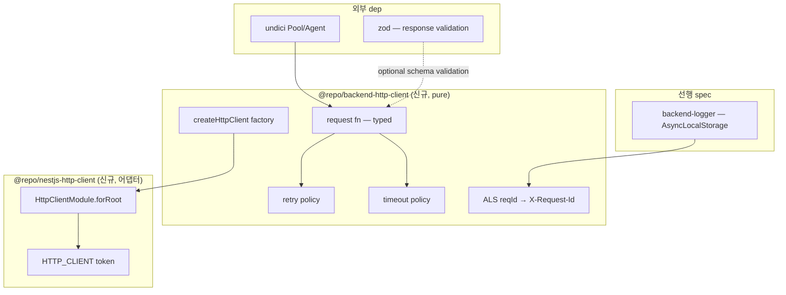

# spec-03-04: `@repo/backend-http-client` — undici 기반 + retry/timeout/typed + AsyncLocalStorage trace 연계

## 📋 메타

| 항목 | 값 |
|---|---|
| **Spec ID** | `spec-03-04` |
| **Phase** | `phase-03` (Backend Foundation, Phase Base Branch 모드) |
| **Branch** | `spec-03-04-backend-http-client` |
| **PR Target** | `phase-03-backend-foundation` |
| **상태** | Planning |
| **타입** | Feature |
| **Integration Test Required** | no |
| **작성일** | 2026-05-19 |
| **소유자** | dennis |

## 📋 배경 및 문제 정의

### 현재 상황

phase-03 진행 중:
- spec-03-01 `@repo/backend-settings` (pure) 박힘
- spec-03-02 `@repo/backend-logger` (pure) + spec-03-03 `@repo/nestjs-logger` (어댑터) 박힘
- ADR-0015 (PR #11) framework adapter 컨벤션 박힘 — pure/어댑터 분리 명문화

**다음**: 외부 API / 다른 마이크로서비스 호출 표준화. NestJS `@nestjs/axios` 가 있으나 *axios 의존* + *retry/trace 기본 없음* — 본 보일러플레이트는 *undici 직접 wrap* + *production 기본기 박힘* 으로 진행 (ADR-0002 catalog: undici 선호 / Node 진영 최고 성능).

### 문제점

1. **`fetch` 직접 사용** = retry / timeout / circuit breaker / typed response *없음* — 외부 API 장애 시 application 다운.
2. **각 서비스가 *자체* HTTP wrapper** 작성 → 보일러플레이트 중복 + 일관성 없음 (어떤 곳은 retry, 어떤 곳은 없음).
3. **request-id propagation 부재** — `@repo/backend-logger`의 AsyncLocalStorage `reqId`가 *외부 API 호출 시* upstream으로 전달 안 됨 → distributed trace 깨짐.
4. **`@nestjs/axios` 채택 불가**: axios 외부 dep + *우리 nestjs-logger의 reqId* 연계 안 됨 + ADR-0002에서 *undici locked*.

### 해결 방안 (요약)

**2 패키지** (ADR-0015 패턴 답습):

**A. `@repo/backend-http-client`** (pure, framework-agnostic):
1. `createHttpClient(options)` factory — undici `Pool` / `Agent` 기반
2. retry / timeout / typed JSON response
3. `X-Request-Id` outbound header 자동 attach (AsyncLocalStorage from `@repo/backend-logger`)
4. logger inject hook (`onRequest` / `onResponse` / `onError`)
5. zod schema 기반 response validation 옵션

**B. `@repo/nestjs-http-client`** (NestJS 어댑터):
1. `HttpClientModule.forRoot(options)` DynamicModule
2. `HTTP_CLIENT` injection token
3. `BackendLoggerModule` 의존 (reqId propagation 검증)

## 📊 개념도

## 🎯 요구사항

### Functional Requirements

1. **`packages/backend/http-client/` 신규 패키지** (`@repo/backend-http-client`, pure):
   - scaffold (package.json / tsconfig with `types: ["node"]` / vitest.config.ts)
   - `dependencies`: `undici: catalog:` + `@repo/backend-logger: workspace:*` (ALS reqId 사용) + `zod: catalog:` (optional response validation)
   - DOM lib 미포함 — Node-only

2. **`createHttpClient(options)` factory**:
   - 시그니처: `createHttpClient({ baseUrl, timeoutMs?, retries?, headers?, schema? })`
   - undici `Pool` 또는 `Agent` 기반 (keepalive 효율)
   - return: `{ request, get, post, put, delete, patch }` typed methods
   - `request<T>({ method, path, body?, headers?, schema? }): Promise<T>` — typed response

3. **retry policy**:
   - 기본 3 retries (configurable)
   - exponential backoff (100ms / 200ms / 400ms — configurable)
   - retry 조건: network error + 5xx + 429 (idempotent methods만 — GET/PUT/DELETE/HEAD)
   - 429 시 `Retry-After` header 존중

4. **timeout policy**:
   - 기본 10s (configurable)
   - `AbortController` 사용
   - timeout 시 `AppError({ code: "TIMEOUT" })` throw

5. **X-Request-Id propagation**:
   - `getCurrentRequestId()` (from `@repo/backend-logger`) 호출 — 있으면 outbound `X-Request-Id` header에 자동 attach
   - 없으면 header 미설정 (수동 override 가능)

6. **response validation (optional)**:
   - `schema?: ZodSchema<T>` 인자로 받음
   - `schema.parse(body)` → typed T return
   - 검증 실패 시 `AppError({ code: "VALIDATION" })` throw

7. **에러 처리**:
   - network error → `AppError({ code: "NETWORK" })`
   - timeout → `AppError({ code: "TIMEOUT" })`
   - 4xx → `AppError({ code: "BAD_REQUEST", status })` (status 보존)
   - 5xx → `AppError({ code: "UPSTREAM" })` (retry 후 최종 실패)

8. **`packages/nestjs/http-client/` 신규 어댑터 패키지** (`@repo/nestjs-http-client`):
   - scaffold (decorators tsconfig)
   - `dependencies`: `@nestjs/common: catalog:` + `@repo/backend-http-client: workspace:*` + `reflect-metadata: catalog:`
   - `HttpClientModule.forRoot(options)` DynamicModule
   - `HTTP_CLIENT` symbol injection token

9. **단위 테스트** (~12 예상, undici `MockAgent` 사용):
   - createHttpClient factory (3): baseUrl 적용 / default headers 적용 / 기본 GET 성공
   - retry policy (3): 5xx retry → 성공 / network error retry / max retries 초과 시 AppError UPSTREAM
   - timeout (2): 정상 응답 / timeout 시 AppError TIMEOUT
   - X-Request-Id propagation (2): runWithRequestId 안에서 outbound header / 밖에서는 header 없음
   - schema validation (1): zod schema parse 성공 + 실패 시 AppError VALIDATION
   - HttpClientModule (1): DynamicModule 구조 (어댑터 패키지)

### Non-Functional Requirements

1. **외부 dep 최소**: undici + zod + workspace dep만.
2. **DOM lib 미포함** — Node-only.
3. **ADR-0015 일관**: pure (framework dep 0) + 어댑터 (별 패키지) 분리.
4. **API 변경 free**: 본 spec 후 시그니처 변경 시 *명시적 spec*.

## 🚫 Out of Scope

- **circuit breaker**: 후속 spec 또는 운영 phase. retry로 *대부분 케이스* 커버.
- **request signing / OAuth flow**: 도메인별 — auth phase (05~08) 에서.
- **streaming (SSE / chunked transfer)**: 본 spec scope 밖. 필요 시 후속 spec.
- **GraphQL client**: 별 패키지 (`backend-graphql-client` 가설).
- **frontend http-client**: 본 spec scope 밖 — undici Node-only. browser는 phase-04+.
- **integration test against real server**: 본 spec은 단위 test (undici `MockAgent` 사용).

## 📑 ADR 후보

- [ ] **부분 후보**: *AsyncLocalStorage 기반 reqId outbound propagation* 패턴이 *다른 backend 어댑터* (database / observability) 에도 적용된다면 ADR 격상. 현재 1회 적용 — 보류.
- [x] **없음 (본 spec)** — pure/어댑터 분리는 ADR-0015 적용. error code naming은 ADR-0009 (AppError) 적용.

## ✅ Definition of Done

- [ ] `packages/backend/http-client/` 신규 (pure)
- [ ] `packages/nestjs/http-client/` 신규 (어댑터)
- [ ] `createHttpClient` + retry + timeout + reqId propagation + optional schema validation
- [ ] `HttpClientModule.forRoot()` DynamicModule
- [ ] `pnpm test` 그린 (~12 test 추가)
- [ ] `pnpm lint` / `pnpm typecheck` 그린
- [ ] `pnpm exec depcruise` 0 violations
- [ ] `walkthrough.md` / `pr_description.md` ship commit
- [ ] PR 생성 (base = `phase-03-backend-foundation`)
- [ ] 사용자 알림
