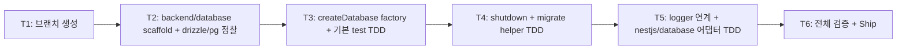

# Implementation Plan: spec-03-05

## 📋 Branch Strategy

- 신규 브랜치: `spec-03-05-backend-database`
- 시작 지점: `phase-03-backend-foundation` (sync commit `ae55830` 반영된 상태)
- 첫 task가 브랜치 생성
- **PR Target**: `phase-03-backend-foundation`

## 🛑 사용자 검토 필요 (User Review Required)

> [!IMPORTANT]
> - [x] **driver = `pg` (node-postgres)** 채택: ADR-0005에 명시 없음 — 본 spec에서 박음. 대안 `postgres` (porsager) 는 *더 빠르나* mature 부족 + NestJS 생태계 표준은 `pg`. driver 교체 ADR은 *driver 자체 교체 검토* 시점에 격상.
> - [x] **schema 위치 = app-level**: 본 패키지에 schema 0. `apps/<app>/src/db/schema/` 컨벤션 — service별 자유.
> - [x] **real PostgreSQL 단위 test 안 함**: pg.Pool mock + drizzle factory mock. real DB는 *integration test* (별 spec / phase-10).
> - [x] **ADR-0015 패턴 4회째 적용**: pure (`backend/database`) + 어댑터 (`nestjs/database`) 분리. 동일 객체 리터럴 DynamicModule 패턴.

> [!WARNING]
> - [x] **drizzle-orm + drizzle-kit 둘 다 catalog 추가** + `pg` + `@types/pg` — catalog 4개 신규 (단일 spec 기준 dep 증가량 ↑).
> - [x] **OnModuleDestroy lifecycle 어댑터 패키지에서 처리** — pure 패키지에는 shutdown 함수만 노출. 어댑터가 *NestJS lifecycle hook* 책임.

## 🎯 핵심 전략 (Core Strategy)

### 아키텍처 컨텍스트



### 주요 결정

| 컴포넌트 | 전략 | 이유 |
|:---:|:---|:---|
| ORM | drizzle-orm (locked) | ADR-0005 locked |
| PostgreSQL driver | `pg` (node-postgres) | mature + NestJS 생태계 표준 + drizzle-orm/node-postgres 어댑터 official |
| pool 라이브러리 | `pg.Pool` | 표준 + connection 재사용 |
| schema 위치 | app-level (`apps/<app>/src/db/schema/`) | service별 자유 + 본 패키지는 *infra factory* |
| schema 전달 | generic 인자 (`createDatabase<TSchema>`) | typed query API 보존 |
| migrate helper | drizzle-kit `migrate(db, { migrationsFolder })` wrap | drizzle-kit이 이미 CLI / API 제공 — wrapping 없이 re-export |
| logger 연계 | optional inject + logQueries flag | dev에서 query 로깅 / production OFF (보안 + 성능) |
| shutdown 시점 | 어댑터 OnModuleDestroy / pure는 함수만 | NestJS lifecycle hook은 어댑터 책임 |
| 단위 test 전략 | `pg.Pool` mock + drizzle 호출 검증 | real DB 의존 0 |
| 어댑터 패턴 | 객체 리터럴 DynamicModule + symbol | ADR-0015 4회째 답습 — 패턴 안정 |

### 📑 ADR 후보

- [x] **부분 후보**: PostgreSQL driver = `pg` (node-postgres) — `postgres` (porsager) 대안 검토 ADR. 본 spec에서 *결정 명시* (walkthrough), ADR 격상은 *driver 교체 검토* 시점.
- [x] **객체 리터럴 DynamicModule 패턴** ADR 격상 — 본 spec 머지 시 4회째 (Icebox).

## 📂 Proposed Changes

### catalog 추가 (`pnpm-workspace.yaml`)

```yaml
catalog:
  drizzle-orm: ^0.45.2
  drizzle-kit: ^0.31.10
  pg: ^8.21.0
  "@types/pg": ^8.20.0
```

### `packages/backend/database/` (신규, pure)

```
packages/backend/database/
├── package.json
├── tsconfig.json   (types: ["node"])
├── vitest.config.ts
└── src/
    ├── index.ts
    └── index.test.ts
```

#### `package.json` 핵심:

```json
{
  "name": "@repo/backend-database",
  "dependencies": {
    "@repo/backend-logger": "workspace:*",
    "@repo/errors": "workspace:*",
    "drizzle-orm": "catalog:",
    "pg": "catalog:"
  },
  "devDependencies": {
    "@types/pg": "catalog:",
    "drizzle-kit": "catalog:",
    ...
  }
}
```

#### `src/index.ts` 핵심 구조:

```ts
import { drizzle, type NodePgDatabase } from "drizzle-orm/node-postgres";
import { migrate as drizzleKitMigrate } from "drizzle-orm/node-postgres/migrator";
import { Pool } from "pg";
import type { Logger } from "@repo/backend-logger";
import { AppError } from "@repo/errors";

export interface CreateDatabaseOptions<TSchema extends Record<string, unknown>> {
  connectionUrl: string;
  schema: TSchema;
  poolSize?: number;
  logger?: Logger;
  logQueries?: boolean;
}

export interface Database<TSchema extends Record<string, unknown>> {
  db: NodePgDatabase<TSchema>;
  pool: Pool;
}

export const createDatabase = <TSchema extends Record<string, unknown>>(
  options: CreateDatabaseOptions<TSchema>,
): Database<TSchema> => {
  const pool = new Pool({
    connectionString: options.connectionUrl,
    max: options.poolSize ?? 10,
  });
  const drizzleLogger = options.logQueries && options.logger
    ? { logQuery: (q: string, p: unknown[]) => options.logger?.debug({ q, p }, "drizzle query") }
    : false;
  const db = drizzle(pool, { schema: options.schema, logger: drizzleLogger });
  return { db, pool };
};

export const shutdown = async (pool: Pool): Promise<void> => {
  await pool.end();
};

export interface MigrateOptions {
  migrationsFolder: string;
}

export const migrate = async <TSchema extends Record<string, unknown>>(
  db: NodePgDatabase<TSchema>,
  options: MigrateOptions,
): Promise<void> => {
  try {
    await drizzleKitMigrate(db, options);
  } catch (cause) {
    throw new AppError({
      code: "MIGRATION_FAILED",
      message: `drizzle migrate failed: ${options.migrationsFolder}`,
      statusCode: 500,
      cause,
    });
  }
};
```

### `packages/nestjs/database/` (신규, 어댑터)

```
packages/nestjs/database/
├── package.json
├── tsconfig.json   (decorators + node types)
├── vitest.config.ts
└── src/
    ├── index.ts
    └── index.test.ts
```

```ts
// src/index.ts
import { Module, type OnModuleDestroy } from "@nestjs/common";
import { createDatabase, shutdown, type CreateDatabaseOptions, type Database } from "@repo/backend-database";

export const DATABASE = Symbol("DATABASE");

export const DatabaseModule = {
  forRoot<TSchema extends Record<string, unknown>>(options: CreateDatabaseOptions<TSchema>) {
    const database = createDatabase(options);
    return {
      module: DatabaseModule,
      providers: [{ provide: DATABASE, useValue: database }],
      exports: [DATABASE],
      global: true,
      // OnModuleDestroy hook: NestJS DI 컨테이너 종료 시 shutdown(pool) 호출
      // 실제 hook은 별 provider class로 (또는 useFactory 패턴)
    };
  },
};
```

> 정밀: NestJS OnModuleDestroy는 *provider class*에서만 동작. *useValue로 박은 객체*는 lifecycle hook 못 받음. 따라서 `DatabaseShutdownService` provider 클래스를 추가하고 그쪽에 OnModuleDestroy 박는 방식 — 구현 시점에 확정.

## 🧪 검증 계획 (Verification Plan)

### 단위 테스트 (~8)

```bash
pnpm --filter @repo/backend-database test
pnpm --filter @repo/nestjs-database test
```

분포:
- `createDatabase` (3): connectionUrl + Pool 생성 검증 / schema 통과 / poolSize 적용
- `shutdown` (1): pool.end() 호출 검증 (mock pool)
- `migrate` (1): drizzle-kit migrate api 호출 검증 (mock)
- `logger 연계` (1): logQueries true + logger 있을 때 drizzle 옵션 활성
- `DatabaseModule` (2, 어댑터): DynamicModule 구조 / OnModuleDestroy 호출 시 shutdown

### 통합 검증

```bash
pnpm lint && pnpm typecheck && pnpm test
pnpm exec depcruise --config packages/config/depcruise-config/base.cjs packages/
# 기대: 0 violations (ADR-0015 룰 유지)
```

### 수동 검증

```ts
// 실제 사용 패턴 (apps/api에서)
import { createDatabase, migrate, shutdown } from "@repo/backend-database";
import * as schema from "./db/schema/index.js";

const { db, pool } = createDatabase({
  connectionUrl: process.env.DATABASE_URL!,
  schema,
});
await migrate(db, { migrationsFolder: "./migrations" });
// ... query
await shutdown(pool); // graceful exit
```

## 🔁 Rollback Plan

- 패키지 revert. 후속 spec(03-06/07) 진입 전이면 ripple 없음.
- catalog 추가 (drizzle / pg) revert 시 lockfile 갱신.

## 📦 Deliverables 체크

- [ ] task.md 작성 (다음 단계)
- [ ] 사용자 Plan Accept
- [ ] (실행 후) backend/database + nestjs/database 2 패키지
- [ ] (실행 후) ~8 test
- [ ] (실행 후) walkthrough / pr_description ship
