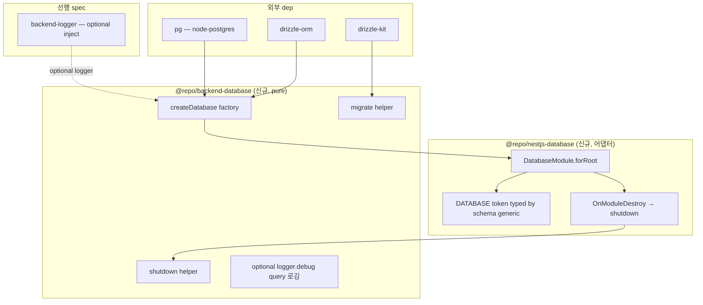

# spec-03-05: `@repo/backend-database` — Drizzle + node-postgres + 마이그레이션 + lifecycle

## 📋 메타

| 항목 | 값 |
|---|---|
| **Spec ID** | `spec-03-05` |
| **Phase** | `phase-03` (Backend Foundation, Phase Base Branch 모드) |
| **Branch** | `spec-03-05-backend-database` |
| **PR Target** | `phase-03-backend-foundation` |
| **상태** | Planning |
| **타입** | Feature |
| **Integration Test Required** | no (real-DB integration은 별 spec — phase-10 또는 후속) |
| **작성일** | 2026-05-19 |
| **소유자** | dennis |

## 📋 배경 및 문제 정의

### 현재 상황

phase-03 진행:
- spec-03-01/02/04 (settings / logger / http-client) + spec-03-03 (ADR-0015 정정) 머지됨
- ADR-0005 **NestJS + Drizzle + PostgreSQL 단일** locked — Prisma 채택 안 함

**다음**: Drizzle ORM 기반 데이터베이스 접근 표준화. ADR-0013 Session storage / ADR-0014 auth security 가 *PostgreSQL 정밀 제어* 의존 — Drizzle의 raw SQL 친화 + typed query builder 활용.

### 문제점

1. **service별 자체 Drizzle 셋업** = pool 생성 / shutdown / logger 연계 / migration 워크플로 *각자 보일러플레이트* → 일관성 없음.
2. **schema 위치 결정 부재** — `packages/backend/database/schema/` (공유) vs `apps/<app>/db/schema/` (app별) 컨벤션 박혀야 후속 spec 진입 시 *결정 반복* 안 함.
3. **PostgreSQL client 라이브러리 미명시** — ADR-0005에 ORM (Drizzle) / DB (PostgreSQL) 만 명시. driver 라이브러리 (`pg` vs `postgres`) *본 spec에서 박음*.
4. **graceful shutdown 부재** — NestJS app 종료 시 pool 안 닫으면 *connection leak* + 마이그레이션 hang.

### 해결 방안 (요약)

**2 패키지** (ADR-0015 패턴 답습 — 4회째):

**A. `@repo/backend-database`** (pure, framework-agnostic):
1. `createDatabase<TSchema>(options)` factory — Drizzle client + `pg` Pool 기반, generic schema 지원
2. `shutdown(db)` helper — pool graceful close
3. `migrate(db, options)` helper — drizzle-kit api wrap (`migrations` 디렉토리 적용)
4. logger 옵션 inject (logger.debug 로 query 로깅 — production OFF 기본)

**B. `@repo/nestjs-database`** (NestJS 어댑터):
1. `DatabaseModule.forRoot<TSchema>(options)` DynamicModule
2. `DATABASE` injection token (typed `NodePgDatabase<TSchema>`)
3. `OnModuleDestroy` lifecycle — pool 자동 close

**schema 위치 컨벤션**:
- `packages/backend/database/` 자체에는 *schema 0* — 본 패키지는 *infra factory* 만
- schema는 **app-level** (`apps/<app>/src/db/schema/`) — service별 자유
- factory에 schema 인자 generic으로 받음 (`createDatabase<TSchema>({ schema })`)

## 📊 개념도



## 🎯 요구사항

### Functional Requirements

1. **`packages/backend/database/` 신규 패키지** (`@repo/backend-database`, pure):
   - scaffold (package.json / tsconfig with `types: ["node"]` / vitest.config.ts)
   - `dependencies`: `drizzle-orm: catalog:` + `pg: catalog:` + `@repo/backend-logger: workspace:*` (optional) + `@repo/errors: workspace:*`
   - `devDependencies`: 표준 + `@types/pg: catalog:` + `drizzle-kit: catalog:`
   - DOM lib 미포함 — Node-only

2. **`createDatabase<TSchema>(options)` factory**:
   - 시그니처:
     ```ts
     createDatabase<TSchema extends Record<string, unknown>>(options: {
       connectionUrl: string;
       schema: TSchema;
       poolSize?: number;       // default 10
       logger?: Logger;         // pino logger from backend-logger
       logQueries?: boolean;    // default false (production safe)
     }): { db: NodePgDatabase<TSchema>; pool: Pool };
     ```
   - return: `{ db, pool }` — db로 쿼리, pool은 lifecycle 관리용 노출

3. **`shutdown(pool)` helper**:
   - `pool.end()` await — graceful close
   - 호출 후 `db` 사용 불가 (사용 시 throw)

4. **`migrate(db, options)` helper**:
   - drizzle-kit의 `migrate(db, { migrationsFolder })` wrap
   - 사용 예: `await migrate(db, { migrationsFolder: "./apps/api/migrations" })`
   - 실패 시 throw (원본 에러 wrap)

5. **logger 연계 (optional)**:
   - `logger` 옵션 있고 `logQueries: true` 시 — drizzle `logger: { logQuery(query, params) { logger.debug(...) }}` 옵션 활성
   - 기본 OFF (production 보안 + 성능)

6. **`packages/nestjs/database/` 신규 어댑터 패키지** (`@repo/nestjs-database`):
   - scaffold (decorators tsconfig)
   - `dependencies`: `@nestjs/common: catalog:` + `@repo/backend-database: workspace:*` + `reflect-metadata: catalog:`
   - `DatabaseModule.forRoot<TSchema>(options)` DynamicModule
   - `DATABASE` symbol injection token
   - NestJS `OnModuleDestroy` interface impl — pool 자동 shutdown

7. **단위 테스트** (~8 예상, real PostgreSQL 없이):
   - createDatabase factory (3): connectionUrl + pool 생성 / schema 통과 / poolSize 적용
   - shutdown (1): pool.end() 호출 검증
   - migrate (1): drizzle-kit api 호출 검증 (mock)
   - logger 연계 (1): logQueries true 시 logger.debug 호출
   - DatabaseModule (2): DynamicModule 구조 / OnModuleDestroy 호출 시 shutdown

### Non-Functional Requirements

1. **schema는 본 패키지에 *0*** — app-level 책임. 본 패키지는 generic factory만.
2. **real PostgreSQL 의존 0** (단위 test) — `pg.Pool` mock + drizzle factory mock.
3. **integration test는 별 spec** (phase-10 또는 후속) — *real DB가 booted up 상태*에서 검증.
4. **ADR-0015 일관**: pure (framework dep 0) + 어댑터 (별 패키지).

## 🚫 Out of Scope

- **real PostgreSQL integration test**: 별 spec / phase-10. testcontainers / docker-compose 결정도 그때.
- **schema 정의**: app-level 책임 — apps/api scaffold (spec-03-07) 또는 그 이후.
- **마이그레이션 CLI script**: drizzle-kit이 이미 CLI 제공 — wrapping 없음. `migrate()` 함수만 제공.
- **multi-tenant connection routing**: 도메인 — 후속 spec.
- **read replicas / write/read split**: 후속 spec.
- **MySQL / SQLite 지원**: ADR-0005 PostgreSQL locked.
- **Prisma 호환 layer**: ADR-0005 — Prisma 채택 안 함.

## 📑 ADR 후보

- [ ] **부분 후보**: PostgreSQL driver = `pg` (node-postgres) — `postgres` (porsager) 대안 검토 ADR 가치 있음. 본 spec에서 *명시적 결정* 박음 (walkthrough 결정 기록), ADR 격상은 후속 (driver 교체 검토 시점).
- [x] **객체 리터럴 DynamicModule 패턴** — 4회째 (settings / settings-nestjs / logger-nestjs / http-client-nestjs / database-nestjs) — **ADR 격상 즉시 후보** (Icebox 이미 추가됨).

## ✅ Definition of Done

- [ ] `packages/backend/database/` 신규 (pure)
- [ ] `packages/nestjs/database/` 신규 (어댑터)
- [ ] `createDatabase` + `shutdown` + `migrate` helper
- [ ] `DatabaseModule.forRoot()` + `OnModuleDestroy` lifecycle
- [ ] `pnpm test` 그린 (~8 test 추가)
- [ ] `pnpm lint` / `pnpm typecheck` 그린
- [ ] `pnpm exec depcruise` 0 violations
- [ ] `walkthrough.md` / `pr_description.md` ship commit
- [ ] PR 생성 (base = `phase-03-backend-foundation`)
- [ ] 사용자 알림
