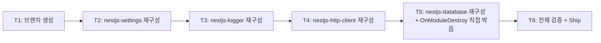

# Implementation Plan: spec-03-06

## 📋 Branch Strategy

- 신규 브랜치: `spec-03-06-rework-nestjs-adapters`
- 시작 지점: `phase-03-backend-foundation` (sync commit `3bf4bf1` — ADR-0016 반영 완료)
- 첫 task 가 브랜치 생성
- **PR Target**: `phase-03-backend-foundation`

## 🛑 사용자 검토 필요 (User Review Required)

> [!IMPORTANT]
> - [x] **동작 변경 0** — 본 spec 은 *패턴 재작성*. `forRoot` 시그니처 / token export / provider 구조 그대로. 호출자 영향 0.
> - [x] **ADR-0016 적용** — 표준 `@Module` class 채택. lifecycle 있는 `database` 는 *Module class 자체* 에 `implements OnModuleDestroy`.
> - [x] **`DatabaseShutdownService` 제거** — 우회 class 더 이상 불필요. test 의 *fake pool inject* 패턴 변경 필요할 수 있음 (Module class 자체 lifecycle 호출).

> [!WARNING]
> - [x] **`@Module` decorator value import**: `@nestjs/common` 의 `Module` 을 *type-only* 가 아닌 *value import*. ADR-0016 명시한 *허용 비용* — 어댑터 패키지 한정.
> - [x] **NestJS 인스턴스화 변화** — `@Module` class 는 NestJS DI 컨테이너가 인스턴스 생성. `forRoot` 는 *static method*. `DatabaseModule` 의 `onModuleDestroy` 는 *instance method* — NestJS 가 호출. pool 보유 방식 *static field 또는 instance field* 결정 필요.

## 🎯 핵심 전략 (Core Strategy)

### 아키텍처 컨텍스트



### 주요 결정

| 컴포넌트 | 전략 | 이유 |
|:---:|:---|:---|
| 작업 순서 | settings → logger → http-client → database (단순한 것부터) | database 가 lifecycle 추가로 *가장 복잡* — 단순 어댑터 3개로 패턴 안정화 후 진입 |
| `@Module` decorator | `@Module({})` (빈 metadata) | providers / exports 는 `forRoot` 가 *동적* return — class-level metadata 빈 객체 |
| `forRoot` 시그니처 | `static forRoot(...): DynamicModule` | NestJS 표준 시그니처. 객체 리터럴 시점과 *동일* (generic 보존) |
| pool 보유 (database) | static field (`DatabaseModule.currentPool`) | forRoot 가 static — 같은 컨텍스트. NestJS 인스턴스화 시점에 *동일 reference* 유지 |
| `OnModuleDestroy` (database) | `async onModuleDestroy()` instance method | NestJS 표준 — instance lifecycle hook |
| `DatabaseShutdownService` 처리 | **제거** | 우회 class 더 이상 필요 없음 |
| test 영향 | mock 단순화 (DatabaseShutdownService 사라지면 관련 test 정정) | `DatabaseModule.onModuleDestroy` 직접 호출 가능 (instance 생성 + 호출) |
| commit 단위 | 패키지별 1 commit | settings / logger / http-client / database 4 commit (revert 단위) |

### 📑 ADR 후보

- [x] **없음** — 본 spec 은 ADR-0016 적용.

## 📂 Proposed Changes

### `packages/nestjs/settings/src/index.ts` (재구성)

**Before**:
```ts
export const BACKEND_SETTINGS = Symbol("BACKEND_SETTINGS");

export const BackendSettingsModule = {
  forRoot<TSettings>(loader, env) {
    const settings = loader(env);
    return { module: BackendSettingsModule, providers: [...], exports: [...], global: true };
  },
};
```

**After**:
```ts
import { Module, type DynamicModule } from "@nestjs/common";

export const BACKEND_SETTINGS = Symbol("BACKEND_SETTINGS");

@Module({})
export class BackendSettingsModule {
  static forRoot<TSettings>(
    loader: (env: Record<string, string | undefined>) => TSettings,
    env: Record<string, string | undefined> = process.env,
  ): DynamicModule {
    const settings = loader(env);
    return {
      module: BackendSettingsModule,
      providers: [{ provide: BACKEND_SETTINGS, useValue: settings }],
      exports: [BACKEND_SETTINGS],
      global: true,
    };
  }
}
```

### `packages/nestjs/logger/src/index.ts` (재구성)

동일 패턴. `BACKEND_LOGGER` symbol + `PinoLoggerService` provider 그대로. `PinoLoggerService` class 자체는 이미 class 기반 — 변경 없음.

### `packages/nestjs/http-client/src/index.ts` (재구성)

동일 패턴. `HTTP_CLIENT` symbol provider 그대로.

### `packages/nestjs/database/src/index.ts` (재구성 + lifecycle 직접)

**Before**:
```ts
export const DATABASE = Symbol("DATABASE");

export class DatabaseShutdownService implements OnModuleDestroy {
  constructor(private readonly database: Database<...>) {}
  async onModuleDestroy() { await shutdown(this.database.pool); }
}

export const DatabaseModule = {
  forRoot(options) {
    const database = createDatabase(options);
    return {
      module: DatabaseModule,
      providers: [
        { provide: DATABASE, useValue: database },
        { provide: DatabaseShutdownService, useFactory: () => new DatabaseShutdownService(database) },
      ],
      exports: [DATABASE],
      global: true,
    };
  },
};
```

**After**:
```ts
import { Module, type DynamicModule, type OnModuleDestroy } from "@nestjs/common";
import { createDatabase, shutdown, ... } from "@repo/backend-database";

export const DATABASE = Symbol("DATABASE");

@Module({})
export class DatabaseModule implements OnModuleDestroy {
  private static currentDatabase: Database<Record<string, unknown>> | undefined;

  static forRoot<TSchema>(options: CreateDatabaseOptions<TSchema>): DynamicModule {
    const database = createDatabase(options);
    DatabaseModule.currentDatabase = database as Database<Record<string, unknown>>;
    return {
      module: DatabaseModule,
      providers: [{ provide: DATABASE, useValue: database }],
      exports: [DATABASE],
      global: true,
    };
  }

  async onModuleDestroy(): Promise<void> {
    if (DatabaseModule.currentDatabase) {
      await shutdown(DatabaseModule.currentDatabase.pool);
    }
  }
}
```

핵심:
- `DatabaseShutdownService` **제거**
- `static currentDatabase` 로 pool 보유 (`forRoot` 가 static — 같은 class context)
- `onModuleDestroy` 는 instance method (NestJS DI 컨테이너가 instance 생성 후 호출)

### `packages/nestjs/database/src/index.test.ts` (정정)

**Before** (T5 — DatabaseShutdownService fake pool inject):
```ts
it("DatabaseShutdownService.onModuleDestroy 호출 시 주입된 pool.end() 실행", async () => {
  const fakeDatabase = { pool: { end: fakeEnd }, db: {} };
  const shutdownService = new DatabaseShutdownService(fakeDatabase as any);
  await shutdownService.onModuleDestroy();
  expect(fakeEnd).toHaveBeenCalledTimes(1);
});
```

**After**:
```ts
it("DatabaseModule.onModuleDestroy 호출 시 pool.end() 실행 (mock pool)", async () => {
  // forRoot 가 createDatabase 호출 → mock pg.Pool 사용 → mockPoolEnd 추적
  mockPoolEnd.mockClear();
  DatabaseModule.forRoot({ connectionUrl: "...", schema: {x:1} });
  const instance = new DatabaseModule();
  await instance.onModuleDestroy();
  expect(mockPoolEnd).toHaveBeenCalledTimes(1);
});
```

mock hoisting 패턴은 이미 spec-03-05 시점에 잡힌 패턴 (`vi.hoisted`) — 그대로 활용.

## 🧪 검증 계획 (Verification Plan)

### 단위 테스트

```bash
pnpm --filter @repo/nestjs-settings test       # 2 test
pnpm --filter @repo/nestjs-logger test         # 4 test
pnpm --filter @repo/nestjs-http-client test    # 1 test
pnpm --filter @repo/nestjs-database test       # 2 test
```

총 9 test (이전 9 와 같음, 위치/내용 거의 동일).

### 통합 검증

```bash
pnpm lint && pnpm typecheck && pnpm test
pnpm exec depcruise --config packages/config/depcruise-config/base.cjs packages/
# 기대: 0 violations
```

### 수동 검증

1. `grep "export const \(Backend\|Http\|Database\)" packages/nestjs/` — 0 hit (객체 리터럴 모두 제거)
2. `grep "DatabaseShutdownService" packages/nestjs/` — 0 hit (우회 class 제거)
3. `grep "@Module" packages/nestjs/` — 4 hit (각 어댑터)
4. 호출자 코드 영향 0 — `forRoot` 시그니처 / token export 그대로 (사용 site 없으니 검증 자체는 자동)

## 🔁 Rollback Plan

- 본 spec 은 *패턴 재작성*. revert 시 git history 로 즉시 복구.
- 호출자 사용 site 0 (apps 미존재) — ripple 없음.

## 📦 Deliverables 체크

- [ ] task.md 작성 (다음 단계)
- [ ] 사용자 Plan Accept
- [ ] (실행 후) 4 어댑터 모두 `@Module` class 패턴
- [ ] (실행 후) `DatabaseShutdownService` 제거
- [ ] (실행 후) test 9 그린
- [ ] (실행 후) walkthrough / pr_description ship
