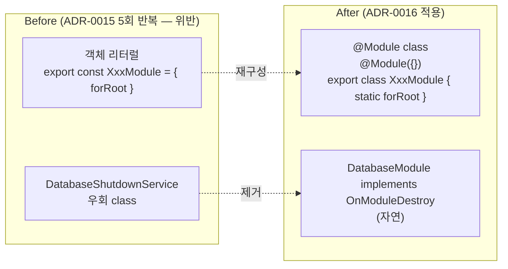

# spec-03-06: NestJS 어댑터 4 패키지 — 객체 리터럴 → 표준 `@Module` class 재구성 (ADR-0016 적용)

## 📋 메타

| 항목 | 값 |
|---|---|
| **Spec ID** | `spec-03-06` |
| **Phase** | `phase-03` (Backend Foundation, Phase Base Branch 모드) |
| **Branch** | `spec-03-06-rework-nestjs-adapters` |
| **PR Target** | `phase-03-backend-foundation` |
| **상태** | Planning |
| **타입** | Refactor (ADR-0016 적용 — 코드 패턴 재구성, 동작 변경 0) |
| **Integration Test Required** | no |
| **작성일** | 2026-05-19 |
| **소유자** | dennis |

## 📋 배경 및 문제 정의

### 현재 상황

ADR-0016 (PR #15) 로 *어댑터 모듈 구현 패턴* 컨벤션 박힘:
- 기본 권장: 표준 `@Module` decorator class + `implements OnModuleDestroy`
- 허용 예외: ultra-thin adapter (token-only + lifecycle 없음 + ecosystem 기능 불필요)

phase-03 현재 *임시 위반* 상태 — 5 어댑터 패키지가 모두 *객체 리터럴 DynamicModule* 패턴:

| 패키지 | 현재 (객체 리터럴) | 목표 (`@Module` class) |
|---|---|---|
| `@repo/nestjs-settings` | `export const BackendSettingsModule = { forRoot }` | `@Module({}) export class BackendSettingsModule { static forRoot }` |
| `@repo/nestjs-logger` | `export const BackendLoggerModule = { forRoot }` | `@Module({}) export class BackendLoggerModule { static forRoot }` |
| `@repo/nestjs-http-client` | `export const HttpClientModule = { forRoot }` | `@Module({}) export class HttpClientModule { static forRoot }` |
| `@repo/nestjs-database` | `export const DatabaseModule = { forRoot }` + `DatabaseShutdownService` 우회 class | `@Module({}) export class DatabaseModule implements OnModuleDestroy { static forRoot }` (우회 class 제거) |

### 문제점

1. **ADR-0016 위반 상태**: 5 어댑터가 *객체 리터럴* 사용. 룰은 박혔으나 코드는 미적용.
2. **`DatabaseShutdownService` 우회 class**: spec-03-05 에서 박은 *부자연 패턴*. 표준 `@Module class implements OnModuleDestroy` 로 *자연 해결*.
3. **새 어댑터 추가 시 *위반 패턴 답습 위험***: 후속 spec (apps/api scaffold, frontend adapters 등) 진입 시 *기존 코드 보고 따라할* 위험.

### 해결 방안 (요약)

**4 어댑터 패키지 동시 재구성** (코드 동작 변경 0 — 패턴만 정정):

1. 각 어댑터의 `src/index.ts` 를 *객체 리터럴* → *`@Module` class* 로 재작성
2. `@repo/nestjs-database` 에서:
   - `DatabaseShutdownService` 별 class 제거
   - `DatabaseModule implements OnModuleDestroy` 박음
   - pool 보유 방식 변경 (static field 또는 instance field)
3. test 그대로 + mock 단순화 가능 (DatabaseShutdownService 사라지면 관련 test 정정)

## 📊 개념도

## 🎯 요구사항

### Functional Requirements

1. **`packages/nestjs/settings/src/index.ts` 재구성**:
   - `export const BackendSettingsModule = {...}` → `@Module({}) export class BackendSettingsModule { static forRoot(...) }`
   - `forRoot` 시그니처 / `BACKEND_SETTINGS` symbol export / provider / global 모두 *그대로*
   - test 2개 그대로 (`forRoot` 호출 / DynamicModule 구조 검증)

2. **`packages/nestjs/logger/src/index.ts` 재구성**:
   - `export const BackendLoggerModule = {...}` → `@Module({}) export class BackendLoggerModule { static forRoot(...) }`
   - `BACKEND_LOGGER` symbol + `PinoLoggerService` provider 그대로
   - test 4개 그대로

3. **`packages/nestjs/http-client/src/index.ts` 재구성**:
   - `export const HttpClientModule = {...}` → `@Module({}) export class HttpClientModule { static forRoot(...) }`
   - `HTTP_CLIENT` symbol provider 그대로
   - test 1개 그대로

4. **`packages/nestjs/database/src/index.ts` 재구성** (가장 변경 큼):
   - `export const DatabaseModule = {...}` → `@Module({}) export class DatabaseModule implements OnModuleDestroy { static forRoot(...) }`
   - `DatabaseShutdownService` 별 class **제거**
   - `DatabaseModule.onModuleDestroy()` 안에서 직접 `await shutdown(pool)` 호출
   - pool 보유: `static currentPool` (또는 instance field — class 인스턴스화 시점 검토)
   - test 2개:
     - `DynamicModule 구조 검증` 그대로
     - `DatabaseShutdownService.onModuleDestroy 호출 시 pool.end()` → `DatabaseModule.onModuleDestroy 호출 시 pool.end()` 로 변경

5. **검증**:
   - `pnpm install` 정상
   - `pnpm lint` / `pnpm typecheck` / `pnpm test` 전체 그린
   - `pnpm exec depcruise` 0 violations
   - 직접 검증: `grep "export const \(Backend\|Http\|Database\)" packages/nestjs/` → 0 hit (객체 리터럴 모두 제거)

### Non-Functional Requirements

1. **동작 변경 0**: `forRoot` 시그니처 / token export / provider 구조 모두 *그대로*. 호출자 (app) 영향 0.
2. **test 수 같음**: 9 test (settings 2 + logger 4 + http-client 1 + database 2) → 9 test (위치/내용 *거의* 동일).
3. **rollback 용이**: 본 spec 은 *패턴 재작성* — revert 시 git history 로 즉시 복구.
4. **ADR-0016 일관**: 표준 `@Module` class + lifecycle 자연 + ultra-thin 예외 *없음* (모두 lifecycle 있거나 ecosystem 기능 가능성 있음).

## 🚫 Out of Scope

- **새 기능 추가**: API 변경 0. 단순 *패턴 재작성*.
- **`@repo/backend-*` core 패키지 변경**: ADR-0015 §4-bis 그대로. 본 spec 은 *어댑터 한정*.
- **spec-03-01 backend-settings 의 NestJS 흔적 추가 정정**: spec-03-03 에서 이미 해소 (NestJS 코드 → packages/nestjs/settings 이동). 본 spec 영향 없음.
- **테스트 추가**: 신규 test 없음. 기존 9 test 의 *코드 정정* 만 (mock 단순화 가능).
- **다른 framework 어댑터** (Fastify 등): 본 spec scope 밖.

## 📑 ADR 후보

- [x] **없음** — 본 spec 은 ADR-0016 적용. 추가 ADR 가치 없음.

## ✅ Definition of Done

- [ ] `packages/nestjs/settings/` 표준 `@Module` class 재구성
- [ ] `packages/nestjs/logger/` 표준 `@Module` class 재구성
- [ ] `packages/nestjs/http-client/` 표준 `@Module` class 재구성
- [ ] `packages/nestjs/database/` 표준 `@Module` class + `OnModuleDestroy` 직접 박음 + `DatabaseShutdownService` 제거
- [ ] `pnpm test` 그린 (9 test, 위치/내용 거의 동일)
- [ ] `pnpm lint` / `pnpm typecheck` 그린
- [ ] `pnpm exec depcruise` 0 violations
- [ ] `walkthrough.md` / `pr_description.md` ship commit
- [ ] PR 생성 (base = `phase-03-backend-foundation`)
- [ ] 사용자 알림
