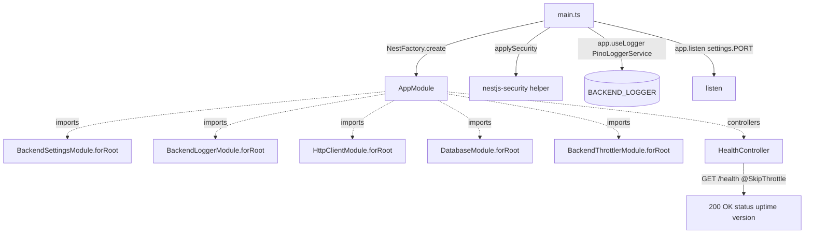

# Implementation Plan: spec-03-08 apps-api-scaffold

## 📋 Branch Strategy

- 신규 브랜치: `spec-03-08-apps-api-scaffold`
- 시작 지점: `phase-03-backend-foundation` (Phase Base Branch 모드)
- 첫 task 가 브랜치 생성을 수행함

## 🛑 사용자 검토 필요

> [!IMPORTANT]
> - [x] **scope = health-check 스켈레톤** (사용자 선택 옵션 A). 실 도메인 / Repository 패키지 구현은 본 spec 밖
> - [x] **5 어댑터 모두 wire-up** (settings / logger / http-client / database / throttler) — phase-03 성공기준 §5 답습
> - [x] **`DatabaseModule.forRoot({ schema: {} })`** — 빈 schema. drizzle migration 도 본 spec 밖

> [!WARNING]
> - [ ] `pg.Pool` 은 *lazy connection* — 부트 시점 DB 검증 안 함. DATABASE_URL 가짜여도 부트 OK. *health endpoint 가 DB 안 건드림*. 단 실 DB 연결 시점 fail 은 *추후 도메인 spec* 영역
> - [ ] `BackendThrottlerModule` 의 `APP_GUARD` 자동 등록 — health 가 `@SkipThrottle()` 미적용 시 100req/60s 한정. *적용* 박음
> - [ ] `apps/api` 가 처음 등장 — `tsconfig` / `vitest` setup 정합성 검증 필요 (다른 패키지와 패턴 다를 수 있음)

## 🎯 핵심 전략 (Core Strategy)

### 아키텍처 컨텍스트



### 주요 결정

| 컴포넌트 | 전략 | 이유 |
|:---:|:---|:---|
| **app 위치** | `apps/api/` | ADR-0003 (Package Layout) — apps/ 가 NestJS app 위치 |
| **app name** | `@apps/api` (private) | apps/ namespace 컨벤션 |
| **build** | tsx (dev) / tsup (prod 빌드) | 다른 backend 패키지와 다름 — apps 는 실행 가능 entrypoint 필요. dev 시 tsx, prod 빌드는 추후 결정 (본 spec 은 dev 부트만) |
| **settings loader** | `defineSettings({ schema: BaseBackendSchema.extend(...) })` | `@repo/backend-settings` 표준 사용. apps/api 자체 env 확장 |
| **logger 사용** | `app.useLogger(app.get(PinoLoggerService))` | NestJS built-in logger 대신 어댑터 logger 사용 |
| **health endpoint** | `GET /health` → `{ status, uptime, version }` JSON | k8s liveness probe 호환 표준 |
| **health throttle** | `@SkipThrottle()` 적용 | k8s probe 빈도가 default limit 초과 가능 |
| **DB schema (forRoot)** | `{}` 빈 객체 | 본 spec 은 *health-check 스켈레톤* — schema 정의는 phase-04+ |
| **HTTP_CLIENT baseUrl** | env 또는 placeholder `http://localhost:9999` | 본 spec 에선 *unused* — wire-up 검증만 |
| **E2E framework** | `vitest` + `supertest` + `@nestjs/testing` | NestJS 표준 E2E 패턴. 다른 패키지와 동일 vitest |
| **README 가이드** | docstring 가이드 박음 | Repository 패턴 예고 + 부트 방법 |

### 📑 ADR 후보

- [ ] ADR 가치 있는 결정 있음
- [x] **없음** — 본 spec 은 *기존 어댑터 통합*. 신규 결정 ADR 가치 없음.

## 📂 Proposed Changes

### `apps/api/` 신설

#### [NEW] `apps/api/package.json`
```json
{
  "name": "@apps/api",
  "version": "0.0.0",
  "private": true,
  "type": "module",
  "scripts": {
    "start": "tsx watch src/main.ts",
    "lint": "biome check .",
    "typecheck": "tsc --noEmit",
    "test": "vitest run"
  },
  "dependencies": {
    "@nestjs/common": "catalog:",
    "@nestjs/core": "catalog:",
    "@nestjs/platform-express": "catalog:",
    "@repo/backend-settings": "workspace:*",
    "@repo/nestjs-settings": "workspace:*",
    "@repo/nestjs-logger": "workspace:*",
    "@repo/nestjs-http-client": "workspace:*",
    "@repo/nestjs-database": "workspace:*",
    "@repo/nestjs-security": "workspace:*",
    "reflect-metadata": "catalog:",
    "rxjs": "catalog:"
  },
  "devDependencies": {
    "@biomejs/biome": "catalog:",
    "@nestjs/testing": "catalog:",
    "@repo/biome-config": "workspace:*",
    "@repo/typescript-config": "workspace:*",
    "@repo/vitest-config": "workspace:*",
    "@types/node": "catalog:",
    "@types/supertest": "catalog:",
    "supertest": "catalog:",
    "tsx": "catalog:",
    "typescript": "catalog:",
    "vitest": "catalog:",
    "zod": "catalog:"
  }
}
```

(catalog 갱신: `@nestjs/platform-express`, `supertest`, `@types/supertest` 추가)

#### [NEW] `apps/api/tsconfig.json`
- decorator 옵션 ON (다른 nestjs/* 어댑터와 동일)
- `include: ["src/**/*.ts"]`

#### [NEW] `apps/api/vitest.config.ts`
- `@repo/vitest-config/node` 재사용

#### [NEW] `apps/api/.env.example`
```
NODE_ENV=development
PORT=3000
LOG_LEVEL=info
DATABASE_URL=postgres://localhost:5432/service_foundry_dev
HTTP_CLIENT_BASE_URL=http://localhost:9999
```

#### [NEW] `apps/api/src/settings.ts`
- `defineSettings({ schema: BaseBackendSchema.extend({ DATABASE_URL: z.string(), HTTP_CLIENT_BASE_URL: z.string().url() }) })` loader export

#### [NEW] `apps/api/src/health/health.controller.ts`
- `@Controller("health") + @SkipThrottle()` decorator
- `@Get() health()` → `{ status: "ok", uptime: process.uptime(), version: process.env.npm_package_version ?? "0.0.0" }`

#### [NEW] `apps/api/src/app.module.ts`
- `@Module({ imports: [5 어댑터 forRoot], controllers: [HealthController] })`
- 5 어댑터 forRoot 호출 — settings loader 결과 사용

#### [NEW] `apps/api/src/main.ts`
- `NestFactory.create(AppModule, { bufferLogs: true })` (어댑터 logger 셋업 전 임시)
- `app.useLogger(app.get(PinoLoggerService))`
- `applySecurity(app)` — helmet + cors default
- `app.listen(settings.PORT)`

#### [NEW] `apps/api/src/health/health.e2e.test.ts`
- `Test.createTestingModule({ imports: [AppModule] })` + supertest `GET /health` → 200 + JSON body 검증

#### [NEW] `apps/api/README.md`
- 부트 방법 + .env 가이드 + Repository 패턴 예고 (phase-04+ 영역)

#### [MODIFY] `pnpm-workspace.yaml`
- catalog 추가: `@nestjs/platform-express`, `supertest`, `@types/supertest`

#### [MODIFY] `backlog/phase-03.md`
- spec 표 자동 갱신 이미 완료 (`sdd spec new`)

## 🧪 검증 계획

### 단위/E2E 테스트
```bash
pnpm --filter @apps/api test    # E2E supertest GET /health 200
pnpm test                        # 전체 — 153 + 1 (E2E)
```

### 수동 검증
1. `pnpm --filter @apps/api start` — 부트 성공 (DB 없이도 OK)
2. `curl http://localhost:3000/health` → 200 `{ status: "ok", ... }`
3. `pnpm exec depcruise --config packages/config/depcruise-config/base.cjs .` — 0 violations
4. `pnpm lint && pnpm typecheck` — 모두 그린

## 🔁 Rollback Plan

- 본 spec 은 *신규 디렉토리 추가* + catalog 3 라인 — 기존 코드 영향 0
- 롤백 시 PR revert + catalog 정리. 영향 0.

## 📦 Deliverables 체크

- [x] task.md 작성 (다음 단계)
- [ ] 사용자 Plan Accept 받음
- [ ] (실행 후) 모든 task 완료
- [ ] (실행 후) walkthrough.md / pr_description.md ship
