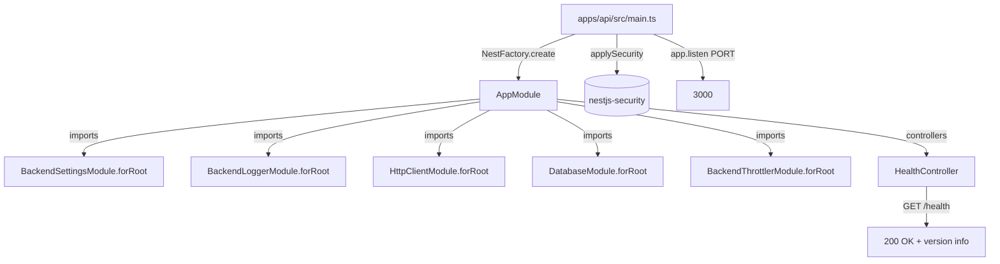

# spec-03-08: apps-api-scaffold — `apps/api` NestJS app + 5 어댑터 통합 wire-up + `GET /health`

## 📋 메타

| 항목 | 값 |
|---|---|
| **Spec ID** | `spec-03-08` |
| **Phase** | `phase-03` |
| **Branch** | `spec-03-08-apps-api-scaffold` |
| **상태** | Planning |
| **타입** | Feature |
| **Integration Test Required** | yes (E2E `GET /health` 200 검증) |
| **작성일** | 2026-05-19 |
| **소유자** | dennis |

## 📋 배경 및 문제 정의

### 현재 상황

- phase-03 인프라 어댑터 5 개 (`nestjs-settings/logger/http-client/database/security`) 모두 박힘.
- `apps/` 디렉토리 *미존재* — phase 시작 이래 *통합 검증 시점이 없음*.
- 각 어댑터는 단위 테스트만 — 5 개가 *함께* 동작하는 *실 app 환경* 검증 부재.

### 문제점

- 어댑터들이 *조립 가능* 한지 *모름*. forRoot 시그니처 충돌, `APP_GUARD` 자동 등록의 실 영향, request-id propagation, lifecycle hook 동작 — 모두 *unverified*.
- phase-03 성공기준 §5 ("apps/api scaffold가 본 패키지들 wire up → booted NestJS app이 `/health`에 200 응답") 미충족.
- 후속 phase (auth / business domain) 진입 시 *통합 실패* 가능 — 본 spec 이 *기반 검증 시점*.

### 해결 방안 (요약)

`apps/api` 신설 — *최소 NestJS scaffold*. 5 어댑터 모두 `AppModule` 에 wire-up. `HealthController` 1개 (`GET /health` → 200). `main.ts` 에서 `applySecurity(app)` + `NestFactory.create` + `listen`. E2E test (supertest) 로 `GET /health` 200 검증. **Repository 패턴 실 도메인은 본 spec scope 밖** — `User` 등 실 도메인은 phase-04+ 영역.

## 📊 개념도

## 🎯 요구사항

### Functional Requirements

1. **`apps/api/` 디렉토리 신설** (NestJS app):
   - `package.json` (`@apps/api` private)
   - `tsconfig.json` (extends `@repo/typescript-config/base`)
   - `vitest.config.ts` (E2E test 포함)
   - `.env.example` (PORT / NODE_ENV / LOG_LEVEL / DATABASE_URL placeholder)

2. **`AppModule`**: 5 어댑터 모두 `forRoot` 호출 + `HealthController` 등록:
   - `BackendSettingsModule.forRoot(loadSettings)` — `defineSettings` 로 작성한 loader (BaseBackendSchema 확장)
   - `BackendLoggerModule.forRoot({ level, redactPaths })`
   - `HttpClientModule.forRoot({ baseUrl: settings.HTTP_CLIENT_BASE_URL })` — 또는 default placeholder
   - `DatabaseModule.forRoot({ connectionUrl: settings.DATABASE_URL, schema: {} })` — schema 는 빈 객체 (phase-04+ 에서 실 도메인 schema)
   - `BackendThrottlerModule.forRoot()` — default preset

3. **`HealthController`**: `GET /health` → 200 + `{ status: "ok", uptime, version }` JSON.
   - `@SkipThrottle()` decorator 적용 — health probe 가 ThrottlerGuard 한계에 걸리지 않게.

4. **`main.ts`**:
   - `NestFactory.create(AppModule, { logger: app.get(PinoLoggerService) })` — 어댑터 logger 사용
   - `applySecurity(app)` — helmet + cors default
   - `app.listen(settings.PORT)`

5. **E2E test**: supertest 로 `GET /health` 200 응답 검증. DB 의존 없음 (health 가 DB 안 건드림).

6. **개발 가이드 (`apps/api/README.md`)**:
   - 부트 방법 (`pnpm --filter @apps/api start`)
   - .env 설정 가이드
   - Repository 패턴 docstring (phase-04+ 영역 예고)

### Non-Functional Requirements

1. depcruise 룰 위반 0 — apps/* 가 packages/frontend/* import 안 함.
2. ADR-0009 (AppError) 준수 — 본 spec 에서 자체 error 발생 영역 거의 없음.
3. health endpoint 는 *DB / 외부 의존 없음* — apps/api 부트만으로 응답.
4. ThrottlerGuard 자동 적용 — `@SkipThrottle()` 미적용 endpoint 는 100req/60s 제한.

## 🚫 Out of Scope

- **실 도메인 (User / Tenant 등)**: phase-04+ 영역. 본 spec 은 *health-check 스켈레톤* 만.
- **Repository 패턴 실 구현**: docstring 가이드만 박음. 실 entity / repository interface / Drizzle 구현은 phase-04+.
- **DB schema 정의**: `DatabaseModule.forRoot({ schema: {} })` 빈 객체. drizzle migration 도 본 spec scope 밖.
- **observability tracer** (OTel): phase-03.md 의 원래 성공기준 일부였으나 본 phase 에서 빠짐 — phase-04+ 영역.
- **auth wire-up**: phase-05~08 영역.
- **business logic endpoint**: phase-09 (Apps + Admin Tools) 영역.
- **CI deployment**: phase-10+ 영역.

## 📑 ADR 후보

- [ ] ADR 가치 있는 결정 있음
- [x] **없음** — 본 spec 은 *기존 5 어댑터 통합* + *health-check 스켈레톤*. 신규 결정 ADR 가치 없음.

## ✅ Definition of Done

- [ ] `apps/api/` 디렉토리 신설 (package.json / tsconfig / vitest.config.ts / .env.example)
- [ ] `AppModule` — 5 어댑터 forRoot + HealthController 등록
- [ ] `HealthController` — `GET /health` 200 + `@SkipThrottle()`
- [ ] `main.ts` — applySecurity + NestFactory + listen
- [ ] E2E test PASS (supertest GET /health 200)
- [ ] 단위 test (별도 있다면) PASS
- [ ] `pnpm lint` / `pnpm typecheck` 그린
- [ ] `pnpm exec depcruise` 0 violations
- [ ] `walkthrough.md` / `pr_description.md` 작성 및 ship commit
- [ ] PR 생성 (base = `phase-03-backend-foundation`)
- [ ] 사용자 검토 요청 알림 완료
