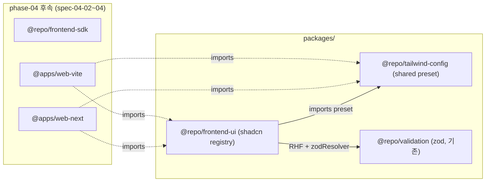

# spec-04-01: frontend-ui — `@repo/tailwind-config` (shared preset) + `@repo/frontend-ui` (shadcn registry)

## 📋 메타

| 항목 | 값 |
|---|---|
| **Spec ID** | `spec-04-01` |
| **Phase** | `phase-04` |
| **Branch** | `spec-04-01-frontend-ui` |
| **상태** | Planning |
| **타입** | Feature |
| **Integration Test Required** | no (단위 + jsdom render test 그린이면 충분) |
| **작성일** | 2026-05-20 |
| **소유자** | dennis |

## 📋 배경 및 문제 정의

### 현재 상황

- phase-03 (Backend Foundation) 머지 완료 — `apps/api` `/health` 그린.
- `apps/` 디렉토리에 *frontend app 없음*. `packages/frontend/*` 도 *미존재*.
- Icebox 이슈 *tailwind 위치 결정* — 본 spec 진입 시점 박음 (Phase Done 조건 §4 명시).

### 문제점

- Frontend foundation 부재 — phase-04 다른 spec (sdk / web-next / web-vite) 이 *UI 컴포넌트 + tailwind preset* 의존.
- monorepo 의 *UI 일관성* 박힘 시점 없음. 각 app 이 자체 shadcn add 하면 *drift*. shared registry 박아야 *한 곳에 components, 다수 app 이 import*.
- tailwind v4 진입 시점 — *CSS-first* (`@theme` directive) 패러다임. 초기 박는 게 *long-term value*.

### 해결 방안 (요약)

`@repo/tailwind-config` shared preset 패키지 + `@repo/frontend-ui` shared registry 패키지 2개 신설. tailwind v4 + shadcn registry 패턴 + `react-hook-form` Form 통합 + `sonner` Toaster. 단위 테스트 (vitest + jsdom + `@testing-library/react`).

## 📊 개념도

## 🎯 요구사항

### Functional Requirements

1. **`@repo/tailwind-config` shared preset** (`packages/config/tailwind-config/`):
   - tailwind v4 (`@theme` directive, CSS-first)
   - shared theme variables (colors / fonts / spacing tokens)
   - `globals.css` export — 호출자가 `@import "@repo/tailwind-config/globals.css"`
   - shadcn-compatible CSS variables (light/dark mode)

2. **`@repo/frontend-ui` shared registry** (`packages/frontend/ui/`):
   - React 19 + TypeScript
   - shadcn-style components (CVA + Radix UI primitives):
     - `Button` — variant (default/destructive/outline/secondary/ghost/link) + size (default/sm/lg/icon)
     - `Input` — text input baseline
     - `Label` — Radix Label wrap
     - `Card` — composable (Card / CardHeader / CardTitle / CardContent / CardFooter)
     - `Form` + react-hook-form 통합 (`useForm` + `zodResolver` 표준 패턴)
     - `Toaster` (sonner wrap)
   - `cn(...inputs)` utility (clsx + tailwind-merge)
   - 모든 component `'use client'` 디렉티브 (Next.js App Router 호환)

3. **단위 테스트**: vitest + jsdom + `@testing-library/react` — Button render / variant / Form submit / Toaster smoke 등.

4. **shadcn `components.json`** — `add` 명령 호환 (registry path, aliases, tailwind config 경로).

5. **#19 Phase 4 후보 채택**:
   - `react-hook-form` + `@hookform/resolvers/zod` — Form
   - `sonner` — Toaster

### Non-Functional Requirements

1. depcruise 룰: `packages/frontend/*` → `packages/backend/*` import 0건 (ADR-0015 룰 답습)
2. tailwind v4 — `@tailwindcss/vite` (Vite) + `@tailwindcss/postcss` (Next.js) 양쪽 호환
3. `react: ^19` peer dep — Next.js 15 + Vite 둘 다 호환
4. `'use client'` 디렉티브 모든 client component — Next.js Server Component 컨텍스트에서 자연 import 가능

## 🚫 Out of Scope

- **Form fields beyond basic** (DatePicker / Select / Combobox 등): spec-04-NN 추가 또는 app spec 안에서 박음
- **dark mode 토글 / theme provider**: spec-04-03 (web-next) 또는 별 spec
- **storybook**: 본 spec scope 밖 (storybook 도입은 별 검토)
- **animation library (framer-motion 등)**: 별 spec
- **i18n / a11y deep dive**: 별 spec
- **`@repo/frontend-sdk` 통합** (Form submit → API): spec-04-02 영역
- **app integration** (web-next/vite 에서 ui 실 사용): spec-04-03/04 영역

## 📑 ADR 후보

- [ ] ADR 가치 있는 결정 있음
- [x] **없음** — 본 spec 의 결정은 *frontend tooling 채택* — ADR-0003 (Package Layout) 답습. tailwind v4 / shadcn 채택은 *기술 trend 답습* — *불변 결정* 아님.

> **검토 후 박힐 가능성**: 만약 spec-04-NN 들이 *shared ui registry* 패턴 반복 답습 시 phase-04 ship 또는 phase-05 진입 시점 ADR 격상 후보.

## ✅ Definition of Done

- [ ] `@repo/tailwind-config` 신설 — globals.css + preset 박힘
- [ ] `@repo/frontend-ui` 신설 — Button / Input / Label / Card / Form / Toaster + `cn` util
- [ ] `components.json` shadcn add 호환
- [ ] 단위 테스트 PASS (Button + Form + Toaster 최소)
- [ ] `pnpm lint` / `pnpm typecheck` 그린
- [ ] `pnpm exec depcruise` 0 violations
- [ ] `walkthrough.md` / `pr_description.md` 작성 및 ship commit
- [ ] PR 생성 (base = `phase-04-frontend-foundation`)
- [ ] 사용자 검토 요청 알림 완료
