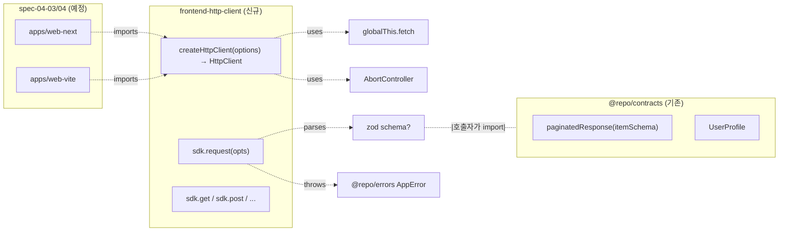

# spec-04-02: frontend-http-client — `@repo/frontend-http-client` typed API client (globalThis.fetch + AppError + zod parse)

## 📋 메타

| 항목 | 값 |
|---|---|
| **Spec ID** | `spec-04-02` |
| **Phase** | `phase-04` |
| **Branch** | `spec-04-02-frontend-http-client` |
| **상태** | Planning |
| **타입** | Feature |
| **Integration Test Required** | no (단위 테스트 + fetch mock 으로 충분) |
| **작성일** | 2026-05-20 |
| **소유자** | dennis |

## 📋 배경 및 문제 정의

### 현재 상황

- phase-04 의 spec-04-01 (`@repo/tailwind-config` + `@repo/frontend-ui`) 머지됨.
- frontend app (`@apps/web-next`, `@apps/web-vite`) 아직 미존재 — spec-04-03/04 영역.
- *typed API client* 부재 — 각 app 이 자체 fetch + 자체 type 박으면 *drift* + *contracts SoT 가치 손실*.

### 문제점

- `@repo/contracts` (Phase 2) 의 `UserProfile` / `paginatedResponse<T>` 는 *runtime zod schema* — *fetch 결과 검증* 도구 박혀있지 않음.
- backend-http-client (Node, undici) 는 *frontend 에 못 박힘* — bundle 수용 불가.
- frontend 가 *cross-env* (Next Server / Next Client / Vite SPA / Edge runtime) — *unopinionated, env-agnostic* SDK 필요.

### 해결 방안 (요약)

`@repo/frontend-http-client` 패키지 신설. **`ky` (fetch 기반 검증된 wrapper)** + **factory pattern** (`createHttpClient({ baseUrl })`) + **@repo/errors AppError 변환 layer** + **explicit zod schema** 바인딩. ky 의 *retry/timeout/hooks 검증된 기능* 사용 — 알고리즘 직접 박지 않음. `reqId propagation` 은 *frontend 환경 한계* (AsyncLocalStorage 없음) — 호출자가 `headers` 로 명시.

> **NeoAuth `auth-http` 와 비교 (검토 결과)**: ky 채택 자체는 답습 — 다만 NeoAuth 의 *형편없는 점* 정정: (1) zod schema parse 박음 (타입 안전성) (2) AppError 변환 layer (표준 error class) (3) factory pattern — module-level side effect 제거 (4) snake_case / `.result` unwrap 은 *호출자 정책* (SDK 박지 않음).

## 📊 개념도

## 🎯 요구사항

### Functional Requirements

1. **`createHttpClient(options)` factory** export:
   - signature: `createHttpClient(options: CreateHttpClientOptions): HttpClient`
   - `CreateHttpClientOptions`: `{ baseUrl, timeoutMs?, retries?, headers? }`
   - 내부 — `ky.create({ prefixUrl, timeout, retry, hooks })` 인스턴스 생성

2. **`HttpClient` interface**: backend-http-client 와 *동일 API surface* (학습 비용 0):
   - `request<T>(opts: HttpRequestOptions<T>): Promise<T>`
   - `get<T>(path, opts?)` / `post<T>(path, body?, opts?)` / `put<T>(path, body?, opts?)` / `delete<T>(path, opts?)` / `patch<T>(path, body?, opts?)`

3. **retry/timeout** (ky 옵션 매핑):
   - default `timeout: 10_000ms`, `retry.limit: 3`
   - **POST/PATCH default no retry** — ky `retry.methods` 옵션으로 `['get', 'put', 'delete', 'head', 'options', 'trace']` 박음 (idempotency safety, backend-http-client 정책 답습)
   - exponential backoff — ky 내장
   - status code retry — `retry.statusCodes: [408, 429, 500, 502, 503, 504]` (5xx + rate-limit)

4. **에러 변환 layer** (`hooks.beforeError`):
   - ky `HTTPError` → status 기반 분기:
     - 4xx → `AppError({ code: "BAD_REQUEST" })`
     - 5xx → `AppError({ code: "UPSTREAM" })`
   - ky `TimeoutError` → `AppError({ code: "TIMEOUT" })`
   - network error (fetch throws) → `AppError({ code: "NETWORK" })`
   - zod parse fail → `AppError({ code: "VALIDATION" })`

5. **`schema?: ZodType<TOutput>` (explicit binding)**:
   - 호출자가 명시: `sdk.get<UserProfile>("/me", { schema: UserProfile })`
   - schema 박혔으면 `parse()` → fail → `AppError({ code: "VALIDATION" })`
   - schema 미박힘 시 raw JSON 반환 (TypeScript type `T` 는 *unsafe cast* — 호출자 책임)

6. **헤더 기본값**:
   - `content-type: application/json`, `accept: application/json` (ky 기본 동작)
   - `headers?` opts 로 override
   - **reqId propagation 안 박음** — frontend 환경 한계, 호출자가 명시 (예: `headers: { "x-request-id": myId }`)

7. **단위 테스트**: vitest + `vi.stubGlobal("fetch", ...)`:
   - GET 200 + schema parse → 결과 반환
   - 404 → AppError BAD_REQUEST
   - 500 → retry 후 UPSTREAM
   - timeout → AppError TIMEOUT
   - network error → AppError NETWORK
   - schema validation fail → AppError VALIDATION
   - POST default → 1회만 시도 (no retry)
   - POST with retry opt → retry 동작
   - headers override

### Non-Functional Requirements

1. depcruise 룰: `packages/frontend/*` → `packages/backend/*` import 0건 (ADR-0015)
2. **cross-env** (browser + Node 18+ + Edge): ky 의 `globalThis.fetch` 의존 — 외부 fetch impl 의존 없음
3. dep: `ky ^1.x` (frontend bundle +3KB gzip)
4. peer deps: `zod: ^4.0.0` (호출자가 catalog 사용)
5. `@repo/errors` workspace dep — `AppError` 답습

## 🚫 Out of Scope

- **TanStack Query 통합**: 본 spec 은 *unopinionated SDK* — query layer 는 *호출자 책임* (별 spec 또는 app 안)
- **OpenAPI codegen**: phase-09 영역 또는 별 spec — 본 spec 은 *수동 wrap* 패턴
- **reqId propagation**: frontend 환경 한계 (AsyncLocalStorage 없음) — 호출자가 `headers` 로 명시
- **contracts-defined endpoint metadata**: explicit binding 채택 — endpoint 메타데이터는 *호출자가 schema 직접 import*. 추후 *DRY 가치 확인* 시 별 spec
- **응답 캐싱 / 중복 요청 dedupe**: TanStack Query 영역
- **interceptor / middleware**: unopinionated 위반 — 별 spec
- **`apps/web-next/vite` 실 사용**: spec-04-03/04 영역

## 📑 ADR 후보

- [ ] ADR 가치 있는 결정 있음
- [x] **없음** — 본 spec 의 결정은 *backend-http-client 답습 + frontend-specific 조정*. ADR-0009 (AppError) + ADR-0015 (framework-adapter naming) 답습. 신규 결정 ADR 가치 없음.

## ✅ Definition of Done

- [ ] `@repo/frontend-http-client` 신설 (`createHttpClient` factory + `HttpClient` interface)
- [ ] ky 채택 + retry/timeout/hooks 옵션 매핑 (backend-http-client 정책 답습)
- [ ] `hooks.beforeError` 에서 ky `HTTPError` / `TimeoutError` → `AppError` 변환
- [ ] `AppError` codes: NETWORK / TIMEOUT / UPSTREAM / BAD_REQUEST / VALIDATION
- [ ] explicit schema binding (`schema?: ZodType<T>`) — parse fail 시 VALIDATION
- [ ] 단위 테스트 PASS (fetch mock — 9 test 케이스)
- [ ] `pnpm lint` / `pnpm typecheck` 그린
- [ ] `pnpm exec depcruise` 0 violations
- [ ] `walkthrough.md` / `pr_description.md` 작성 및 ship commit
- [ ] PR 생성 (base = `phase-04-frontend-foundation`)
- [ ] 사용자 검토 요청 알림 완료
