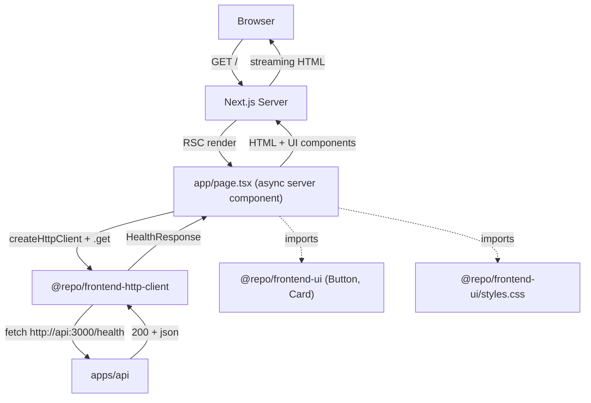

# spec-04-03: web-next-scaffold — `apps/web-next` Next.js 16 App Router + RSC `/health` 시연

## 📋 메타

| 항목 | 값 |
|---|---|
| **Spec ID** | `spec-04-03` |
| **Phase** | `phase-04` |
| **Branch** | `spec-04-03-web-next-scaffold` |
| **상태** | Planning |
| **타입** | Feature |
| **Integration Test Required** | no (수동 부트 + render 검증) |
| **작성일** | 2026-05-20 |
| **소유자** | dennis |

## 📋 배경 및 문제 정의

### 현재 상황

- phase-04 의 spec-04-01 (`@repo/frontend-ui`) + spec-04-02 (`@repo/frontend-http-client`) 머지됨.
- `apps/` 디렉토리에 *frontend app 없음* — phase-03 의 `apps/api` 하나만.
- phase-04 의 *통합 검증 시점* — UI / HTTP client / Next.js 가 *함께 동작* 검증 필요.

### 문제점

- *Next.js scaffold 부재* — boilerplate 의 *public site* 옵션 없음.
- spec-04-01/02 의 패키지가 *실제로 Next 환경에서 동작* 검증 안 됨 (단위 테스트만).
- *RSC 시연 부재* — Next 의 핵심 가치 (서버 렌더링 + zero-bundle component) 보여줄 site 없음.

### 해결 방안 (요약)

`apps/web-next` 신설 — **Next.js 16 App Router** + tailwind v4 + shadcn (`@repo/frontend-ui`) + http client (`@repo/frontend-http-client`). 홈 페이지 (`/`) 가 **async RSC** 로 `apps/api` 의 `/health` 호출 + Card UI 로 결과 표시. *TanStack Query / nuqs 미도입* — 본 spec 은 *최소 스켈레톤*, *별 spec 으로 미룸*. dev port 3001 (api 3000 과 분리).

## 📊 개념도

## 🎯 요구사항

### Functional Requirements

1. **`apps/web-next/` 신설** (Next.js 16 App Router):
   - `package.json` (`@apps/web-next` private)
   - `next.config.ts` (Turbopack default 사용 — Next 16+)
   - `tsconfig.json` (decorator 없음, jsx preserve)
   - `postcss.config.mjs` (`@tailwindcss/postcss` plugin)
   - `.gitignore` (`.next` / `out` 등)

2. **App Router 구조**:
   - `src/app/layout.tsx` — root layout, `<html lang="ko">` + `<body>` + UI fonts/theme
   - `src/app/page.tsx` — **async server component**, `apps/api` 의 `/health` 호출 + Card 표시
   - `src/app/globals.css` — `@import "@repo/frontend-ui/styles.css"` (tailwind v4 entry)
   - `src/env.ts` — env 검증 (zod) — `API_BASE_URL` server-only

3. **`/` 페이지 시연 내용**:
   - RSC 안에서 `createHttpClient({ baseUrl: API_BASE_URL })` 인스턴스 생성
   - `client.get<HealthResponse>("/health", { schema: HealthResponseSchema })` 호출 (zod schema 시연)
   - error handling: try/catch → AppError catch → 친화 메시지 표시
   - UI: `<Card>` 안 `<CardHeader>` (제목) + `<CardContent>` (status / uptime / version) + `<Button asChild>` (`/health` raw 링크)

4. **dev / build / start scripts**:
   - `dev`: `next dev --turbopack --port 3001`
   - `build`: `next build`
   - `start`: `next start --port 3001`
   - `lint`: `biome check .`
   - `typecheck`: `tsc --noEmit`
   - `test`: `vitest run` (1-2 단위 test — render 시연)

5. **단위 테스트** (jsdom):
   - `<HealthCard>` (presentation component) render 검증 — 200 응답 mock 시 status/uptime/version 표시
   - error 응답 mock 시 error message 표시

6. **README**:
   - 부트 가이드 (`pnpm --filter @apps/web-next dev` + `apps/api` 함께 띄움)
   - port 3001 명시 + api 3000 충돌 회피
   - RSC 패러다임 한 줄 (TanStack Query / nuqs 별 spec)

### Non-Functional Requirements

1. depcruise: `apps/web-next` → `packages/backend/*` import 0건 (ADR-0015)
2. Next.js 16+ App Router 기본 — Page Router 안 박음
3. peer deps 정렬: react ^19 (`@repo/frontend-ui` 의 peer 와 일치)
4. Turbopack default (Next 16+) — webpack 옵션 박지 않음
5. `'use client'` 디렉티브 — *필요시만*. 본 spec 의 `page.tsx` 는 *순수 server component*

## 🚫 Out of Scope

- **TanStack Query 통합** — RSC 만 사용. client interaction 등장 시점 별 spec
- **nuqs (URL state)** — 최소 스켈레톤이라 URL state 시연 명분 없음. 실 페이징 진입 시 별 spec
- **Authentication / Authorization** — phase-06 영역
- **Playwright E2E** — 수동 부트 + curl 검증만. Playwright 도입은 별 spec
- **dark mode toggle** — `@repo/tailwind-config` 의 `.dark` 박혀있으나 toggle UI 별 spec
- **i18n / SEO meta** — minimal scaffold, 후속 spec
- **Server Action** — phase-04 scope 밖 (실 form submit 등 도메인 영역)
- **Streaming SSR / Suspense boundary** — minimal 페이지라 불필요

## 📑 ADR 후보

- [ ] ADR 가치 있는 결정 있음
- [x] **없음** — Next.js App Router *default 패턴 답습*. ADR-0015 (framework-adapter naming) 답습. 신규 결정 ADR 가치 없음.

## ✅ Definition of Done

- [ ] `apps/web-next/` 신설 (Next.js 16 App Router)
- [ ] `src/app/page.tsx` RSC 안에서 `createHttpClient` + `/health` 호출 + Card 표시
- [ ] env 검증 (zod) — `API_BASE_URL`
- [ ] `pnpm --filter @apps/web-next dev` 부트 — port 3001
- [ ] 수동 검증: `apps/api` 함께 부트 → `http://localhost:3001` 페이지에 `/health` 결과 표시
- [ ] 단위 테스트 PASS (HealthCard render)
- [ ] `pnpm lint` / `pnpm typecheck` / `pnpm build` 그린
- [ ] `pnpm exec depcruise` 0 violations
- [ ] `walkthrough.md` / `pr_description.md` 작성 및 ship commit
- [ ] PR 생성 (base = `phase-04-frontend-foundation`)
- [ ] 사용자 검토 요청 알림 완료
