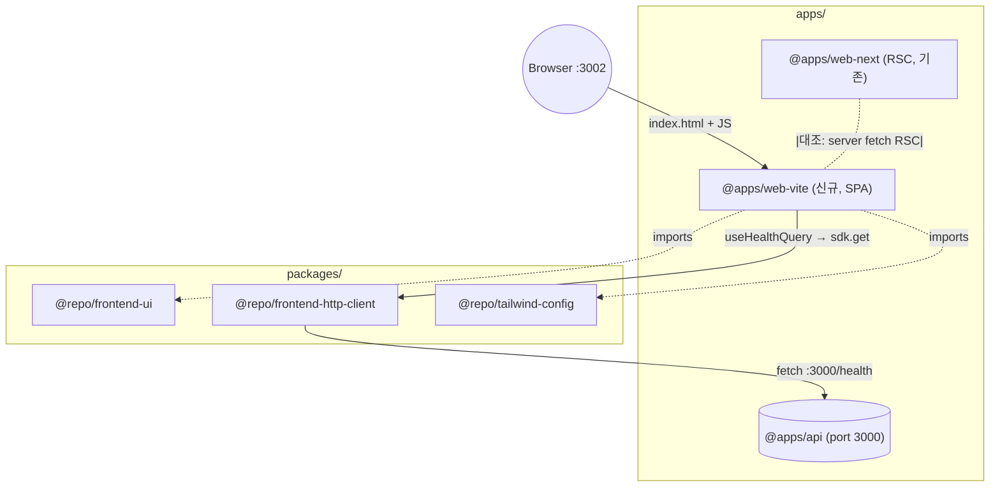

# Implementation Plan: spec-04-04 web-vite-scaffold

## 📋 Branch Strategy

- 신규 브랜치: `spec-04-04-web-vite-scaffold`
- 시작 지점: `phase-04-frontend-foundation` (Phase Base Branch 모드)
- 첫 task 가 브랜치 생성을 수행함

## 🛑 사용자 검토 필요

> [!IMPORTANT]
> - [x] **Vite 7 + React 19 SPA** (static build, S3/Netlify 호환)
> - [x] **tanstack-router file-based** (auto-gen routeTree, `@tanstack/router-plugin/vite`)
> - [x] **TanStack Query 본 spec 도입** — web-next (RSC server fetch) 와 *의도적 비대칭* (SPA client query)
> - [x] **dev port: 3002** (api 3000 / web-next 3001 와 분리)

> [!WARNING]
> - [ ] **web-next 와 의도적 비대칭** — 둘 다 React 지만 *렌더 모델 / fetch 패턴 다름*. README 에 명시
> - [ ] `routeTree.gen.ts` 자동 생성 — `.gitignore` 박음 + commit 안 함
> - [ ] `VITE_` prefix env 박힘 — client bundle 노출 OK (public API base URL)
> - [ ] api 동시 부트 필요 — README 가이드

## 🎯 핵심 전략

### 아키텍처 컨텍스트



### 주요 결정

| 컴포넌트 | 전략 | 이유 |
|:---:|:---|:---|
| **Vite 버전** | `^7.x` (latest) | boilerplate long-term. Vite 7 — React 19 + tanstack-router 호환 |
| **router** | `@tanstack/react-router` file-based + `@tanstack/router-plugin/vite` | 자동 코드 생성, file 기반 (Next App Router 패턴 유사) |
| **state/query** | `@tanstack/react-query` v5 | SPA 표준. *client query* 시연 (web-next 의 RSC 와 대조) |
| **HealthCard** | web-next 의 패턴 답습 (복사) + loading 분기 추가 | *추출 정책* (공통 화) 은 별 spec — 본 spec 은 *복사 + 자체 분기* |
| **fetch 위치** | hook 안 (`useHealthQuery`) | TanStack Query 표준 — query function 안 `createHttpClient` |
| **client 인스턴스 위치** | `src/lib/http-client.ts` (singleton) | module-level 박음. 매 query 마다 인스턴스화 회피 |
| **env 노출** | `VITE_API_BASE_URL` (public) | client bundle 노출 OK — public API. server-only env 와 차이 |
| **dev port** | 3002 | api 3000 / web-next 3001 분리 |
| **build target** | SPA (static HTML + JS bundle) | Vite default. static host 호환 |
| **TS jsx** | `react-jsx` (Vite 표준) | web-next 의 `preserve` 와 다름 — *Vite 가 자체 transform* |
| **build 검증** | `vite build` task 통합 검증 | dist/ 출력 + bundle size 확인 |
| **`tailwind` plugin** | `@tailwindcss/vite` | web-next 의 `@tailwindcss/postcss` 와 다름 — Vite 표준 |

### 📑 ADR 후보

- [ ] ADR 가치 있는 결정 있음
- [x] **없음** — Vite + tanstack-router/query *표준 패턴 답습*

## 📂 Proposed Changes

### `apps/web-vite` (신규)

#### [NEW] `apps/web-vite/package.json`
```json
{
  "name": "@apps/web-vite",
  "version": "0.0.0",
  "private": true,
  "type": "module",
  "scripts": {
    "dev": "vite --port 3002",
    "build": "tsc --noEmit && vite build",
    "preview": "vite preview --port 3002",
    "lint": "biome check .",
    "typecheck": "tsc --noEmit",
    "test": "vitest run"
  },
  "dependencies": {
    "@repo/errors": "workspace:*",
    "@repo/frontend-http-client": "workspace:*",
    "@repo/frontend-ui": "workspace:*",
    "@repo/tailwind-config": "workspace:*",
    "@tanstack/react-query": "catalog:",
    "@tanstack/react-router": "catalog:",
    "react": "catalog:",
    "react-dom": "catalog:",
    "zod": "catalog:"
  },
  "devDependencies": {
    "@biomejs/biome": "catalog:",
    "@repo/biome-config": "workspace:*",
    "@repo/typescript-config": "workspace:*",
    "@repo/vitest-config": "workspace:*",
    "@tailwindcss/vite": "catalog:",
    "@tanstack/router-plugin": "catalog:",
    "@testing-library/jest-dom": "catalog:",
    "@testing-library/react": "catalog:",
    "@types/node": "catalog:",
    "@types/react": "catalog:",
    "@types/react-dom": "catalog:",
    "@vitejs/plugin-react": "catalog:",
    "jsdom": "catalog:",
    "tailwindcss": "catalog:",
    "typescript": "catalog:",
    "vite": "catalog:",
    "vitest": "catalog:"
  }
}
```

**catalog 갱신**:
- `vite: ^7.x`
- `@tanstack/react-router: ^1.x`
- `@tanstack/router-plugin: ^1.x`
- `@tanstack/react-query: ^5.x`

#### [NEW] `apps/web-vite/vite.config.ts`
```ts
import { tanstackRouter } from "@tanstack/router-plugin/vite";
import tailwindcss from "@tailwindcss/vite";
import react from "@vitejs/plugin-react";
import { defineConfig } from "vite";

export default defineConfig({
  plugins: [
    tanstackRouter({ target: "react", autoCodeSplitting: true }),
    react(),
    tailwindcss(),
  ],
  server: { port: 3002 },
});
```

#### [NEW] `apps/web-vite/tsconfig.json`
- `@repo/typescript-config/base` extends
- `jsx: "react-jsx"`, `lib: ["DOM", "DOM.Iterable", "ES2023"]`
- `paths: { "@/*": ["./src/*"] }`
- include `src/routeTree.gen.ts` (auto-gen file)

#### [NEW] `apps/web-vite/vitest.config.ts`
- `@repo/vitest-config/react` + plugin-react + setupFiles (web-next 답습)

#### [NEW] `apps/web-vite/vitest.setup.ts`
- testing-library cleanup + jest-dom matchers

#### [NEW] `apps/web-vite/.gitignore`
- `dist/`, `node_modules/`, `src/routeTree.gen.ts`, `*.log`

#### [NEW] `apps/web-vite/env.example`
```
VITE_API_BASE_URL=http://localhost:3000
```

#### [NEW] `apps/web-vite/index.html`
- Vite entry — `<div id="root">` + `<script type="module" src="/src/main.tsx">`

#### [NEW] `apps/web-vite/src/styles.css`
- `@import "@repo/frontend-ui/styles.css"`

#### [NEW] `apps/web-vite/src/main.tsx`
- createRoot + `<QueryClientProvider>` + `<RouterProvider>` + `import "./styles.css"`

#### [NEW] `apps/web-vite/src/lib/http-client.ts`
- module-level `createHttpClient({ baseUrl: import.meta.env.VITE_API_BASE_URL })` singleton export

#### [NEW] `apps/web-vite/src/lib/queries.ts`
- `useHealthQuery()` hook — `useQuery({ queryKey: ['health'], queryFn })`
- HealthSchema zod (web-next 의 답습 — 별 패키지 추출은 후속)

#### [NEW] `apps/web-vite/src/routes/__root.tsx`
- root layout — `<Outlet />` + meta

#### [NEW] `apps/web-vite/src/routes/index.tsx`
- home page (`/`) — `useHealthQuery` 호출 + `<HealthCard>` (loading / success / error 분기)

#### [NEW] `apps/web-vite/src/components/health-card.tsx`
- web-next 의 답습 + `loading` 분기 추가
- props: `{ data?, error?, loading? }`

#### [NEW] `apps/web-vite/src/components/health-card.test.tsx`
- 3 test (loading / data / error)

#### [NEW] `apps/web-vite/src/lib/queries.test.tsx`
- `useHealthQuery` hook test — `renderHook` + QueryClient wrapper + fetch mock

#### [NEW] `apps/web-vite/README.md`
- 부트 가이드 (api + web-vite — port 3002)
- SPA / client query 패러다임 설명
- web-next 와 *의도적 비대칭* 설명 (RSC vs SPA)

### depcruise (검토)

- 기존 `no-orphans` 예외에 `vite.config.*` 추가 검토 (Next 답습 패턴) — 또는 source 박혀있으면 자동 인식

## 🧪 검증 계획

### 단위 테스트
```bash
pnpm --filter @apps/web-vite test       # useHealthQuery + HealthCard (5 test)
pnpm test                                # 전체
```

### Vite build 검증
```bash
pnpm --filter @apps/web-vite build       # tsc + vite build → dist/ 출력
```

### 수동 검증
```bash
# Terminal 1: apps/api
npx tsx apps/api/src/main.ts (env 박음)

# Terminal 2: apps/web-vite
VITE_API_BASE_URL=http://localhost:3000 pnpm --filter @apps/web-vite dev

# 브라우저 http://localhost:3002 — Card 안 status/uptime/version 표시
```

### CI/lint/typecheck/depcruise
```bash
pnpm lint && pnpm typecheck && pnpm test
pnpm exec depcruise --config packages/config/depcruise-config/base.cjs .
```

## 🔁 Rollback Plan

- 본 spec 은 *신규 app 1개* — 기존 코드 영향 0
- 롤백 시 PR revert + catalog 정리. 영향 0

## 📦 Deliverables 체크

- [x] task.md 작성 (다음 단계)
- [ ] 사용자 Plan Accept 받음
- [ ] (실행 후) 모든 task 완료
- [ ] (실행 후) walkthrough.md / pr_description.md ship
