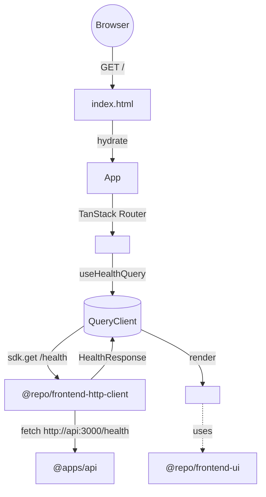

# spec-04-04: web-vite-scaffold — `apps/web-vite` Vite 7 SPA + tanstack-router + tanstack-query + `/health` 시연

## 📋 메타

| 항목 | 값 |
|---|---|
| **Spec ID** | `spec-04-04` |
| **Phase** | `phase-04` |
| **Branch** | `spec-04-04-web-vite-scaffold` |
| **상태** | Planning |
| **타입** | Feature |
| **Integration Test Required** | no (수동 부트 + render 검증) |
| **작성일** | 2026-05-20 |
| **소유자** | dennis |

## 📋 배경 및 문제 정의

### 현재 상황

- phase-04 의 spec-04-01 (frontend-ui) + spec-04-02 (frontend-http-client) + spec-04-03 (web-next) 머지됨.
- `apps/web-next` 가 *RSC + server fetch* 패턴 시연 — *public site / SSR* 영역.
- *SPA 옵션 부재* — `apps/admin` 같은 *내부 도구* 컨텍스트 박혀있지 않음.

### 문제점

- *SPA 스택 부재* — Vite + tanstack-router + tanstack-query 표준 패턴 boilerplate 안에 박힘 없음.
- web-next 와 *대조 패턴* 검증 부재 — *server fetch (RSC) vs client query (SPA)* 둘 다 박는 게 *boilerplate 의 차별 가치*.
- *internal app* 예시 부재 — phase-09 의 `apps/admin` prototype 시점이라 본 spec scope.

### 해결 방안 (요약)

`apps/web-vite` 신설 — **Vite 7 + React 19 SPA**. **tanstack-router file-based** + **TanStack Query** (client query 시연) + `@repo/frontend-ui` + `@repo/frontend-http-client`. `useHealthQuery()` hook 으로 `/health` 호출 + Card 표시. web-next 와 *의도적 비대칭* (RSC vs SPA + server fetch vs client query). dev port 3002 (api/web-next 와 분리). SPA static build (S3/Netlify 호환).

## 📊 개념도

## 🎯 요구사항

### Functional Requirements

1. **`apps/web-vite/` 신설** (Vite 7 SPA):
   - `package.json` (`@apps/web-vite` private)
   - `vite.config.ts` (`@vitejs/plugin-react` + `@tailwindcss/vite` + `@tanstack/router-plugin/vite`)
   - `tsconfig.json` (jsx react-jsx, DOM lib)
   - `index.html` (root entry)
   - `src/main.tsx` (createRoot + RouterProvider + QueryClientProvider)
   - `src/styles.css` (`@import "@repo/frontend-ui/styles.css"`)
   - `env.example` (`VITE_API_BASE_URL`)

2. **tanstack-router file-based**:
   - `src/routes/__root.tsx` — root layout (Outlet)
   - `src/routes/index.tsx` — home page (`/`) — Card + Health 표시
   - `src/routeTree.gen.ts` — auto-generated (gitignore)
   - `@tanstack/router-plugin/vite` 가 watch + 자동 생성

3. **TanStack Query**:
   - `QueryClient` 인스턴스 1개 (main.tsx)
   - `QueryClientProvider` root wrap
   - `useHealthQuery()` custom hook — `useQuery({ queryKey: ['health'], queryFn })`
   - error / loading / success 상태 분기

4. **`HealthCard` 재사용 (web-next 패턴 답습)**:
   - `apps/web-vite/src/components/health-card.tsx` (web-next 의 복사 — *재사용 추출 별 spec* 으로 미루기)
   - 단, 본 spec 의 *useHealthQuery* 의 `isLoading / isError / data` 분기 추가

5. **dev / build / preview scripts**:
   - `dev`: `vite --port 3002`
   - `build`: `vite build`
   - `preview`: `vite preview --port 3002`
   - `lint` / `typecheck` / `test`: 다른 frontend 패키지 답습

6. **단위 테스트** (jsdom):
   - `useHealthQuery` hook test (mocked fetch + QueryClient wrapper)
   - `<HealthCard>` render — loading / success / error 분기

7. **README**:
   - 부트 가이드 (api + web-vite — port 3002)
   - SPA / client query 패러다임 + web-next 와 비대칭 의도 설명
   - dark mode toggle / nuqs / Playwright 등 별 spec 예고

### Non-Functional Requirements

1. depcruise: `apps/web-vite` → `packages/backend/*` import 0건 (ADR-0015)
2. Vite 7 + React 19 + tanstack-router/query 최신 안정
3. SPA build — output `dist/` (static host 호환)
4. `import.meta.env.VITE_API_BASE_URL` — client bundle 노출 OK (public API)
5. `'use client'` 디렉티브 *불필요* (Vite SPA — 전체 client)

## 🚫 Out of Scope

- **SSR** — Vite SSR 도입은 별 spec. 본 spec 은 *SPA only*
- **Authentication / Authorization** — phase-06 영역
- **nuqs (URL state)** — 별 spec
- **HealthCard 패키지 추출** (web-next 와 web-vite 의 공통화) — 후속 spec, 본 spec 은 *복사 + 자체 분기*
- **Playwright E2E** — 수동 부트 + curl 검증만
- **dark mode toggle UI** — 별 spec
- **apps/admin 분리 정책 결정** — phase-09 영역 (Icebox 이슈)
- **route 다수 시연** — `/` 하나만. nested route / dynamic param 은 별 spec

## 📑 ADR 후보

- [ ] ADR 가치 있는 결정 있음
- [x] **없음** — Vite + tanstack-router/query *표준 패턴 답습*. web-next 와 *의도적 비대칭* 은 *phase ship walkthrough* 에서 회고 가능. 신규 ADR 가치 없음.

## ✅ Definition of Done

- [ ] `apps/web-vite/` 신설 (Vite 7 SPA)
- [ ] tanstack-router file-based (`__root` + `index`)
- [ ] TanStack Query (QueryClient + useHealthQuery)
- [ ] `/health` 호출 + `<HealthCard>` 표시 (loading / success / error)
- [ ] dev port 3002
- [ ] 단위 테스트 PASS (useHealthQuery hook + HealthCard render)
- [ ] `pnpm lint` / `pnpm typecheck` / `pnpm build` 그린
- [ ] `pnpm exec depcruise` 0 violations
- [ ] 수동 검증: `curl :3002` index.html + JS bundle / `pnpm dev` 부트 후 브라우저 Card 표시
- [ ] `walkthrough.md` / `pr_description.md` 작성 및 ship commit
- [ ] PR 생성 (base = `phase-04-frontend-foundation`)
- [ ] 사용자 검토 요청 알림 완료
