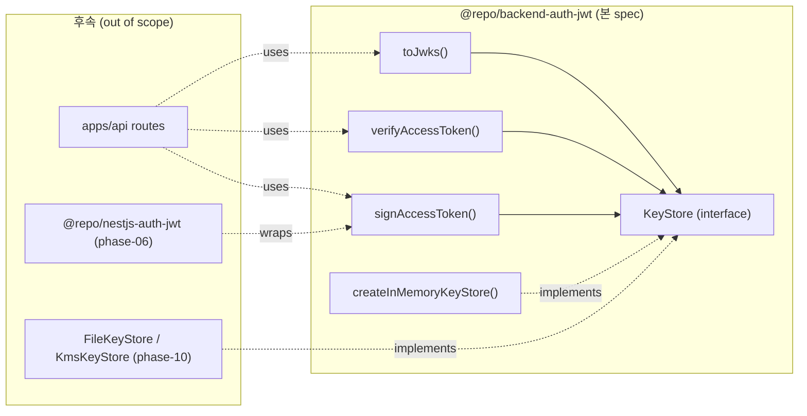

# Implementation Plan: spec-05-03

## 📋 Branch Strategy

- 신규 브랜치: `spec-05-03-auth-jwt`
- 시작 지점: `phase-05-auth-core-security` (phase base branch)
- 첫 task 가 브랜치 생성 수행

## 🛑 사용자 검토 필요 (User Review Required)

> [!IMPORTANT]
> - [ ] **jose 라이브러리 catalog 추가** — `pnpm-workspace.yaml` 의 `catalog:` 섹션에 `jose: ^5.x` 추가. `@repo/backend-auth-jwt/package.json` 은 `"jose": "catalog:"` 참조. ADR-0013 Decision 1.
> - [ ] **TTL 기본값 15분** — ADR-0013 Decision 1 의 "5~15분" 범위 중 *상한* 채택. 짧을수록 revocation 신뢰성 ↑, 길수록 refresh 부담 ↓. signin endpoint (spec-05-05+) 진입 시 환경별 조정 가능.
> - [ ] **`KeyStore` interface + in-memory 만 박음** — file/KMS/rotation cron 은 phase-10. 본 spec 은 *interface 자리* 만 박아 후속 swap 자연.
> - [ ] **JWKS endpoint mount 분리** — `toJwks()` helper 만 본 spec. 실제 apps/api 의 `/.well-known/jwks.json` 라우트는 endpoint 진입 spec (spec-05-05) 또는 별 spec 에서.

> [!WARNING]
> - [ ] **`jose` 신규 의존** — Node 의 `crypto.subtle.generateKey` 와 `jose` 의 `generateKeyPair` 둘 다 가능. **`jose.generateKeyPair("EdDSA", {crv: "Ed25519"})`** 채택 — Edge runtime 호환 일관.
> - [ ] **Private key 메모리 관리** — in-memory store 는 process restart 마다 키 재발급. 다중 인스턴스/배포에서는 *모두 같은 키* 가 필요하므로 **production 에서는 phase-10 의 file/KMS store 로 swap 필수** — 본 spec 은 단일 인스턴스 / 로컬 / 테스트 용도만.

## 🎯 핵심 전략 (Core Strategy)

### 아키텍처 컨텍스트



### 주요 결정

| 컴포넌트 | 전략 | 이유 |
|:---:|:---|:---|
| **라이브러리** | `jose` (panva/jose) | ADR-0013 Decision 1. Node + Edge 호환. EdDSA 1급 지원. |
| **알고리즘** | EdDSA (Ed25519) | ADR-0013 Decision 2. RS256/ES256 대비 빠르고 키 짧음. |
| **Refresh token** | 본 spec scope 밖 | spec-05-02 에서 opaque random + DB hash 박힘. JWT 화 비채택 (ADR-0013 Decision 4). |
| **KeyStore** | Interface + in-memory | auth-session 의 `SessionStore` 패턴 답습. file/KMS swap 자연. |
| **Claims** | sub/iat/exp/iss/aud/jti | ADR-0013 Decision 3. PII 금지. roles/perm 은 별 spec. |
| **TTL** | 기본 15분 (override 가능) | ADR-0013 Decision 1 상한. |
| **JWKS 형식** | `kty: OKP` + `crv: Ed25519` + `kid` + `alg: EdDSA` | RFC 8037 표준. |
| **에러 매핑** | `@repo/errors` AuthErrorCode | ADR-0012. flat code 일관. |
| **Result 반환** | `@repo/utils` Result | ADR-0008. throw 안 함, `verify` 는 Result 반환. |
| **테스트 패턴** | fake keystore (Map 기반) | auth-session 의 fake store 답습. jose mock 회피. |

### 📑 ADR 후보

- [ ] ADR 가치 있는 결정 있음
- [x] 없음 — ADR-0013 구현이므로 새 ADR 불요.

## 📂 Proposed Changes

### 1) 새 패키지: `packages/backend/auth-jwt`

#### [NEW] `packages/backend/auth-jwt/package.json`

```json
{
  "name": "@repo/backend-auth-jwt",
  "version": "0.0.0",
  "private": true,
  "type": "module",
  "exports": {
    ".": { "types": "./src/index.ts", "default": "./src/index.ts" }
  },
  "scripts": {
    "lint": "biome check .",
    "typecheck": "tsc --noEmit",
    "test": "vitest run"
  },
  "dependencies": {
    "@repo/errors": "workspace:*",
    "@repo/utils": "workspace:*",
    "jose": "catalog:"
  },
  "devDependencies": {
    "@biomejs/biome": "catalog:",
    "@repo/biome-config": "workspace:*",
    "@repo/typescript-config": "workspace:*",
    "@repo/vitest-config": "workspace:*",
    "typescript": "catalog:",
    "vitest": "catalog:"
  }
}
```

#### [NEW] `packages/backend/auth-jwt/src/keystore.ts`

`KeyStore` interface + `KeyMaterial` type (kid + key handle).

#### [NEW] `packages/backend/auth-jwt/src/memory-store.ts`

`createInMemoryKeyStore({ activeKeys?: number, kidFactory?: () => string })` — Ed25519 키 1개 생성 후 활성. 추가 활성 키 batch 또는 verify-only 키 등록 helper (`addVerificationOnlyKey`).

#### [NEW] `packages/backend/auth-jwt/src/sign.ts`

`signAccessToken(payload, store, opts)` — payload 의 `sub` 필수. `opts.issuer` / `opts.audience` 필수. `opts.expiresIn` (기본 15m).

#### [NEW] `packages/backend/auth-jwt/src/verify.ts`

`verifyAccessToken(token, store, opts)` — `opts.issuer` / `opts.audience` 검증. `Result<Claims, AuthError>` 반환.

#### [NEW] `packages/backend/auth-jwt/src/jwks.ts`

`toJwks(store) -> Promise<{keys: JsonWebKey[]}>`. `jose.exportJWK(publicKey)` + kid/alg 부여.

#### [NEW] `packages/backend/auth-jwt/src/index.ts`

위 함수 + 타입 re-export.

#### [NEW] `packages/backend/auth-jwt/src/*.test.ts`

테스트 분할:
- `sign-verify.test.ts` — round-trip + 다양한 claims
- `expiry.test.ts` — exp 만료 검증
- `tamper.test.ts` — signature tamper / payload tamper
- `kid.test.ts` — kid mismatch + 활성/verify-only 키 split
- `claim-mismatch.test.ts` — iss/aud 불일치
- `jwks.test.ts` — JWKS 형식 + public key only

#### [NEW] `packages/backend/auth-jwt/tsconfig.json`

`@repo/typescript-config/library.json` extends. auth-session 동일.

#### [NEW] `packages/backend/auth-jwt/vitest.config.ts`

`@repo/vitest-config` extends.

### 2) 카탈로그 추가

#### [MODIFY] `pnpm-workspace.yaml`

`catalog:` 섹션에 `jose: ^5.10.0` (latest stable) 추가.

### 3) `@repo/errors` 확인

#### [VERIFY] `packages/shared/errors/src/auth.ts` (또는 동등)

`AuthErrorCode.TOKEN_EXPIRED` / `TOKEN_INVALID` / `TOKEN_KEY_NOT_FOUND` / `TOKEN_CLAIM_MISMATCH` 존재 여부 확인. 없으면 본 spec 에서 추가 (ADR-0012 영역).

## 🧪 검증 계획 (Verification Plan)

### 단위 테스트 (필수)

```bash
pnpm --filter @repo/backend-auth-jwt test
```

기대 결과: 모든 test PASS (round-trip / expired / tamper / kid mismatch / claim mismatch / JWKS 6 영역, 케이스 15+).

### 통합 테스트

Integration Test Required = **no**. 본 spec 은 pure crypto + JWKS 형식 — 실 DB 불요. Phase 통합 시나리오는 phase-ship 단계 시점.

### 수동 검증 시나리오

1. **JWKS 검증** — `toJwks(store)` 출력을 `jose.createRemoteJWKSet` 으로 (가짜) 검증 가능한지 확인. 기대 결과: standard JWKS shape + Ed25519 알고리즘.
2. **Round-trip** — `sign` 후 `verify` 의 claims 가 입력 payload 와 일치. iat/exp 자동 부여 확인.
3. **Tamper resistance** — 토큰 payload base64 일부 변조 후 `verify` → `Result.err(TOKEN_INVALID)`.
4. **Expired** — `expiresIn: "1ms"` 후 setTimeout 10ms → `verify` → `Result.err(TOKEN_EXPIRED)`.

전체 monorepo 빌드:
```bash
pnpm typecheck
pnpm lint
pnpm depcruise:validate   # (또는 동등 명령 확인 — auth-session 답습)
```

## 🔁 Rollback Plan

- 본 spec 은 *신규 패키지 추가* — 기존 코드 변경 0 (jose catalog 추가 + `@repo/errors` 잠재적 확장만).
- Rollback: 브랜치 폐기 + `pnpm-workspace.yaml` 의 jose 추가 줄 revert. apps/api / 다른 패키지가 본 패키지를 import 하기 전까지 영향 0.

## 📦 Deliverables 체크

- [ ] task.md 작성 (다음 단계)
- [ ] 사용자 Plan Accept 받음
- [ ] (실행 후) 모든 task 완료
- [ ] (실행 후) walkthrough.md / pr_description.md ship
