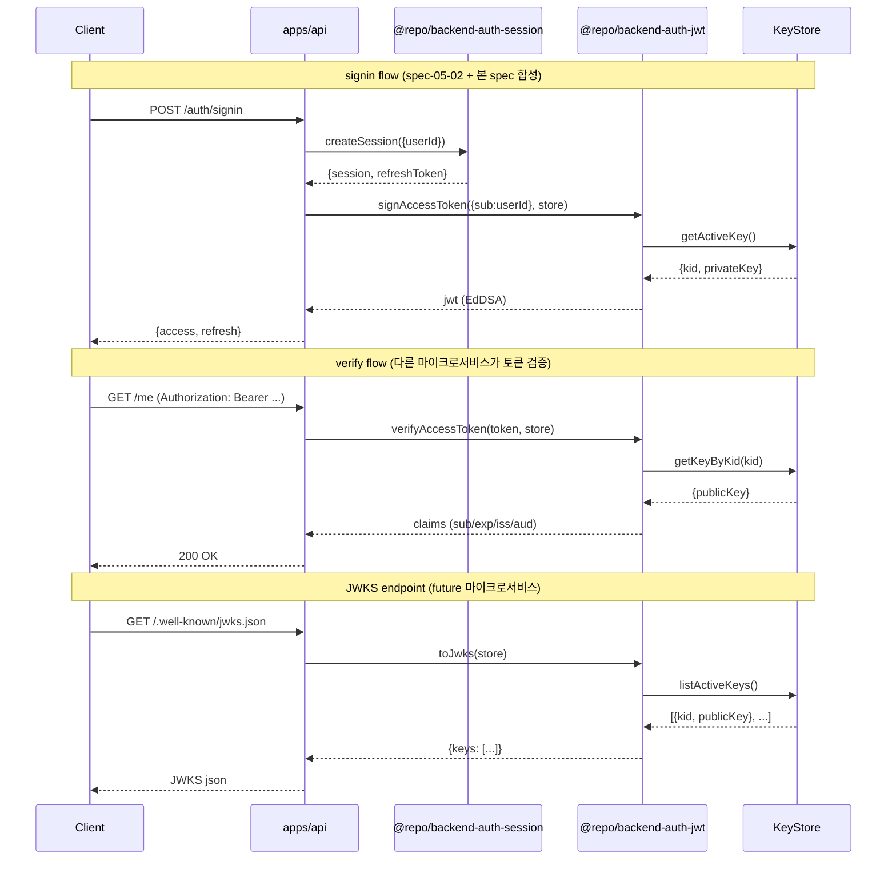

# spec-05-03: auth-jwt (jose EdDSA + JWKS)

## 📋 메타

| 항목 | 값 |
|---|---|
| **Spec ID** | `spec-05-03` |
| **Phase** | `phase-05` |
| **Branch** | `spec-05-03-auth-jwt` |
| **상태** | Planning |
| **타입** | Feature |
| **Integration Test Required** | no (실 PG 불요 — pure crypto + JWKS) |
| **작성일** | 2026-05-20 |
| **소유자** | dennis |

## 📋 배경 및 문제 정의

### 현재 상황

- phase-05 진행 중. spec-05-01 (auth-contracts 확장) + spec-05-02 (`@repo/backend-auth-session`) 머지 완료.
- auth-session 은 *refresh token* (opaque random + DB hash) 만 처리 — *access token (JWT)* 발급/검증은 **미구현**.
- ADR-0013 *Session lifecycle* 의 Decision 1/2/3/7 — JWT EdDSA + JWKS + 90일 rotation — 박을 자리.
- apps/api 부트 가능 (phase-03) + Drizzle 실 PG 검증 완료 (spec-05-02).

### 문제점

1. **Access token 발급 수단 없음** — auth-session 의 `createSession` / `rotateSession` 이 access token 을 반환할 매개체 부재. signin/refresh flow 가 *반쪽*.
2. **분산 검증 불가** — JWKS endpoint 없으면 future 마이크로서비스가 토큰 검증할 방법 없음 (HS256 같은 대칭키는 ADR-0013 에서 비채택).
3. **Key rotation 자리 미정** — 90일 rotation 운영 (phase-10) 전에 *interface 자리* 박아둬야 후속 plug-in 자연.

### 해결 방안 (요약)

`@repo/backend-auth-jwt` *framework-agnostic* 패키지 박음. `signAccessToken` / `verifyAccessToken` / `toJwks` + `KeyStore` interface + `createInMemoryKeyStore` 박음. auth-session 의 *Repository 패턴* 답습 — domain 은 *key 보관 메커니즘* (memory / file / KMS) 모름.

## 📊 개념도

## 🎯 요구사항

### Functional Requirements

1. **FR-1 signAccessToken**: `signAccessToken(payload, keystore, opts?) -> Promise<string>`. EdDSA (Ed25519) 서명. 기본 TTL **15분** (`opts.expiresIn` 으로 override). `iss` / `aud` `opts` 필수. `iat` / `exp` 자동.
2. **FR-2 verifyAccessToken**: `verifyAccessToken(token, keystore, opts) -> Promise<Result<Claims, AuthError>>`. `iss` / `aud` 일치 검증, `exp` 만료 검증, signature 검증. 실패 시 `Result.err(AuthError)`.
3. **FR-3 KeyStore interface**: `{ getActiveSigningKey(): Promise<{kid, privateKey}>; getVerificationKey(kid): Promise<{publicKey} | null>; listActivePublicKeys(): Promise<{kid, publicKey}[]>; }`. 도메인 함수는 *interface 만 의존*.
4. **FR-4 createInMemoryKeyStore**: in-memory 구현. `generateEd25519KeyPair()` 박은 후 (`kid` = UUID) 활성 키 1개 + (선택) verify-only 키 N개. 본 spec 의 *프로덕션 가능 구현* — 실 rotation cron 은 phase-10.
5. **FR-5 toJwks**: `toJwks(keystore) -> Promise<{keys: JsonWebKey[]}>`. *public 키만* 노출. `kid` / `alg: EdDSA` / `kty: OKP` / `crv: Ed25519` 표준 JWKS 형식.
6. **FR-6 Claims 구조**: `sub` / `iat` / `exp` / `iss` / `aud` 필수, `jti` 권장 (UUID 자동 발급). PII 금지 (ADR-0013 Decision 3). `roles` 등 조건부는 본 spec scope 밖.
7. **FR-7 AuthError 매핑**: `@repo/errors` 의 AuthErrorCode (ADR-0012) 사용 — `TOKEN_EXPIRED` / `TOKEN_INVALID` / `TOKEN_KEY_NOT_FOUND` / `TOKEN_CLAIM_MISMATCH`.

### Non-Functional Requirements

1. **NFR-1 Framework-agnostic**: NestJS / Express / Hono 등 framework 의존 0. auth-session 답습.
2. **NFR-2 Edge runtime 호환**: `jose` 사용 (Node + Edge 둘 다 지원). Node 의 `crypto.randomBytes` 등 Node-only API 회피.
3. **NFR-3 Stateless 검증**: `verifyAccessToken` 은 DB 조회 0. Key lookup 만 keystore 통해.
4. **NFR-4 보안 baseline**: 평문 private key 노출 금지. KeyStore 인터페이스가 *private key 를 캐싱/노출하지 않도록* 호출자가 보장 (in-memory store 는 process 메모리 내 보관).
5. **NFR-5 결정성**: `signAccessToken` 은 *순수 함수* (시간 + 키 의존 외). 동일 입력 + 시간 고정 → 동일 출력 (테스트 가능).
6. **NFR-6 단위 테스트 커버리지**: 핵심 path 100% — sign/verify round-trip, expired, kid mismatch, signature tamper, claim mismatch, JWKS 출력 형식.

## 🚫 Out of Scope

- **NestJS adapter** (`@repo/nestjs-auth-jwt` Guard / Module) — phase-06
- **JWKS endpoint 라우트 mount** (apps/api `/.well-known/jwks.json`) — spec-05-05 또는 별 spec (endpoint 첫 진입 시점). 본 spec 은 `toJwks()` helper 만 제공.
- **Key rotation 자동화** (90일 cron, file/KMS keystore) — phase-10. 본 spec 은 *interface + in-memory* 만.
- **jti deny list** (Redis 기반 revocation) — phase-10
- **`session.id` ↔ `jti` 연계** (즉시 revocation) — 필요 시 phase-10. 본 spec 의 `jti` 는 발급만, deny list 조회 안 함.
- **`roles` / `permissions` claims** — RBAC spec 별도.
- **Refresh token JWT 화** — ADR-0013 비채택 (opaque random + DB hash 유지).
- **다중 audience / multi-tenant** — claims 구조 단순 유지 (단일 `iss` / `aud`).

## 📑 ADR 후보

본 spec 의 결정은 **이미 ADR-0013 에 박혀 있음** (Decision 1/2/3/7). 본 spec 은 ADR-0013 *구현* — 새 ADR 불요.

- [ ] ADR 가치 있는 결정 있음
- [x] 없음 (ADR-0013 구현)

## 🔍 Critique 결과

미실행. 필요 시 `/hk-spec-critique` 로 후속 실행.

## ✅ Definition of Done

- [ ] `@repo/backend-auth-jwt` 패키지 생성 + workspace 등록 (`packages/backend/auth-jwt`)
- [ ] `signAccessToken` / `verifyAccessToken` / `toJwks` / `createInMemoryKeyStore` 구현
- [ ] `KeyStore` interface 정의 + fake store (테스트용)
- [ ] AuthError 매핑 — `@repo/errors` 의 AuthErrorCode 사용
- [ ] 단위 테스트 PASS (round-trip / expired / tamper / kid mismatch / claim mismatch / JWKS)
- [ ] lint / typecheck / depcruise 그린
- [ ] `walkthrough.md` + `pr_description.md` 작성 및 ship commit
- [ ] `spec-05-03-auth-jwt` 브랜치 push + PR 생성 (target: `phase-05-auth-core-security`)
