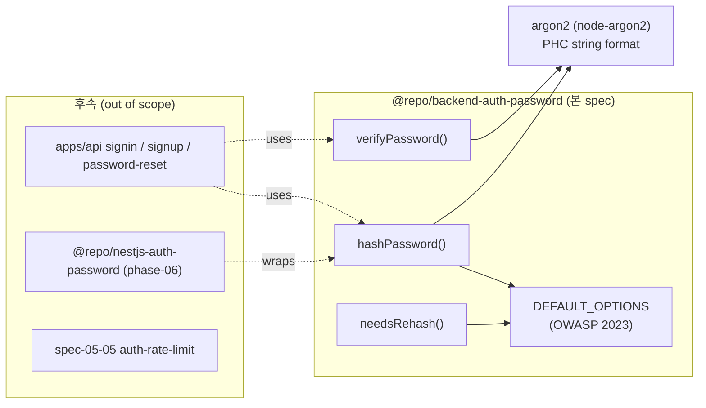

# Implementation Plan: spec-05-04

## 📋 Branch Strategy

- 신규 브랜치: `spec-05-04-auth-password`
- 시작 지점: `phase-05-auth-core-security` (phase base branch)
- 첫 task 가 브랜치 생성 수행

## 🛑 사용자 검토 필요 (User Review Required)

> [!IMPORTANT]
> - [ ] **argon2 라이브러리 선택** — 3 후보:
>   - **`argon2` (node-argon2) ^0.44.0** *추천* — C++ binding, OWASP cheatsheet 표준 예제 라이브러리. native build 필요하나 prebuild 다수.
>   - `@node-rs/argon2` — Rust binding (NAPI-RS), install 빠름 (Rust prebuilt 다수). 최신.
>   - `@noble/hashes/argon2id` — pure JS, slow (~10-100x). Edge 호환만 메리트, 본 spec scope 밖.
> - [ ] **cost parameter 기본값** (OWASP 2023 권장 *minimum*):
>   - memoryCost: 19456 (19 MiB)
>   - timeCost: 2 iterations
>   - parallelism: 1
>   - hashLength: 32 (256-bit)
> - [ ] **`verifyPassword` 반환 타입**: `Promise<boolean>` 채택 — wrong password 는 *예상 사용자 흐름*, malformed hash 는 *프로그래밍 오류 (throw)* 로 자연 분리. (jwt verify 와 다른 정책 — 사유는 walkthrough 에 기록 예정.)

> [!WARNING]
> - [ ] **`argon2` native binding** — Docker base image / CI runner 마다 prebuild 사용 가능 여부 다름. prebuild 실패 시 build-time C++ toolchain 필요 (CI 영향). Dockerfile / CI yml 에서 verify 필수 — 본 spec scope 는 아님 (phase-10 ops). install 단계에서 *적어도 본 로컬 환경 빌드 성공* 확인.

## 🎯 핵심 전략 (Core Strategy)

### 아키텍처 컨텍스트



### 주요 결정

| 컴포넌트 | 전략 | 이유 |
|:---:|:---|:---|
| **라이브러리** | `argon2` (node-argon2) ^0.44.0 | OWASP cheatsheet 표준. native binding (prebuilt 다수). |
| **알고리즘** | argon2id | side-channel + GPU 양쪽 균형. ADR-0014. |
| **Cost parameter** | OWASP 2023 minimum (m=19MiB / t=2 / p=1 / hashLen=32) | 표준 권장. 환경별 조정 가능 (override). |
| **PHC string** | 라이브러리 native (`$argon2id$v=19$m=...`) | rehash 시 *옛 hash 의 cost 파싱* 가능. |
| **`verifyPassword` 반환** | `Promise<boolean>` | wrong password 와 malformed hash 의 *책임 분리*. |
| **`needsRehash` 시그니처** | `(hash: string, opts?: HashOptions) -> boolean` | argon2 라이브러리의 `needsRehash` API 활용 — PHC string 파싱 자체는 라이브러리 책임. |
| **에러 발급** | malformed hash 만 throw (`AppError({code: "PASSWORD_HASH_MALFORMED", statusCode: 500})`) | 사용자 흐름 아님, 프로그래밍/저장 오류. |

### 📑 ADR 후보

- [x] 없음 — ADR-0014 구현.

## 📂 Proposed Changes

### 1) 새 패키지: `packages/backend/auth-password`

#### [NEW] `packages/backend/auth-password/package.json`

```json
{
  "name": "@repo/backend-auth-password",
  "version": "0.0.0",
  "private": true,
  "type": "module",
  "exports": {
    ".": { "types": "./src/index.ts", "default": "./src/index.ts" }
  },
  "scripts": {
    "lint": "biome check .",
    "typecheck": "tsc --noEmit",
    "test": "vitest run"
  },
  "dependencies": {
    "@repo/errors": "workspace:*",
    "argon2": "catalog:"
  },
  "devDependencies": {
    "@biomejs/biome": "catalog:",
    "@repo/biome-config": "workspace:*",
    "@repo/typescript-config": "workspace:*",
    "@repo/vitest-config": "workspace:*",
    "@types/node": "catalog:",
    "typescript": "catalog:",
    "vitest": "catalog:"
  }
}
```

#### [NEW] `src/options.ts`

`HashOptions` interface + `DEFAULT_OPTIONS` (OWASP 2023). `needsRehash` 가 *현 정책* 과 비교 시 참조.

#### [NEW] `src/hash.ts`

`hashPassword(plain, opts?)` — argon2.hash 박음 + PHC string 반환 + 빈 input 거부.

#### [NEW] `src/verify.ts`

`verifyPassword(plain, hash)` — argon2.verify 박음 + boolean. PHC string parse 실패는 AppError throw.

#### [NEW] `src/rehash.ts`

`needsRehash(hash, opts?)` — argon2 의 `needsRehash` API 활용.

#### [NEW] `src/index.ts`

barrel re-export.

#### [NEW] `src/*.test.ts`

테스트 분할:
- `options.test.ts` (2 케이스) — DEFAULT_OPTIONS 값 / merge 동작
- `hash.test.ts` (4 케이스) — PHC string shape / salt 랜덤 / cost override / 빈 input
- `verify.test.ts` (4 케이스) — round-trip / wrong password / 빈 input / malformed throw
- `rehash.test.ts` (3 케이스) — 옛 cost true / 현 cost false / 명시 opts 비교

#### [NEW] `tsconfig.json` / `vitest.config.ts`

auth-jwt 답습.

### 2) 카탈로그 추가

#### [MODIFY] `pnpm-workspace.yaml`

`catalog:` 섹션 — `argon2: ^0.44.0`.

## 🧪 검증 계획

### 단위 테스트

```bash
pnpm --filter @repo/backend-auth-password test
```

기대: 13 케이스 PASS. argon2 native build 성공 자동 확인.

### 통합 테스트

Integration Test Required = **no** — pure crypto.

### 수동 검증 시나리오

1. **PHC string shape**: `hashPassword("secret")` 의 출력이 `$argon2id$v=19$m=19456,t=2,p=1$<salt>$<hash>` 패턴 매치.
2. **Round-trip**: hash 후 verify(plain) = true.
3. **Wrong password**: hash("a") 후 verify("b") = false (throw 아님).
4. **Cost override**: `hashPassword("x", {memoryCost: 4096})` 출력의 cost 부분 검증.
5. **needsRehash**: 옛 cost (m=4096) hash 에 대해 `needsRehash(hash)` = true; 현 cost (m=19456) hash = false.
6. **Malformed hash**: `verifyPassword("x", "not-a-phc-string")` → throw.

전체:
```bash
pnpm typecheck
pnpm lint
npx depcruise --config packages/config/depcruise-config/base.cjs packages apps
```

## 🔁 Rollback Plan

- 신규 패키지 추가 — 기존 코드 변경 0.
- Rollback: 브랜치 폐기 + `pnpm-workspace.yaml` 의 argon2 줄 revert.

## 📦 Deliverables 체크

- [ ] task.md 작성 (다음 단계)
- [ ] 사용자 Plan Accept 받음
- [ ] (실행 후) 모든 task 완료
- [ ] (실행 후) walkthrough.md / pr_description.md ship
