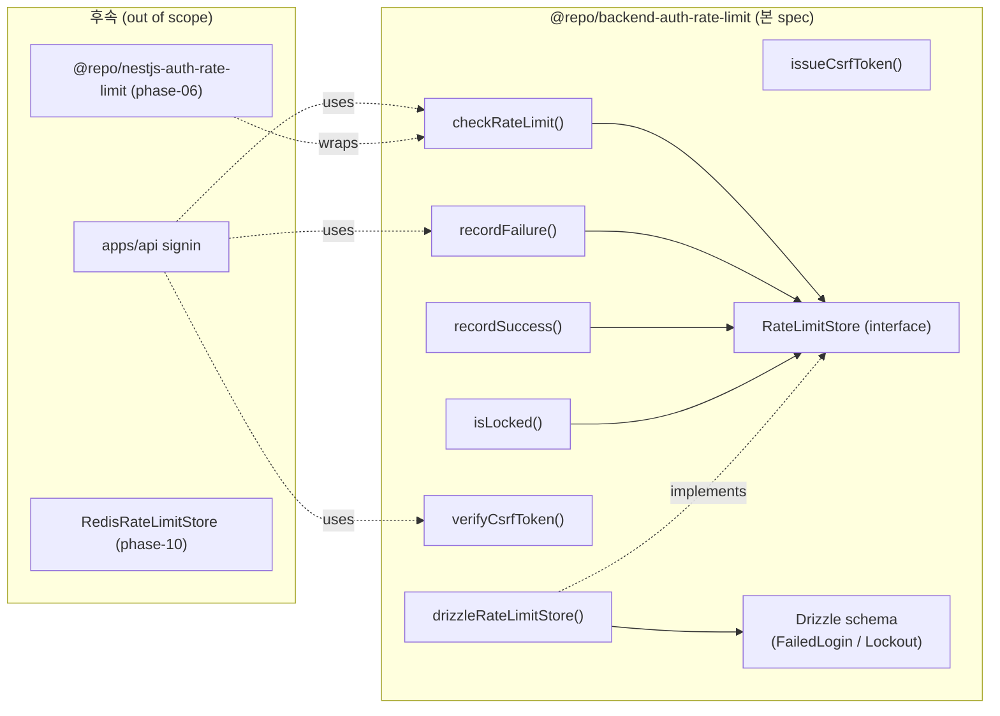

# Implementation Plan: spec-05-05

## 📋 Branch Strategy

- 신규 브랜치: `spec-05-05-auth-rate-limit`
- 시작 지점: `phase-05-auth-core-security`
- 첫 task 가 브랜치 생성

## 🛑 사용자 검토 필요 (User Review Required)

> [!IMPORTANT]
> - [ ] **Rate limit 정책 기본값**:
>   - per-IP: 30 req / 5분 window (signin 한정)
>   - per-account: 5 req / 5분 window
>   - 합산: 둘 중 하나라도 초과 → block
> - [ ] **Lockout 정책 기본값** (ADR 승격 후보):
>   - threshold: 5회 연속 fail
>   - cooldown: 15분 (progressive backoff — 반복 lockout 마다 ×2, 최대 24h)
>   - reset 조건: 성공 signin 시
> - [ ] **CSRF 패턴**: double-submit cookie + HMAC-SHA256 deterministic token. session id 가 key — cookie 의 token 과 header 의 token *둘 다 일치* + HMAC 검증 시 통과. session 동반이라 *session revoke = CSRF 자동 invalidate*.
> - [ ] **CSRF secret 출처**: apps/api settings (`AUTH_CSRF_SECRET` env). 본 spec 은 *secret 을 함수 인자* 로 받음 — secret 관리는 settings 영역.
> - [ ] **Drizzle 스키마 통합**: `@repo/backend-auth-session` 의 drizzle setup 답습. 새 테이블 2개 (FailedLogin / Lockout) 추가, migration `0001_*.sql` 생성.
> - [ ] **Integration Test Required = yes**: 실 PostgreSQL 검증 — `auth-session` 의 *수동 PG 검증* 패턴 답습 (Docker postgres:16 + db:migrate + round-trip + cleanup).

> [!WARNING]
> - [ ] **Migration 충돌 가능성** — `auth-session` 의 `0000_funny_jane_foster.sql` 과 본 spec 의 `0001_*.sql` 이 *같은 schema namespace* 에서 동작해야. drizzle config + connection 정합성 확인.
> - [ ] **Sliding window 구현 — DB COUNT vs in-memory cache** — DB COUNT 는 매 request 마다 query → high traffic 영향. 본 spec 은 *DB COUNT* 시작 (간단 + 확실), Redis cache 는 phase-10. 단위 테스트로 boundary 검증.
> - [ ] **Lockout 의 race condition** — 동시 N+1 회 fail 시 *마지막 회* 가 lockout 발급 race. 본 spec 은 *DB unique constraint + advisory lock* 으로 보호. boundary 테스트 박음.

## 🎯 핵심 전략 (Core Strategy)

### 아키텍처 컨텍스트



### 주요 결정

| 컴포넌트 | 전략 | 이유 |
|:---:|:---|:---|
| **Rate limit window** | sliding window via DB COUNT | 정확 + 단순. high traffic 은 Redis (phase-10) 이전. |
| **Lockout state** | DB row (per accountKey) — `unlockAt` 컬럼 | 만료 자동 unlock — sync로 비교만 (read on each check). |
| **Progressive backoff** | streak 컬럼 — 반복 lockout ×2 cooldown | OWASP 권장. brute-force 점진 차단. |
| **CSRF token** | HMAC-SHA256 (sessionId + secret) → base64url | stateless deterministic. session 동반이라 *session revoke = CSRF invalidate* 자연. |
| **CSRF storage** | session cookie (double-submit) — 본 spec scope 밖 (호출자) | endpoint 가 Set-Cookie 박음. 본 spec 은 token 발급/검증만. |
| **Store** | Repository 패턴 (interface + Drizzle + fake) | `auth-session` 답습. domain 은 DB 모름. |
| **Drizzle schema 위치** | `packages/backend/auth-rate-limit/src/schema.ts` + drizzle config | `auth-session` 패턴 답습. migration `0000_*.sql` (본 패키지 첫 migration). |
| **Migration 충돌** | `auth-session` 과 *다른 schema 영역* (각 패키지 별 migration) — DB 통합은 apps/api 시점 | 패키지 단위 격리. 통합은 phase-06+ apps/api integration. |
| **Result 반환** | rate-limit/lockout 은 *struct 반환* (`{allowed, retryAfter, reason}`), CSRF 는 `boolean` | jwt/password 의 정책 답습 — *예상 사용자 흐름* (rate-limited) 은 struct, *형식 검증 실패* 는 boolean. |

### 📑 ADR 후보

- [ ] **Lockout 정책** (5회 / 15분 / ×2 backoff) — convention. 본 spec walkthrough 에 기록 후 *경계 사례* 부각 시 승격.

## 📂 Proposed Changes

### 1) 새 패키지: `packages/backend/auth-rate-limit`

#### [NEW] `package.json`

```json
{
  "name": "@repo/backend-auth-rate-limit",
  "version": "0.0.0",
  "private": true,
  "type": "module",
  "exports": {
    ".": { "types": "./src/index.ts", "default": "./src/index.ts" },
    "./schema": { "types": "./src/schema.ts", "default": "./src/schema.ts" }
  },
  "files": ["src", "drizzle"],
  "scripts": {
    "lint": "biome check .",
    "typecheck": "tsc --noEmit",
    "test": "vitest run",
    "db:generate": "drizzle-kit generate",
    "db:migrate": "drizzle-kit migrate"
  },
  "dependencies": {
    "@repo/backend-database": "workspace:*",
    "@repo/errors": "workspace:*",
    "drizzle-orm": "catalog:"
  },
  "devDependencies": {
    "@biomejs/biome": "catalog:",
    "@repo/biome-config": "workspace:*",
    "@repo/typescript-config": "workspace:*",
    "@repo/vitest-config": "workspace:*",
    "@types/node": "catalog:",
    "@types/pg": "catalog:",
    "drizzle-kit": "catalog:",
    "pg": "catalog:",
    "typescript": "catalog:",
    "vitest": "catalog:"
  }
}
```

#### [NEW] `src/schema.ts`

Drizzle 테이블 2개:
- `failedLogins` (id uuid PK / ip text / accountKey text / attemptedAt timestamptz / INDEX (accountKey, attemptedAt), (ip, attemptedAt))
- `lockouts` (accountKey text PK / lockedAt timestamptz / unlockAt timestamptz / streak int)

#### [NEW] `src/store.ts`

`RateLimitStore` interface:
- `countRecentByIp(ip, since): Promise<number>`
- `countRecentByAccount(accountKey, since): Promise<number>`
- `insertFailure({ip, accountKey, at}): Promise<void>`
- `resetAccount(accountKey): Promise<void>`
- `findLockout(accountKey): Promise<LockoutRow | null>`
- `upsertLockout({accountKey, lockedAt, unlockAt, streak}): Promise<void>`
- `deleteLockout(accountKey): Promise<void>`

#### [NEW] `src/drizzle-store.ts`

`drizzleRateLimitStore(db)` — thin adapter.

#### [NEW] `src/fake-store.ts`

Map 기반 fake — `auth-session` 답습.

#### [NEW] `src/rate-limit.ts`

`checkRateLimit` / `recordFailure` / `recordSuccess` 도메인 함수 + `RATE_LIMIT_DEFAULTS`.

#### [NEW] `src/lockout.ts`

`isLocked` + lockout 평가 로직 (recordFailure 내부 호출) + `LOCKOUT_DEFAULTS`.

#### [NEW] `src/csrf.ts`

`issueCsrfToken` / `verifyCsrfToken` — HMAC-SHA256 + timing-safe compare.

#### [NEW] `src/index.ts`

barrel re-export.

#### [NEW] `src/*.test.ts`

- `rate-limit.test.ts` (5 cases) — IP boundary / account boundary / 합산 / window slide / reset
- `lockout.test.ts` (5 cases) — N회 fail → locked / cooldown 진행 / progressive backoff / 성공 reset / 만료 자동 unlock
- `csrf.test.ts` (4 cases) — round-trip / wrong session id / tampered token / 빈 input
- `store.test.ts` (3 cases) — fake store contract (insert / count / upsert lockout)

#### [NEW] `drizzle.config.ts` / `tsconfig.json` / `vitest.config.ts`

`auth-session` 답습.

#### [NEW] `drizzle/0000_*.sql`

`drizzle-kit generate` 실 PG 검증 후 생성.

### 2) 실 PG 검증

`auth-session` 의 수동 PG 검증 패턴 답습 (walkthrough §4 참조):
- Docker postgres:16 부트
- `pnpm --filter @repo/backend-auth-rate-limit db:migrate`
- `\d failed_logins` / `\d lockouts` 검증
- round-trip: insert / count / lockout upsert
- cleanup

## 🧪 검증 계획

### 단위 테스트

```bash
pnpm --filter @repo/backend-auth-rate-limit test
```

기대: 17 케이스 PASS.

### 통합 테스트 (Integration Test Required = yes)

`auth-session` 패턴 답습 — 수동 PG 검증 walkthrough §검증 결과 에 기록. testcontainers 자동화는 phase-10.

### 수동 검증 시나리오

1. **Rate limit IP**: 31회 요청 (5분 내) → 31째 `allowed: false, reason: rate_limited`.
2. **Rate limit account**: 동일 email 6회 fail → 6째 `allowed: false`.
3. **Lockout**: 5회 fail → 6째 시도 `isLocked: true, until: +15min`.
4. **Progressive**: lockout 만료 후 또 5회 fail → 두 번째 lockout 의 unlockAt 이 30min (×2).
5. **Lockout reset**: 5회 fail → 성공 signin → `streak` 0 + `lockouts` row 삭제.
6. **CSRF round-trip**: `issueCsrfToken(secret, sessionId)` → `verifyCsrfToken(secret, sessionId, token)` = true.
7. **CSRF wrong session**: `verifyCsrfToken(secret, "other-session", token)` = false.
8. **CSRF tamper**: token 1 byte 변조 → false.

전체:
```bash
pnpm typecheck
pnpm lint
npx depcruise --config packages/config/depcruise-config/base.cjs packages apps
```

## 🔁 Rollback Plan

- 신규 패키지 — 기존 코드 변경 0.
- Rollback: 브랜치 폐기 + drizzle migration 미적용 (별 DB 영역).

## 📦 Deliverables 체크

- [ ] task.md 작성 (다음 단계)
- [ ] 사용자 Plan Accept 받음
- [ ] 모든 task 완료
- [ ] walkthrough.md / pr_description.md ship
- [ ] 수동 PG 검증 결과 walkthrough 첨부
