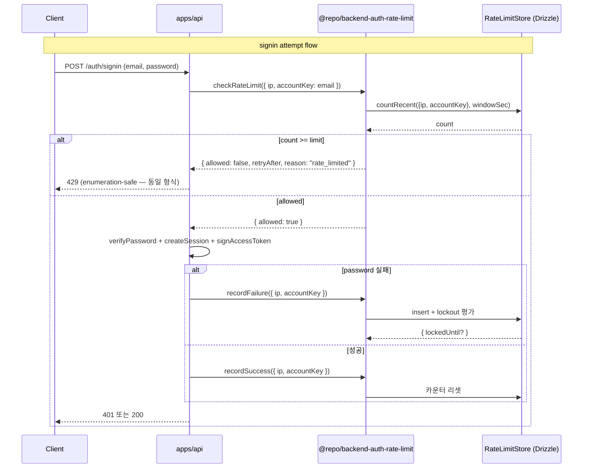

# spec-05-05: auth-rate-limit (rate-limit + lockout + CSRF — core)

## 📋 메타

| 항목 | 값 |
|---|---|
| **Spec ID** | `spec-05-05` |
| **Phase** | `phase-05` |
| **Branch** | `spec-05-05-auth-rate-limit` |
| **상태** | Planning |
| **타입** | Feature |
| **Integration Test Required** | yes (DB schema + state machine) |
| **작성일** | 2026-05-21 |
| **소유자** | dennis |

## 📋 배경 및 문제 정의

### 현재 상황

- phase-05 진행 중. spec-05-01 ~ spec-05-04 머지 완료.
- *abuse 방어 영역 미구현* — signin endpoint (spec-05-06) 진입 시 brute-force / credential stuffing / CSRF 모두 *0 방어*.
- ADR-0014 *Security baseline* 의 CSRF / Rate limit / Lockout 항목 박을 자리.
- 2026-05-21 *spec-05-04 분할 협의* 후 본 spec 은 *rate-limit + lockout + CSRF 3 영역 묶음* (옵션 A 채택).

### 문제점

1. **Brute-force**: signin endpoint 가 *반복 password 시도* 무제한 허용 → argon2 cost 가 약해질수록 위험.
2. **Credential stuffing**: 유출 DB 활용한 *합법 password* 대량 시도 — IP rotation 으로 IP rate-limit 우회 가능 → *account-scoped* lockout 도 필요.
3. **CSRF**: cookie 기반 session 의 cross-origin 요청에 *상태 변경 endpoint* (password reset, session revoke 등) 노출.
4. **Enumeration**: rate-limit / lockout 응답이 *user 존재* 노출하면 안 됨 — *동일 응답 형식* 강제.

### 해결 방안 (요약)

`@repo/backend-auth-rate-limit` *framework-agnostic core* 패키지. 3 영역 응집:

- **Rate limit decision engine** — IP / account 별 sliding window 카운터.
- **Account lockout state machine** — N회 fail 누적 → locked → cooldown → unlock.
- **CSRF token issue/verify** — double-submit cookie 패턴 (stateless, session 동반).

Repository 패턴 — DB store interface + Drizzle 구현 (FailedLogin / Lockout 테이블). middleware mount (NestJS Throttler 어댑터 등) 는 phase-06.

## 📊 개념도

## 🎯 요구사항

### Functional Requirements

#### Rate limit

1. **FR-1 checkRateLimit**: `checkRateLimit(store, { ip, accountKey }, opts) -> Promise<{ allowed: boolean; retryAfter?: number; reason?: "rate_limited" | "locked_out" }>`. IP 단위 sliding window + account 단위 카운터 *합산* 평가.
2. **FR-2 recordFailure**: `recordFailure(store, { ip, accountKey, at? }) -> Promise<{ lockedUntil?: Date }>`. FailedLogin 테이블에 insert + Lockout 평가.
3. **FR-3 recordSuccess**: `recordSuccess(store, { ip, accountKey }) -> Promise<void>`. account 카운터 reset (성공 = 의심 해제). IP 카운터는 보존 (다른 account 영향 회피용).

#### Lockout

4. **FR-4 Lockout state machine**: N회 fail (per-account 기본 5회) → `locked` 상태 + cooldown (기본 15분) → 자동 unlock. progressive backoff 가능 (반복 lockout 마다 cooldown 2x).
5. **FR-5 isLocked**: `isLocked(store, accountKey) -> Promise<{locked: boolean; until?: Date}>`. lockout 만료 자동 unlock.

#### CSRF

6. **FR-6 issueCsrfToken**: `issueCsrfToken(secret: string, sessionId: string) -> string`. HMAC-SHA256 기반 deterministic — 같은 sessionId + secret → 같은 token (double-submit 패턴 친화).
7. **FR-7 verifyCsrfToken**: `verifyCsrfToken(secret, sessionId, presented) -> boolean`. timing-safe 비교.

#### Store interface

8. **FR-8 RateLimitStore + LockoutStore interface**: Repository 패턴 — Drizzle 구현 + fake (Map 기반) 박음.
9. **FR-9 Drizzle 구현**: `FailedLogin` (id / ip / accountKey / attemptedAt) + `Lockout` (accountKey / lockedAt / unlockAt / streak) 테이블. migration 포함.

### Non-Functional Requirements

1. **NFR-1 Framework-agnostic**: NestJS / Express middleware 의존 0. middleware 어댑터는 phase-06.
2. **NFR-2 Enumeration-safe**: rate-limit / lockout 응답이 *user 존재 노출 안 함* — 호출자 책임이지만 본 spec 의 `allowed: false` 응답은 *user 존재 무관* (IP+account key 카운터만).
3. **NFR-3 결정성**: CSRF token 발급은 HMAC deterministic — test 자연.
4. **NFR-4 단위 테스트 커버리지**: rate-limit / lockout / CSRF 각 영역 5+ 케이스 = 15+.
5. **NFR-5 통합 테스트**: 실 PostgreSQL (Docker) 에서 schema migration + round-trip (auth-session 패턴 답습).

## 🚫 Out of Scope

- **NestJS middleware adapter** (Guard / Interceptor) → phase-06 (`@repo/nestjs-auth-rate-limit`)
- **Redis storage** (Drizzle 대신 빠른 in-memory store) → phase-10
- **Distributed rate-limit** (multi-instance 합산) → phase-10 ops
- **Device fingerprint / GeoIP risk score** → 별 spec
- **Captcha 통합** (HCaptcha / reCAPTCHA) → 별 spec
- **Email 알림** (lockout 발생 시 user 알림) → spec-05-07 email flow 후 자연 진행
- **CSRF cookie 발급 자체** (Set-Cookie header) → endpoint spec-05-06 (본 spec 은 token primitives 만)
- **CSRF origin/referer 검증** → endpoint level (NestJS / Express middleware)
- **WebSocket rate-limit** → 별 spec (WebSocket gateway 도입 시)

## 📑 ADR 후보

본 spec 의 결정은 ADR-0014 *Security baseline* 의 *구현*. 다음은 ADR 승격 후보:

- [ ] **Lockout 정책** (5회 fail / 15분 cooldown / progressive backoff 2x) — 운영 운영 영향 큼, 변경 시 *조직 결정* 필요. 후보 slug: `lockout-policy` (type: convention).
- [x] 위 항목 walkthrough §결정 기록 에 박은 후 *경계 사례 (cooldown 정확 분 단위 vs 동적)* 부각되면 그때 ADR 승격.

## 🔍 Critique 결과

미실행.

## ✅ Definition of Done

- [ ] `@repo/backend-auth-rate-limit` 패키지 생성 (`packages/backend/auth-rate-limit`)
- [ ] Rate limit (sliding window) + Lockout (state machine) + CSRF (HMAC token) 구현
- [ ] Drizzle schema (FailedLogin / Lockout) + migration
- [ ] Store interface + fake + Drizzle 구현
- [ ] 단위 테스트 PASS (15+ 케이스)
- [ ] 통합 테스트 PASS — 실 PG round-trip
- [ ] lint / typecheck / depcruise 그린
- [ ] `walkthrough.md` + `pr_description.md` ship
- [ ] PR 생성 (target: `phase-05-auth-core-security`)
