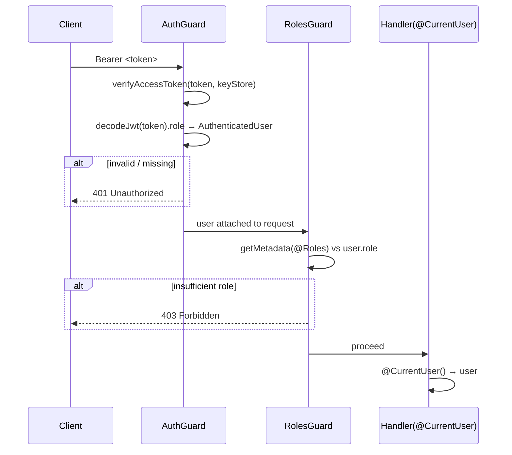

# spec-06-01: NestJS 인증 어댑터 (auth-nestjs)

## 📋 메타

| 항목 | 값 |
|---|---|
| **Spec ID** | `spec-06-01` |
| **Phase** | `phase-06` |
| **Branch** | `spec-06-01-auth-nestjs` |
| **상태** | Planning |
| **타입** | Feature |
| **Integration Test Required** | no |
| **작성일** | 2026-05-21 |
| **소유자** | dennis |

## 📋 배경 및 문제 정의

### 현재 상황

phase-05 완료로 `@repo/backend-auth-jwt` (`verifyAccessToken` / `signAccessToken` / `KeyStore`) 와 apps/api `JwtModule` 이 동작 중이다. JWT 발급·검증 로직은 framework-agnostic 패키지에 있으나, NestJS request 파이프라인에서 이를 *Guard* 로 활용하는 계층이 없다. 현재 모든 endpoint 는 인증 없이 접근 가능하다.

### 문제점

- 인증이 필요한 endpoint 를 선언할 방법이 없음 (`@UseGuards` 연결 Guard 부재).
- `@CurrentUser()` 파라미터 데코레이터 없음 → handler 에서 직접 `req.user` 캐스팅 필요.
- 역할 기반 접근 제어(RBAC) 인프라 없음 (`@Roles('admin')` 등 불가).

### 해결 방안 (요약)

`packages/nestjs/auth/` (`@repo/nestjs-auth`) 패키지를 신설해 `AuthGuard` + `RolesGuard` + `@Roles` / `@CurrentUser` 데코레이터 + `NestjsAuthModule.forRoot(opts)` 를 제공한다. 모두 ADR-0015 (framework-adapter 네이밍) + ADR-0016 (표준 `@Module` class) 를 따르며 기존 auth-jwt 패키지를 wrapping 한다.

## 📊 개념도

## 🎯 요구사항

### Functional Requirements

1. **`AuthGuard`** (`CanActivate`): `Authorization: Bearer <token>` 헤더 추출 → `verifyAccessToken` 서명 검증 → `decodeJwt` 로 `role` 추출 → `AuthenticatedUser` 를 `request.user` 에 부착. 토큰 없음/만료/invalid → `UnauthorizedException` (401).
2. **`RolesGuard`** (`CanActivate`): `Reflector` 로 `@Roles(...)` 메타데이터 조회 → `request.user.role` 비교. `@Roles` 없으면 통과. role 불일치 → `ForbiddenException` (403).
3. **`@Roles(...roles: Role[])`**: `SetMetadata` 기반 데코레이터.
4. **`@CurrentUser()`**: 파라미터 데코레이터 — `ExecutionContext` 에서 `request.user` 추출.
5. **`NestjsAuthModule.forRoot({ keyStore, issuer, audience })`**: `DynamicModule` — `AuthGuard` / `RolesGuard` 를 provider 로 등록.
6. **`AuthenticatedUser` 타입**: `{ sub: string; role: Role }`.

### Non-Functional Requirements

1. `@repo/backend-auth-jwt` 의 `verifyAccessToken` / `KeyStore` 에만 의존 (framework-agnostic 원칙 유지).
2. ADR-0015 네이밍 (`@repo/nestjs-auth`, `packages/nestjs/auth/`) 준수.
3. ADR-0016 표준 `@Module` class (객체 리터럴 아님) 준수.
4. 단위 테스트는 `@nestjs/testing` `TestingModule` 사용, real JWT 서명 (`createFakeKeyStore`) 활용.

## 🚫 Out of Scope

- 실제 signin / signout endpoint (phase-06 spec-06-03 이후)
- Cookie 전략 (spec-06-03)
- Audit event (spec-06-04)
- `email_verified` 강제 검사 (phase-06 이후 결정)
- MFA 관련 Guard
- apps/api controller 에 Guard 실제 적용 (spec-06-01 은 패키지 신설 + apps/api `AppModule` import 까지)

## 📑 ADR 후보

- [x] ADR 가치 있는 결정 있음
  - `nestjs-auth-guard-role-extraction` (type: decision) — `verifyAccessToken` 후 `decodeJwt` 로 custom claim 추출 (JwtClaims 확장 아님). 이유: auth-jwt API 변경 없이 guard 에서 role 접근 가능.

## ✅ Definition of Done

- [ ] 단위 테스트 PASS (AuthGuard + RolesGuard 각각 3케이스 이상)
- [ ] `pnpm typecheck` PASS
- [ ] `walkthrough.md` 와 `pr_description.md` 작성 및 ship commit
- [ ] `spec-06-01-auth-nestjs` 브랜치 push 완료
- [ ] 사용자 검토 요청 알림 완료
