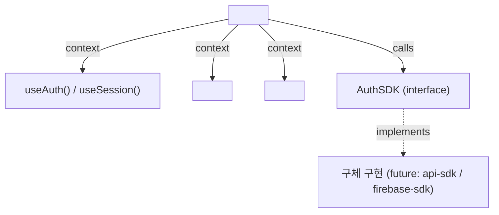

# spec-06-02: React 인증 어댑터 (auth-react)

## 📋 메타

| 항목 | 값 |
|---|---|
| **Spec ID** | `spec-06-02` |
| **Phase** | `phase-06` |
| **Branch** | `spec-06-02-auth-react` |
| **상태** | Planning |
| **타입** | Feature |
| **Integration Test Required** | no |
| **작성일** | 2026-05-21 |
| **소유자** | dennis |

## 📋 배경 및 문제 정의

### 현재 상황

spec-06-01 완료로 `@repo/nestjs-auth` (AuthGuard / RolesGuard) 가 NestJS 레이어에서 JWT 인증을 처리한다. phase-04 완료로 `apps/web-next` 와 `apps/web-vite` 가 부트 상태이나, 프론트엔드에서 인증 상태를 관리하는 공통 React 레이어가 없다.

### 문제점

- 각 앱이 독립적으로 auth 상태를 관리하면 코드 중복 + 불일치 발생.
- ADR-0006 "Consistent Wrapped SDK" 원칙 — `<AuthProvider sdk={sdk}>` 패턴으로 어떤 Provider SDK 든 동일하게 사용해야 하나, 해당 패키지가 없다.
- 인증 필요 라우트 보호(`<RequireAuth>`)나 역할 기반 UI 숨김(`<RequireRole>`) 을 매번 직접 구현해야 한다.

### 해결 방안 (요약)

`packages/frontend/auth-react/` (`@repo/frontend-auth-react`) 패키지를 신설한다. `AuthSDK` Core Surface interface 를 `auth-contracts` 에 추가하고, React Context 기반 `<AuthProvider>` + `useAuth()` / `useSession()` hooks + `<RequireAuth>` / `<RequireRole>` guard 컴포넌트를 제공한다.

## 📊 개념도

## 🎯 요구사항

### Functional Requirements

1. **`AuthSDK` interface** (`auth-contracts` 에 추가) — `signIn` / `signOut` / `getCurrentUser` / `signUp` / `refresh`.
2. **`<AuthProvider sdk={sdk}>`** — mount 시 `sdk.getCurrentUser()` 호출하여 초기 auth 상태 결정. React Context 로 하위 컴포넌트에 상태 제공.
3. **`useAuth()`** — `{ user: User | null, isLoading: boolean, signIn, signOut, signUp, refresh }` 반환. `<AuthProvider>` 외부에서 호출 시 에러.
4. **`useSession()`** — `{ user: User | null, isLoading: boolean }` 반환 (read-only subset of useAuth).
5. **`<RequireAuth fallback?>`** — isLoading → fallback(default: null), 미인증 → fallback, 인증 → children 렌더.
6. **`<RequireRole role="admin" fallback?>`** — `user.role !== role` → fallback, 일치 → children 렌더.

### Non-Functional Requirements

1. `react` 는 peerDependency (번들에 포함 ❌). React 19 호환.
2. `@repo/auth-contracts` 에만 의존 (backend 패키지 의존 ❌).
3. 단위 테스트: `@testing-library/react` + jsdom 환경.
4. Server-side rendering 안전: `useEffect` 내 `getCurrentUser` 호출.

## 🚫 Out of Scope

- `useMfaChallenge` hook (phase-07 MFA spec)
- `onAuthStateChange` 구독 (Firebase/Supabase 패턴 — phase-08)
- Cookie 설정/읽기 (spec-06-03)
- 실제 API 호출 구현 (AuthSDK 인터페이스만, 구체 구현은 spec-06-05 이후)
- `<AuthProvider>` 내부에서 token refresh 자동화
- Route-level 보호 (Next.js middleware / TanStack Router loader — 앱 레벨 결정)

## 📑 ADR 후보

- [ ] 없음 (ADR-0006 Decision 2 "Consistent Wrapped SDK" 의 실체화 — 새 결정 없음)

## ✅ Definition of Done

- [ ] 단위 테스트 PASS (AuthProvider + hooks + guards)
- [ ] `pnpm typecheck` PASS
- [ ] `walkthrough.md` 와 `pr_description.md` 작성 및 ship commit
- [ ] `spec-06-02-auth-react` 브랜치 push 완료
- [ ] 사용자 검토 요청 알림 완료
