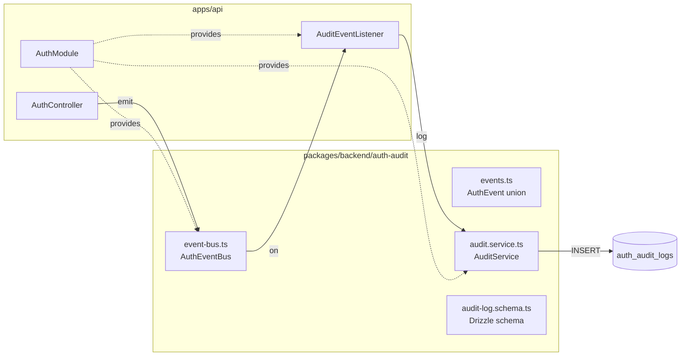

# Implementation Plan: spec-06-04

## 📋 Branch Strategy

- 신규 브랜치: `spec-06-04-audit-event-system`
- 시작 지점: `phase-06-auth-integration` (phase base branch)
- 첫 task가 브랜치 생성을 수행함

## 🛑 사용자 검토 필요 (User Review Required)

> [!IMPORTANT]
> - [x] **이벤트 emit 위치**: AuthController (HTTP 계층) — 서비스가 아닌 컨트롤러에서 emit. 서비스는 순수 도메인 로직 유지.
> - [x] **auth-audit 별도 패키지**: `packages/backend/auth-audit` 신규 생성. auth-session 흡수 안 함 (ADR-0006 §95 명시).
> - [x] **fire-and-forget**: AuditEventListener 실패가 auth 흐름을 차단하지 않음. `.catch(() => {})` 패턴.

> [!WARNING]
> - [x] **Drizzle migration**: `apps/api` migration 0004 추가 — 실 DB에 적용 필요.
> - [x] **AuthController 변경**: `@Req()` 파라미터 추가 (IP/UserAgent 수집). 기존 테스트에 req mock 추가 필요.

## 🎯 핵심 전략 (Core Strategy)

### 아키텍처 컨텍스트



### 주요 결정

| 컴포넌트 | 전략 | 이유 |
|:---:|:---|:---|
| **이벤트 emit 위치** | AuthController | HTTP context(IP/UA) 접근 필요. 서비스 순수성 유지. |
| **Emitter 구현** | Node.js EventEmitter 래퍼 | 표준, 비동기, 타입 안전성 추가 가능. 외부 의존 없음. |
| **패키지 위치** | `packages/backend/auth-audit` 별도 | ADR-0006 §95 명시. 다른 패키지(auth-password 등)에서도 emit 가능. |
| **DB 저장** | AuditEventListener → AuditService | bus 구독자는 listener만 — 단일 책임. |
| **스키마 migrate** | apps/api drizzle 0004 | 기존 패턴 (auth-session schema → apps/api appSchema 조립) 동일. |

### 📑 ADR 후보

- [ ] 없음 (audit 패키지 분리는 ADR-0006에 이미 결정됨)

## 📂 Proposed Changes

### [NEW] `packages/backend/auth-audit`

#### [NEW] `packages/backend/auth-audit/src/events.ts`
8개 AuthEvent 타입 union. 모든 필드 optional-friendly (LOGIN_FAILED는 userId 없음).

```ts
export type AuthEvent =
  | { type: 'SIGNED_IN';        userId: string; sessionId: string; ip?: string; userAgent?: string }
  | { type: 'SIGNED_OUT';       sessionId: string }
  | { type: 'TOKEN_REFRESHED';  sessionId: string }
  | { type: 'PASSWORD_CHANGED'; userId: string }
  | { type: 'LOGIN_FAILED';     email: string; ip?: string; reason: string }
  | { type: 'SESSION_REVOKED';  sessionId: string; reason: string }
  | { type: 'MFA_ENROLLED';     userId: string; method: string }       // phase-07
  | { type: 'SUSPICIOUS_ACTIVITY'; userId: string; signal: string }    // phase-10
```

#### [NEW] `packages/backend/auth-audit/src/event-bus.ts`
`AuthEventBus` — EventEmitter 래퍼. `emit(event: AuthEvent)` / `on(handler)`.

#### [NEW] `packages/backend/auth-audit/src/audit-log.schema.ts`
`auth_audit_logs` Drizzle 테이블 — id(uuid PK), userId(nullable), eventType, ip, userAgent, metadata(jsonb), createdAt.

#### [NEW] `packages/backend/auth-audit/src/audit.service.ts`
`AuditService` — `log(event: AuthEvent, meta?: { ip?: string; userAgent?: string })` → INSERT.

#### [NEW] `packages/backend/auth-audit/src/index.ts`
public exports.

#### [NEW] `packages/backend/auth-audit/package.json` + `tsconfig.json` + `vitest.config.ts`
`@repo/backend-auth-audit`. auth-session 패키지와 동일 패턴.

---

### [MODIFY] `apps/api`

#### [MODIFY] `apps/api/src/infra/schema/index.ts`
`authAuditLogs` 추가 → `appSchema`.

#### [NEW] `apps/api/src/auth/audit.event-listener.ts`
`AuditEventListener` — NestJS Injectable, `onModuleInit()`에서 bus 구독 → `AuditService.log()` fire-and-forget.

#### [MODIFY] `apps/api/src/auth/auth.module.ts`
`AuthEventBus` + `AuditService` + `AuditEventListener` provider 등록.

#### [MODIFY] `apps/api/src/auth/auth.controller.ts`
- `AuthEventBus` inject.
- `signIn()`: `@Req()` 추가, 성공 시 `SIGNED_IN` emit, 실패 시 `LOGIN_FAILED` emit (try-catch).
- `signUp()`: `@Req()` 추가, 성공 시 `SIGNED_IN` emit.
- `signOut()`: `SIGNED_OUT` + `SESSION_REVOKED` emit.
- `refresh()`: `TOKEN_REFRESHED` emit.
- `confirmReset()`: `PASSWORD_CHANGED` emit.

#### [NEW] `apps/api/drizzle/0004_auth_audit_logs.sql`
`CREATE TABLE auth_audit_logs (...)` — `drizzle-kit generate`로 생성.

---

## 🧪 검증 계획 (Verification Plan)

### 단위 테스트 (필수)

```bash
# auth-audit 패키지
pnpm --filter @repo/backend-auth-audit test

# apps/api (컨트롤러 + 기존 서비스 테스트)
pnpm --filter @repo/api test

# 전체
pnpm turbo test
```

### 수동 검증 시나리오

1. signin 성공 → apps/api 로그에 `SIGNED_IN` 이벤트 확인
2. signin 실패 (잘못된 비밀번호) → `LOGIN_FAILED` 이벤트 확인
3. signout → `SIGNED_OUT` + `SESSION_REVOKED` 이벤트 확인
4. refresh → `TOKEN_REFRESHED` 이벤트 확인

## 🔁 Rollback Plan

- PR revert로 apps/api 변경 사항 되돌림.
- migration 0004: `DROP TABLE auth_audit_logs;` (데이터 손실 없음 — 새 테이블).

## 📦 Deliverables 체크

- [ ] task.md 작성 (다음 단계)
- [ ] 사용자 Plan Accept 받음
- [ ] (실행 후) 모든 task 완료
- [ ] (실행 후) walkthrough.md / pr_description.md ship
