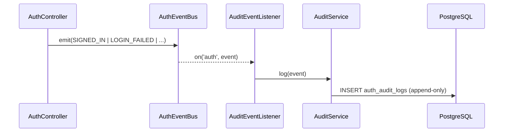

# spec-06-04: Audit & Event System

## 📋 메타

| 항목 | 값 |
|---|---|
| **Spec ID** | `spec-06-04` |
| **Phase** | `phase-06` |
| **Branch** | `spec-06-04-audit-event-system` |
| **상태** | Planning |
| **타입** | Feature |
| **Integration Test Required** | no |
| **작성일** | 2026-05-21 |
| **소유자** | dennis |

## 📋 배경 및 문제 정의

### 현재 상황

- spec-06-03 완료 후 `apps/api` AuthController에 signin/signup/signout/refresh 엔드포인트 동작 중.
- `packages/backend/auth-session` — refresh token rotation + session revoke 구현됨.
- 인증 흐름 전반에서 **누가 / 언제 / 무엇을** 했는지 기록하는 시스템이 없음.

### 문제점

- 로그인 실패, 세션 탈취, 비밀번호 변경 같은 보안 관련 이벤트를 추적할 수 없음.
- 향후 security alerting / analytics / audit trail 연결 기반이 없음.
- MFA, Passkey (phase-07) 도입 시 이벤트 시스템 없이는 감사 불가.

### 해결 방안 (요약)

`packages/backend/auth-audit` 패키지를 신규 생성하여 `AuthEvent` 타입 union, `AuthEventBus`, `AuditService`(DB write)를 정의한다. `apps/api` `AuthController`에서 이벤트를 emit하고, `AuditEventListener`가 구독하여 `auth_audit_logs` 테이블에 append-only로 저장한다.

## 📊 개념도

## 🎯 요구사항

### Functional Requirements

1. `AuthEvent` 타입 union — 8개 이벤트 정의 (설계 노트 §Auth Event System 기준).
2. `AuthEventBus` — Node.js `EventEmitter` 기반, type-safe emit/on.
3. `AuditService` — `auth_audit_logs` 테이블 append-only INSERT (UPDATE/DELETE 없음).
4. `apps/api` `AuthController`가 다음 이벤트를 emit:
   - `SIGNED_IN`: signin / signup 성공 시 (userId, sessionId, ip, userAgent)
   - `SIGNED_OUT`: signout 시 (sessionId)
   - `TOKEN_REFRESHED`: refresh 성공 시 (sessionId)
   - `LOGIN_FAILED`: signin 실패 시 (email, ip, reason)
   - `SESSION_REVOKED`: signout의 revokeSession 경로 (sessionId, reason)
   - `PASSWORD_CHANGED`: password reset confirm 성공 시 (userId)
5. `AuditEventListener` — NestJS service, `onModuleInit`에서 bus 구독 → `AuditService.log()` 호출.
6. Drizzle migration — `auth_audit_logs` 테이블 추가 (apps/api migration 0004).

### Non-Functional Requirements

1. 이벤트 emit은 **fire-and-forget** — AuditService 실패가 auth 흐름을 차단하지 않음.
2. `auth_audit_logs` 는 **append-only** — Drizzle에서 UPDATE/DELETE 쿼리 작성 금지.
3. `packages/backend/auth-audit` 는 **framework-agnostic** — NestJS 의존 없음.
4. `MFA_ENROLLED`, `SUSPICIOUS_ACTIVITY` 타입은 정의만, emit 없음 (phase-07/10).

## 🚫 Out of Scope

- audit log 조회 API (phase-09 admin)
- retention 정책 (phase-10 Ops)
- 별도 audit store / DB (동일 PostgreSQL로 시작 — phase-06.md 결정 기록)
- MFA_ENROLLED emit (phase-07)
- SUSPICIOUS_ACTIVITY 감지 로직 (phase-10)
- OpenTelemetry 연동 (phase-10)

## 📑 ADR 후보 (Architecture Decision Records)

- [ ] 없음 (audit 패키지 별도 분리는 ADR-0006에 이미 명시됨)

## ✅ Definition of Done

- [ ] 모든 단위 테스트 PASS
- [ ] `walkthrough.md` 와 `pr_description.md` 작성 및 ship commit
- [ ] `spec-06-04-audit-event-system` 브랜치 push 완료
- [ ] 사용자 검토 요청 알림 완료
