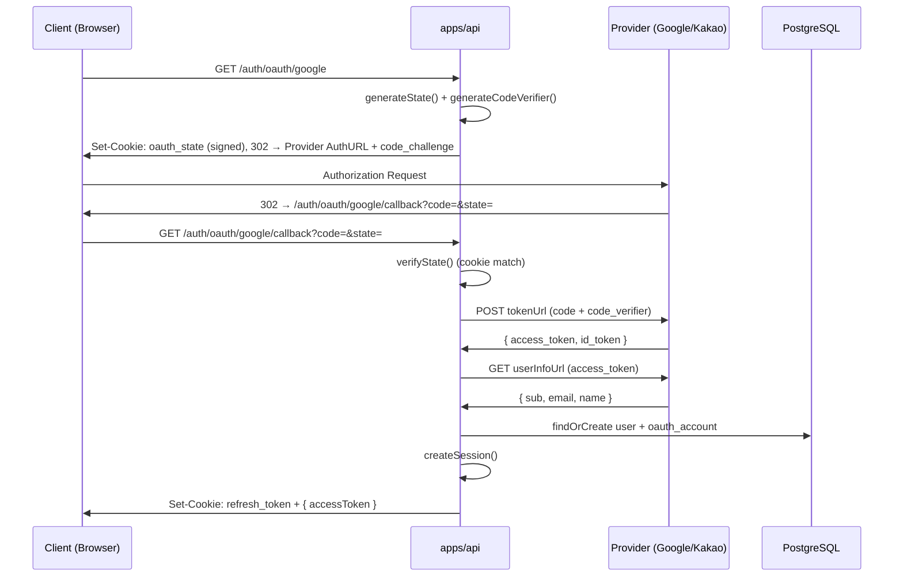

# spec-07-01: OAuth 소셜 로그인 — Core + Google + Kakao Providers

## 📋 메타

| 항목 | 값 |
|---|---|
| **Spec ID** | `spec-07-01` |
| **Phase** | `phase-07` |
| **Branch** | `spec-07-01-auth-oauth` |
| **상태** | Planning |
| **타입** | Feature |
| **Integration Test Required** | yes |
| **작성일** | 2026-05-22 |
| **소유자** | dennis |

## 📋 배경 및 문제 정의

### 현재 상황

- phase-05/06으로 이메일·비밀번호 인증(signup/signin/refresh/cookie/RBAC)이 동작 중.
- `users` 테이블의 `passwordHash` 컬럼은 `NOT NULL` — OAuth로 가입한 사용자는 비밀번호가 없으므로 현재 스키마로는 수용 불가.
- `oauth_accounts` 테이블 없음 — provider별 계정 연결 정보를 저장할 수 없음.
- `packages/backend/auth-oauth` 패키지 없음, OAuth 엔드포인트 없음.

### 문제점

소셜 로그인 없이는 가입 마찰이 높고, Google/Kakao 로그인은 한국 시장에서 사실상 필수.
PKCE·State 없이 OAuth를 구현하면 CSRF 및 인가 코드 인터셉션 공격에 취약.

### 해결 방안 (요약)

`packages/backend/auth-oauth` (framework-agnostic)에 PKCE, State 검증, 토큰 교환, 계정 연결 로직을 구현하고, `apps/api`에 `/auth/oauth/:provider` (리다이렉트) + `/auth/oauth/:provider/callback` (세션 발급) 엔드포인트를 추가한다. DB 마이그레이션으로 `passwordHash` nullable화 + `oauth_accounts` 테이블을 추가한다.

## 📊 개념도

## 🎯 요구사항

### Functional Requirements

1. `GET /auth/oauth/:provider` — provider = `google` | `kakao`. state + PKCE code_verifier 생성 → 쿠키 저장 → provider AuthURL로 302 리다이렉트.
2. `GET /auth/oauth/:provider/callback?code=&state=` — state 검증(쿠키 대조) → code 교환 → userInfo 조회 → 계정 연결 → 세션 발급(refresh cookie + accessToken 응답).
3. Google OIDC: `sub` + `email` 추출. Kakao OAuth 2.0: `id` + `kakao_account.email` 추출.
4. 이메일이 이미 존재하는 사용자 → `oauth_accounts` 연결(link). 신규 이메일 → `users` 생성(passwordHash = null) + `oauth_accounts` 추가.
5. `users.passwordHash` nullable 마이그레이션 + `oauth_accounts` 테이블 추가.
6. PKCE: `code_verifier` = 43-128자 랜덤(base64url), `code_challenge` = SHA-256(verifier) base64url.
7. State: 32바이트 cryptographically random → HMAC-SHA256 서명. 쿠키 `oauth_state` (httpOnly, Secure, SameSite=Lax, 10분 TTL).

### Non-Functional Requirements

1. OAuth provider 토큰(`access_token`, `refresh_token`)은 **DB에 저장하지 않음** — 인증 후 provider API를 대리 호출하지 않으므로 불필요. `providerAccountId`(sub/id)와 연결 정보만 보관.
2. `packages/backend/auth-oauth`는 NestJS 의존성 없음 (platform-agnostic). NestJS 연결은 `apps/api` controller layer에서 직접 수행.
3. 단위 테스트: PKCE 유틸, State 검증, 계정 연결 로직.
4. 통합 테스트: MSW로 provider HTTP 응답 mock → callback flow 전체 E2E (apps/api e2e 테스트).

## 🚫 Out of Scope

- GitHub, Naver 등 추가 provider (후속 phase).
- MFA 연동 (spec-07-02에서 처리).
- OAuth 토큰 갱신 / provider API 대리 호출.
- OAuth 계정 연결 해제(unlink) API.
- 프론트엔드 OAuth 버튼 UI.

## 📑 ADR 후보

- [x] ADR 가치 있는 결정 있음 → `oauth-token-no-storage` (type: decision) — OAuth provider 토큰을 DB에 저장하지 않고 `providerAccountId`만 보관하는 결정. 향후 provider API 호출 필요 시 재검토 기준.

## ✅ Definition of Done

- [ ] 모든 단위 테스트 PASS
- [ ] 선언된 통합 테스트 PASS (MSW mock 기반 callback flow)
- [ ] `walkthrough.md` 와 `pr_description.md` 작성 및 ship commit
- [ ] `spec-07-01-auth-oauth` 브랜치 push 완료 (`phase-07-auth-extension` 대상)
- [ ] 사용자 검토 요청 알림 완료
