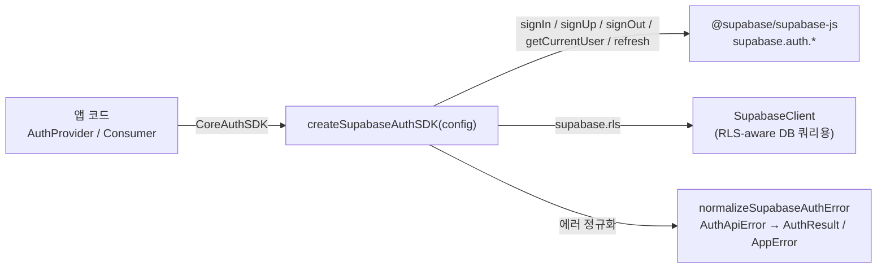

# spec-08-02: Supabase AuthSDK 래퍼

## 📋 메타

| 항목 | 값 |
|---|---|
| **Spec ID** | `spec-08-02` |
| **Phase** | `phase-08` |
| **Branch** | `spec-08-02-auth-supabase` |
| **상태** | In Progress |
| **타입** | Feature |
| **Integration Test Required** | no |
| **작성일** | 2026-05-22 |
| **소유자** | dennis |

## 📋 배경 및 문제 정의

### 현재 상황

spec-08-01에서 `@repo/frontend-auth-firebase`가 `CoreAuthSDK` 계약을 Firebase Client SDK로 구현 완료. `auth-contracts`에 `CoreAuthSDK` 타입(5개 Core 메서드 Pick)이 단일 출처로 존재.

### 문제점

Supabase를 Auth Provider로 쓰는 앱이 `CoreAuthSDK` 계약 없이 `@supabase/supabase-js` API를 직접 호출하면, `auth-react` `AuthProvider`에 주입 불가. "Consistent Wrapped SDK" 컨벤션(ADR-0006)이 Firebase 하나에만 실증된 상태.

### 해결 방안 (요약)

`@repo/frontend-auth-supabase` 패키지를 신규 생성하여 `createSupabaseAuthSDK(config)` 팩토리를 제공한다. 팩토리는 `CoreAuthSDK & { supabase: SupabaseExtensions }` 를 반환하며, `supabase.rls`를 통해 RLS-aware Supabase client 접근을 노출한다.

## 📊 개념도

## 🎯 요구사항

### Functional Requirements

1. `createSupabaseAuthSDK(config: SupabaseConfig): CoreAuthSDK & { supabase: SupabaseExtensions }` 팩토리 제공
2. `CoreAuthSDK` 5개 메서드 (`signIn`, `signUp`, `signOut`, `getCurrentUser`, `refresh`) 구현
3. `SupabaseExtensions.rls` — 인증 세션이 적용된 Supabase client 노출 (RLS 쿼리용)
4. `AuthApiError` 정규화: `invalid_credentials` → `AuthResult { success: false, reason: "invalid_credentials" }` 등 (Account Enumeration 방지)
5. 이메일 중복(`User already registered`) → `AppError({ code: "CONFLICT" })` throw
6. `@repo/auth-contracts CoreAuthSDK` 계약 충족 (TypeScript 레벨 검증)

### Non-Functional Requirements

1. `@repo/frontend-auth-firebase` 와 동일한 패키지 레이아웃 (`packages/frontend/auth-supabase/`, ADR-0015)
2. 단위 테스트 전부 `vi.mock('@supabase/supabase-js', ...)` — node 환경에서 실제 네트워크 호출 없음
3. `pnpm -r typecheck` 전체 패키지 통과

## 🚫 Out of Scope

- Supabase Magic Link / OAuth 로그인 (이 spec에서 다루지 않음)
- Supabase Row Level Security 정책 작성/마이그레이션
- `supabase-admin` 서버 사이드 래퍼 (`service_role` key 기반)
- Realtime / Storage / Edge Functions 연동

## 📑 ADR 후보 (Architecture Decision Records)

> 본 SPEC 의 결정 중 *장기 자산* 으로 박을 가치 있는 것이 있는가?

- [ ] ADR 가치 있는 결정 있음 → 후보 한 줄 요약: `auth-provider-package-location` (type: convention) — spec-08-01 walkthrough에서 이미 후보로 등록. phase-08 완료 시 작성.
- [ ] 없음

## 🔍 Critique 결과 (선택)

미실행.

## ✅ Definition of Done

- [ ] 모든 단위 테스트 PASS (`pnpm --filter frontend-auth-supabase test`)
- [ ] Integration Test Required = no (단위 테스트로 충분)
- [ ] `walkthrough.md` 와 `pr_description.md` 작성 및 ship commit
- [ ] `spec-08-02-auth-supabase` 브랜치 push 완료
- [ ] 사용자 검토 요청 알림 완료
