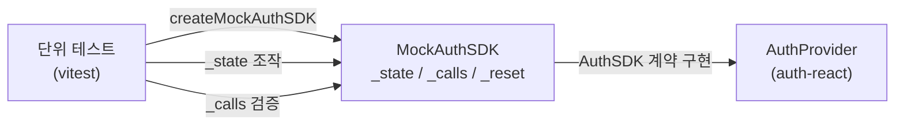

# spec-08-03: Mock AuthSDK (auth-testing)

## 📋 메타

| 항목 | 값 |
|---|---|
| **Spec ID** | `spec-08-03` |
| **Phase** | `phase-08` |
| **Branch** | `spec-08-03-auth-testing` |
| **상태** | In Progress |
| **타입** | Feature |
| **Integration Test Required** | no |
| **작성일** | 2026-05-22 |
| **소유자** | dennis |

## 📋 배경 및 문제 정의

### 현재 상황

spec-08-01/02에서 `CoreAuthSDK` 계약을 Firebase, Supabase로 구현 완료. `auth-react`의 `AuthProvider`는 `AuthSDK`를 prop으로 받아 인증 흐름을 처리. 현재 이 Provider를 단위 테스트할 때 실제 Firebase/Supabase 클라이언트를 사용해야 하거나, 테스트마다 `vi.mock`으로 직접 모킹해야 한다.

### 문제점

- `AuthProvider`/`useAuth`/`useSession` 훅을 단위 테스트하려면 반복적인 mock 설정이 필요
- 네트워크 없이 "로그인 성공 시나리오", "로그인 실패 시나리오" 등 제어 가능한 상태가 필요
- 공유 테스팅 유틸리티 없이 각 패키지가 독립적으로 mock을 구현하면 중복 + 불일치 발생

### 해결 방안 (요약)

`@repo/frontend-auth-testing` 패키지에서 `createMockAuthSDK(initial?)` 팩토리를 제공한다. 반환값은 `AuthSDK & { _state, _calls, _reset }` — 테스트가 상태를 직접 제어하고 호출 기록을 검증할 수 있다. vitest 의존성 없음 (순수 TypeScript).

## 📊 개념도

## 🎯 요구사항

### Functional Requirements

1. `createMockAuthSDK(initial?: Partial<MockAuthState>): AuthSDK & MockControls` 팩토리 제공
2. Core 5 메서드 (`signIn`, `signUp`, `signOut`, `getCurrentUser`, `refresh`) — `_state`로 제어
3. `signIn` 성공 시 `_state.currentUser` 자동 업데이트 (AuthProvider 동작 미러링)
4. MFA/Passkey 5 메서드 — `throw new Error("not implemented in mock")` 스텁
5. `_calls` — 각 메서드 호출 인수 기록 (테스트에서 호출 여부/인수 검증)
6. `_reset()` — 상태와 호출 기록을 초기값으로 리셋

### Non-Functional Requirements

1. `vitest` / `jest` 등 테스트 프레임워크 의존성 없음 — 순수 TypeScript
2. `packages/frontend/auth-testing/` 위치 — `AuthSDK` 계약이 프론트 맥락 (ADR-0015)
3. `@repo/frontend-auth-firebase` / `@repo/frontend-auth-supabase`와 동일 패키지 레이아웃

## 🚫 Out of Scope

- MFA/Passkey 시나리오를 제어하는 mock (스텁으로 충분)
- `auth-nestjs` 전용 mock (NestJS 테스트는 실제 서비스 주입 or 별도 패키지)
- 네트워크 레벨 인터셉터 (msw 등)

## 📑 ADR 후보

- [ ] 없음 (Mock 패키지 설계는 컨벤션이 아닌 구현 — ADR 불필요)

## ✅ Definition of Done

- [ ] 모든 단위 테스트 PASS (`pnpm --filter frontend-auth-testing test`)
- [ ] Integration Test Required = no
- [ ] `walkthrough.md` 와 `pr_description.md` 작성 및 ship commit
- [ ] `spec-08-03-auth-testing` 브랜치 push 완료
- [ ] 사용자 검토 요청 알림 완료
