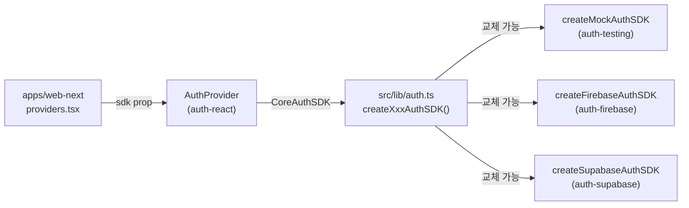

# spec-08-04: SDK Swap 검증 (web-next AuthProvider 연동)

## 📋 메타

| 항목 | 값 |
|---|---|
| **Spec ID** | `spec-08-04` |
| **Phase** | `phase-08` |
| **Branch** | `spec-08-04-sdk-swap-validation` |
| **상태** | In Progress |
| **타입** | Feature |
| **Integration Test Required** | no |
| **작성일** | 2026-05-22 |
| **소유자** | dennis |

## 📋 배경 및 문제 정의

### 현재 상황

spec-08-01~03에서 Firebase, Supabase, Mock 세 개의 Provider 어댑터가 `CoreAuthSDK` 계약을 구현 완료. 그러나 `apps/web-next`에는 `AuthProvider`가 연결되어 있지 않으며, `auth-react`의 `AuthProvider`가 `sdk: AuthSDK` (full)를 요구해 Firebase/Supabase SDK를 주입 불가능한 상태.

### 문제점

1. `AuthProvider` prop이 `AuthSDK` (MFA/Passkey 포함) — Provider 어댑터(Firebase/Supabase)가 MFA/Passkey를 구현하지 않으므로 TypeScript 오류 발생
2. "Provider를 바꿔도 코드가 그대로"라는 ADR-0006 컨벤션이 아직 코드로 증명되지 않음
3. `apps/web-next`에 auth가 연결되지 않아 UI 레이어 통합이 미완성

### 해결 방안 (요약)

`AuthProvider` prop을 `sdk: CoreAuthSDK`로 축소(MFA/Passkey 훅은 각자 SDK를 별도 파라미터로 받으므로 breaking 없음)하고, `apps/web-next`에 `AuthProvider`를 연결한다. SDK 교체 데모: `src/lib/auth.ts` 단일 파일 수정만으로 Mock → Firebase → Supabase 교체 가능함을 typecheck로 증명.

## 📊 개념도

## 🎯 요구사항

### Functional Requirements

1. `auth-react/src/provider.tsx` — `sdk: AuthSDK` → `sdk: CoreAuthSDK` (prop 타입 축소)
2. `apps/web-next/src/lib/auth.ts` — `createMockAuthSDK()` 기본, Firebase/Supabase 교체 예시 주석 포함
3. `apps/web-next/src/components/providers.tsx` — `AuthProvider` 추가
4. `apps/web-next/src/lib/auth.test.ts` — SDK 교체 TypeScript 타입 + 런타임 검증

### Non-Functional Requirements

1. `pnpm -r typecheck` 전체 통과 — SDK 교체가 TypeScript 레벨에서 검증됨
2. MFA/Passkey 훅 (`useMfaChallenge`, `usePasskeyRegister`) — breaking 없이 유지

## 🚫 Out of Scope

- 실제 Firebase/Supabase 프로젝트 연동 (환경변수, API 키 설정)
- 로그인 UI 페이지 구현 (인증 화면은 phase-09 이후)
- NestJS auth 연동

## 📑 ADR 후보

- [x] ADR 가치 있는 결정 있음 → `auth-provider-sdk-prop-contract` (type: convention) — `AuthProvider`는 `CoreAuthSDK`만 요구한다. MFA/Passkey는 별도 훅 param. phase-08 완료 시 `auth-provider-package-location`과 함께 작성.

## ✅ Definition of Done

- [ ] 모든 단위 테스트 PASS (`pnpm --filter @apps/web-next test`)
- [ ] `pnpm -r typecheck` PASS — Firebase/Supabase SDK가 `CoreAuthSDK`로 타입 검증됨
- [ ] `walkthrough.md` 와 `pr_description.md` 작성 및 ship commit
- [ ] `spec-08-04-sdk-swap-validation` 브랜치 push 완료
- [ ] 사용자 검토 요청 알림 완료
