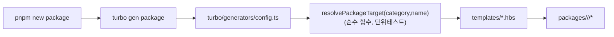

# Implementation Plan: spec-10-02

## 📋 Branch Strategy

- 신규 브랜치: `spec-10-02-tooling-generators`
- 시작 지점: `phase-10-ops-tooling` (base 브랜치 — spec-10-01 머지 반영됨)
- base 모드: PR target = `phase-10-ops-tooling`
- 첫 task 가 브랜치 생성을 수행함

## 🛑 사용자 검토 필요 (User Review Required)

> [!IMPORTANT]
> - [ ] **도구 = turbo gen** (`@turbo/gen`) — plop 아님 (사용자 결정). 신규 외부 의존 0.
> - [ ] **범위 = package 생성기만** — `pnpm new app` 은 후속 spec (사용자 결정).
> - [ ] **생성기 위치 = `turbo/generators/`** (turbo 관례). phase.md 의 `tooling/generators/` 와 다름 — walkthrough 기록.

> [!WARNING]
> - [ ] 통합 테스트가 실제로 패키지를 생성 + `pnpm install` 을 돌리므로 워크스페이스 상태를 변경한다 → 테스트 끝에 반드시 생성물 정리 + lockfile 복구.

## 🎯 핵심 전략 (Core Strategy)

### 아키텍처 컨텍스트



### 주요 결정

| 컴포넌트 | 전략 | 이유 |
|:---:|:---|:---|
| **생성기 엔진** | turbo gen (`@turbo/gen`) | turbo 기설치, 신규 외부 의존 0, handlebars DSL |
| **위치** | `turbo/generators/{config.ts,templates/}` | turbo gen 기본 탐색 경로 |
| **매핑 로직** | 순수 함수 `resolvePackageTarget` 분리 | 카테고리 규칙(네이밍/extends/preset)을 단위 테스트 가능하게 |
| **CLI** | root script `"new": "turbo gen"` → `pnpm new package` | 성공 기준 2번 CLI 형태 충족 |
| **버전** | 전부 `catalog:` / `workspace:*` | ADR-0003 + 일관성 |
| **테스트** | 단위(helper) + 통합(생성→install→lint/typecheck/test→정리) | phase 시나리오 2 |

### 📑 ADR 후보

- [x] ADR 가치 있는 결정 있음 → `generator-location` (type: convention) — phase 누적 후 tooling 레이아웃 ADR 통합. 본 spec 은 walkthrough 기록.
- [ ] 없음

## 📂 Proposed Changes

### turbo/generators (신규)

#### [NEW] `turbo/generators/lib/resolve-target.ts`
순수 함수 `resolvePackageTarget(category, name)` → `{ dir, pkgName, tsconfigExtends, vitestPreset, isConfig }`. 카테고리별 규칙(ADR-0003/0015)을 단일 진실로 캡슐화.

#### [NEW] `turbo/generators/lib/resolve-target.test.ts`
5 카테고리 + 잘못된 카테고리 입력 검증.

#### [NEW] `turbo/generators/config.ts`
turbo gen `package` 생성기 정의. prompt(category, name) → `resolvePackageTarget` → handlebars 템플릿으로 파일 생성. 생성 후 안내 메시지(`pnpm install` 필요) 출력.

#### [NEW] `turbo/generators/templates/package.json.hbs`
카테고리 분기(name/deps) 포함 — handlebars 조건 + helper 사용.

#### [NEW] `turbo/generators/templates/tsconfig.json.hbs`
extends 프리셋 분기(base/react-app/nestjs).

#### [NEW] `turbo/generators/templates/vitest.config.ts.hbs`
preset 분기(node/react).

#### [NEW] `turbo/generators/templates/src/index.ts.hbs`
카테고리별 최소 스텁 (nestjs 는 `@Module` DynamicModule 스텁).

#### [NEW] `turbo/generators/templates/src/index.test.ts.hbs`
최소 통과 테스트.

### 루트

#### [MODIFY] `package.json`
`"new": "turbo gen"` 스크립트 추가 + `@turbo/gen` devDependency(catalog 또는 고정).

#### [MODIFY] `pnpm-workspace.yaml`
(필요 시) `@turbo/gen` catalog 엔트리 추가.

### tooling/docker (해당 없음 — 본 spec 무관)

## 🧪 검증 계획 (Verification Plan)

### 단위 테스트 (필수)
```bash
pnpm --filter <generator helper 위치> test
# 또는 루트에서 vitest 로 turbo/generators/lib/*.test.ts 실행
```
`resolvePackageTarget` 5 카테고리 매핑 검증.

### 통합 테스트 (Integration Test Required = yes)
```bash
bash turbo/generators/smoke-test.sh
```
임시 이름으로 `turbo gen` 비대화 실행(--args) → `pnpm install` → 생성 패키지에서 `lint`/`typecheck`/`test` → 0 error 확인 → 생성물 삭제 + `pnpm install` 로 lockfile 복구.

### 수동 검증 시나리오
1. `pnpm new package` → category=shared, name=demo → `packages/shared/demo/` 생성 → 기대: 5 파일.
2. `pnpm install && pnpm --filter @repo/demo test` → 기대: 0 error.

## 🔁 Rollback Plan

- 신규 파일(turbo/generators/) + `package.json` 스크립트/devDep 추가 + workspace catalog 엔트리뿐. 기존 패키지 무변경. 롤백 = 해당 파일/라인 제거 + `pnpm install`.
- 통합 테스트가 생성물을 남기지 않도록 정리 단계 필수 (lockfile drift 방지).

## 📦 Deliverables 체크

- [ ] task.md 작성 (다음 단계)
- [ ] 사용자 Plan Accept 받음
- [ ] (실행 후) 모든 task 완료
- [ ] (실행 후) walkthrough.md / pr_description.md ship
