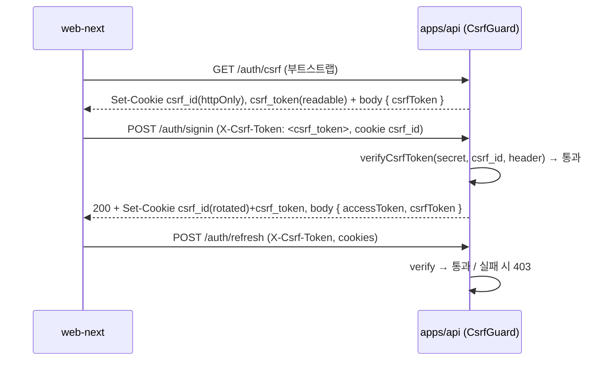

# spec-15-02: CSRF double-submit 배선 (apps/api auth)

## 📋 메타

| 항목 | 값 |
|---|---|
| **Spec ID** | `spec-15-02` |
| **Phase** | `phase-15` |
| **Branch** | `spec-15-02-csrf-wiring` |
| **상태** | Planning |
| **타입** | Feature (보안 배선) |
| **Integration Test Required** | yes (apps/api e2e — CSRF 우회 차단) |
| **작성일** | 2026-06-01 |
| **소유자** | dennis |

## 📋 배경 및 문제 정의

### 현재 상황
`@repo/backend-auth-rate-limit/src/csrf.ts` 에 HMAC-SHA256 기반 double-submit CSRF 함수(`issueCsrfToken(secret, id)` / `verifyCsrfToken(secret, id, presented)`)가 **완전히 구현·테스트**되어 있다. 그러나 `apps/api` 의 auth 흐름 어디에서도 import·호출되지 않는다 (`docs/review/2026-06-01-wiring-audit.md` §A, `docs/explainers/auth/cookie-strategy.md` 에 "미배선" 명시). 1차 방어(SameSite=Lax 쿠키)는 있으나 2차 double-submit 검증이 없다.

### 문제점
- `POST /auth/{signin,signup,refresh,signout}` 및 미인증 상태변경 POST(`password/reset(/confirm)`, `email/verify/request(/confirm)`) 가 CSRF 검증 없이 동작 → cross-site 강제요청에 취약.
- phase-15 성공기준1("refresh 및 상태변경 endpoint 가 `verifyCsrfToken` 통과 못 하면 거부") 미충족.

### 해결 방안 (요약)
per-client `csrf_id` 쿠키에 바인딩한 **통합 double-submit** 으로 CSRF 토큰을 발급/검증한다. safe(GET) 요청에서 `csrf_id`(httpOnly)+`csrf_token`(readable) 쿠키를 부트스트랩하고, 보호 대상 POST 는 `CsrfGuard` 가 `X-Csrf-Token` 헤더를 `verifyCsrfToken(secret, csrf_id, header)` 로 검증한다. signin 성공 시 `csrf_id` 를 rotate 해 fixation 을 방지한다. 미인증 endpoint 도 session 없이 동일 모델로 보호된다.

## 📊 개념도

## 🎯 요구사항

### Functional Requirements
1. **부트스트랩**: safe 경로에서 `csrf_id`(랜덤, httpOnly, sameSite=lax)+`csrf_token`(=`issueCsrfToken(secret, csrf_id)`, 비-httpOnly) 쿠키를 발급하는 진입점 제공 (`GET /auth/csrf`). 응답 body 에도 `csrfToken` 포함.
2. **CsrfGuard**: 보호 대상 POST 는 `X-Csrf-Token` 헤더가 `csrf_id` 쿠키 기준 `verifyCsrfToken` 을 통과해야 함. 실패(쿠키/헤더 부재·불일치) 시 **403** 거부.
3. **적용 범위**: `signin`·`signup`·`refresh`·`signout` + 미인증 `password/reset`·`password/reset/confirm`·`email/verify/request`·`email/verify/confirm` 8개 POST.
4. **rotate**: signin 성공 시 `csrf_id` 를 새 값으로 rotate + `csrf_token` 재발급(cookie+body). signup 도 동일.
5. **secret**: `CSRF_SECRET` 를 settings 스키마에 추가, guard/issuer 에 주입.
6. **프론트(web-next)**: auth API 클라이언트가 부트스트랩으로 `csrfToken` 확보 후 모든 보호 POST 에 `X-Csrf-Token` 헤더 첨부. refresh/signin 응답의 새 토큰 반영.
7. **e2e**: 헤더 정상 → 통과, 헤더 누락/위조 → 403 을 apps/api e2e 로 검증.

### Non-Functional Requirements
1. 기존 auth 흐름(토큰/쿠키 발급, MFA 분기) 동작 불변 — CSRF 검증만 선행 추가.
2. `verifyCsrfToken` 은 timing-safe(이미 구현) — guard 는 함수 재사용, 보안 로직 중복 금지.
3. 검증 순서: CsrfGuard → (기존) throttler/rate-limit → 핸들러.
4. 쿠키 옵션은 기존 `cookie.helper.ts` 정책(secure=NODE_ENV≠development, sameSite=lax, path=/) 일관.

## 🚫 Out of Scope
- **MFA/passkey state-changing POST** 의 CSRF 적용 — 후속(별 spec). 본 spec 은 8개 endpoint 한정.
- web-vite·`packages/frontend/auth-*` SDK 동반 — web-next 만 (사용자 결정). 후속.
- rate-limit/lockout 배선(spec-15-03), request-id(15-04), 생성기 tsconfig(15-05).
- CSRF secret 의 secret-manager 연동 — env(`CSRF_SECRET`) 만.

## 📑 ADR 후보
- [x] ADR 가치 있는 결정 있음 → 후보: `csrf-binding-strategy` (type: decision) — CSRF 토큰 바인딩을 **session(refresh token) 이 아닌 per-client `csrf_id` 쿠키**로 통일한 결정(미인증 endpoint 포함 위해). session-revoke 자동 무효화는 포기하는 trade-off. → 머지 시점 작성 검토.

## 🔗 관련 문서 (Related)
- 관련 wiki: `docs/explainers/auth/cookie-strategy.md`, `docs/review/2026-06-01-wiring-audit.md` §A
- 관련 ADR: ADR-0019(보안 linter), (신규 후보) `csrf-binding-strategy`
- 관련 모듈: `packages/backend/auth-rate-limit/src/csrf.ts`, `apps/api/src/auth/*`

## ✅ Definition of Done
- [ ] 모든 단위 테스트 PASS (CsrfGuard 단위 + csrf 쿠키 헬퍼)
- [ ] 통합 테스트 PASS — apps/api e2e: 정상 헤더 통과 + 누락/위조 403
- [ ] `walkthrough.md` / `pr_description.md` ship commit
- [ ] `spec-15-02-csrf-wiring` 브랜치 push
- [ ] 사용자 검토 요청 알림 완료
