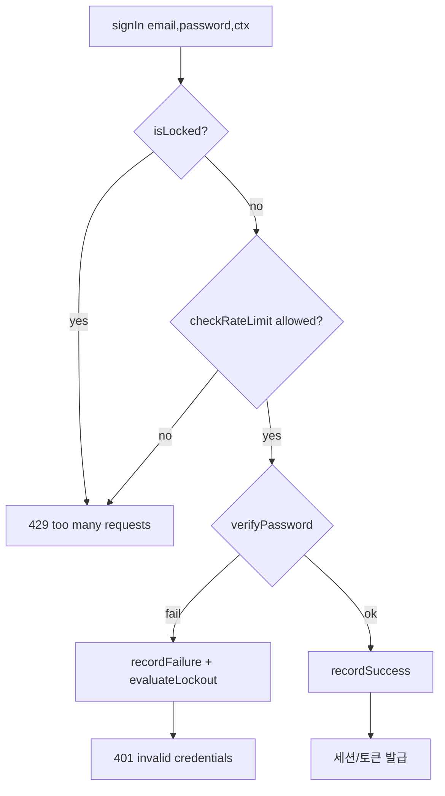

# spec-15-03: 로그인 rate-limit + lockout 배선

## 📋 메타

| 항목 | 값 |
|---|---|
| **Spec ID** | `spec-15-03` |
| **Phase** | `phase-15` |
| **Branch** | `spec-15-03-login-ratelimit-lockout` |
| **상태** | Planning |
| **타입** | Feature (보안 배선) + DB migration |
| **Integration Test Required** | yes (apps/api e2e — N회 실패 → lock) |
| **작성일** | 2026-06-01 |
| **소유자** | dennis |

## 📋 배경 및 문제 정의

### 현재 상황
`@repo/backend-auth-rate-limit` 에 rate-limit(`checkRateLimit`/`recordFailure`/`recordSuccess`)·lockout(`isLocked`/`evaluateLockout`, progressive backoff)·drizzle store·`failed_logins`/`lockouts` 스키마가 **완비**돼 있고 단위 테스트도 통과한다. 그러나 `apps/api` SigninService 가 이를 **호출하지 않고**, `appSchema` 에 두 테이블이 **누락**돼 있다 (`wiring-audit §B`).

### 문제점
- 로그인이 brute-force 에 무방비 — 무제한 시도 가능.
- phase-15 성공기준2 미충족: "failed_logins/lockouts appSchema 포함 + 마이그레이션, SigninService 가 checkRateLimit/recordFailure/recordSuccess/evaluateLockout 호출, N회 실패 → lockout".

### 해결 방안 (요약)
`failed_logins`/`lockouts` 를 `appSchema`(+ migration 생성용 `local.ts`)에 포함하고 마이그레이션을 생성한다. drizzle rate-limit store 를 DI provider 로 등록해 SigninService 에 주입하고, signIn 진입부에 **isLocked → checkRateLimit → 비밀번호 검증 → (실패) recordFailure+evaluateLockout / (성공) recordSuccess** 시퀀스를 배선한다. 차단 시 429.

## 📊 개념도

## 🎯 요구사항

### Functional Requirements
1. `failed_logins`·`lockouts` 를 `apps/api` `appSchema` + `local.ts` 에 포함, `pnpm db:generate` 로 마이그레이션 생성(PR 포함).
2. drizzle `RateLimitStore` 를 DI provider 로 등록(`RATE_LIMIT_STORE` 토큰, `inject:[DATABASE]`), SigninService 에 주입.
3. `signIn` 이 진입부에서 `isLocked`+`checkRateLimit` 평가 → 차단 시 **429**(`HttpException` 429), 통과 시 비밀번호 검증.
4. 비밀번호 실패 시 `recordFailure` + `evaluateLockout`; 성공 시 `recordSuccess`(카운터 리셋·lockout 해제).
5. accountKey = **email**, IP = `req.ip`(controller `getContext` 의 ctx 전달). 임계값은 `RATE_LIMIT_DEFAULTS`/`LOCKOUT_DEFAULTS` 기본값.
6. e2e: 동일 계정 **5회 실패 → 이후 429(lock)** 회귀. 정상 로그인은 영향 없음.

### Non-Functional Requirements
1. 기존 signin/refresh 성공·실패 동작 불변(429 차단 분기만 선행 추가). CSRF(15-02) 와 독립 공존.
2. rate-limit/lockout 보안 로직은 패키지 함수 재사용 — SigninService 는 호출·예외 변환만.
3. enumeration-safe: 비밀번호 실패는 기존대로 통합 401("invalid credentials"). 차단은 429.
4. e2e 가 IP 한도(30/5분)를 우발적으로 넘기지 않도록 lockout 테스트는 전용 계정·최소 횟수로 구성.

## 🚫 Out of Scope
- refresh endpoint 의 rate-limit (signin 한정).
- failed_logins 주기적 cleanup cron (phase-10 영역).
- IP 추출의 프록시(X-Forwarded-For) 신뢰 설정 — 기본 `req.ip`.
- request-id(15-04), 생성기 tsconfig(15-05).

## 📑 ADR 후보
- [ ] ADR 가치 있는 결정 있음
- [x] 없음 (ADR-0014 rate-limit/lockout 설계 범위 내 — 배선만)

## 🔗 관련 문서 (Related)
- 관련 wiki: `docs/explainers/auth/auth-rate-limit-lockout.md`, `docs/review/2026-06-01-wiring-audit.md` §B
- 관련 ADR: ADR-0014 (rate-limit/lockout/CSRF baseline)
- 관련 모듈: `packages/backend/auth-rate-limit/*`, `apps/api/src/auth/signin.service.ts`, `apps/api/src/infra/schema/`

## ✅ Definition of Done
- [ ] appSchema + local.ts 포함 + 마이그레이션 생성
- [ ] RATE_LIMIT_STORE provider + SigninService 주입
- [ ] signIn 에 isLocked/checkRateLimit/recordFailure/evaluateLockout/recordSuccess 배선
- [ ] 단위(SigninService fake store: N회 실패→lock, 성공→reset) + e2e(5회 실패→429) PASS
- [ ] walkthrough/pr_description ship + 브랜치 push + PR (base: phase-15)
