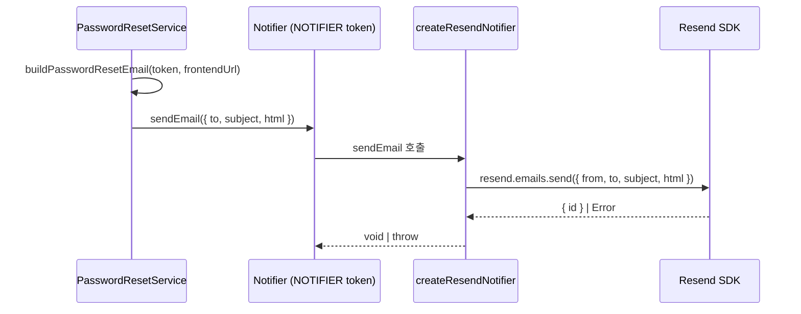

# Implementation Plan: spec-17-01

## 📋 Branch Strategy

- 신규 브랜치: `spec-17-01-email-adapter`
- 시작 지점: `main`
- 첫 task 가 브랜치 생성을 수행함

## 🛑 사용자 검토 필요 (User Review Required)

> [!IMPORTANT]
> - [ ] **Resend 계정 및 API 키**: Resend (resend.com) 계정과 API 키 발급 필요. 테스트 시 sandbox 도메인(`onboarding@resend.dev`) 활용 가능.
> - [ ] **`FRONTEND_URL` 기본값**: 이메일 내 링크에 사용. 기본값 `http://localhost:3000` 으로 설정 예정 — 다른 값을 원하면 알려주세요.

> [!WARNING]
> - [ ] `apps/api/src/auth/password-reset.service.ts` 와 `email-verify.service.ts` 의 이메일 **본문 형태가 변경**됨 (raw 토큰 → 링크). 기존 테스트는 body 내용을 검증하지 않으므로 회귀 없음.
> - [ ] `packages/backend/notification/package.json` 에 `resend` SDK 추가됨 (외부 의존성).

## 🎯 핵심 전략 (Core Strategy)

### 아키텍처 컨텍스트



### 주요 결정

| 컴포넌트 | 전략 | 이유 |
|:---:|:---|:---|
| **createResendNotifier 설계** | Resend 클라이언트를 파라미터로 주입 | 단위 테스트 시 mock 주입 가능 |
| **이메일 본문** | HTML 문자열 (템플릿 함수) | 렌더러 없이 단순하게, 추후 React Email 교체 가능 |
| **FRONTEND_URL 주입** | settings → auth.module 상수 주입 → 서비스 @Inject | 기존 CSRF_SECRET 패턴과 동일 |
| **production 가드** | loadSettings build() 에서 RESEND_API_KEY 검사 | CSRF_SECRET 가드와 동일 패턴 |

### 📑 ADR 후보

- [x] 없음

## 📂 Proposed Changes

### [notification 패키지]

#### [MODIFY] `packages/backend/notification/package.json`
`resend` SDK 를 `dependencies` 에 추가.

#### [MODIFY] `packages/backend/notification/src/index.ts`
- `createResendNotifier(client: ResendClient, from: string): Notifier` 팩토리 추가
- `buildPasswordResetEmail(token: string, frontendUrl: string): EmailMessage` 추가
- `buildEmailVerifyEmail(token: string, frontendUrl: string): EmailMessage` 추가
- `buildInvitationEmail(orgName: string, token: string, frontendUrl: string): EmailMessage` 추가
- `ResendClient` 타입: `{ emails: { send: (payload: ResendSendPayload) => Promise<{ data: unknown; error: unknown }> } }`

```typescript
// createResendNotifier 인터페이스
export function createResendNotifier(client: ResendClient, from: string): Notifier {
  return {
    async sendEmail(message: EmailMessage): Promise<void> {
      const { error } = await client.emails.send({
        from,
        to: message.to,
        subject: message.subject,
        html: message.body,
      });
      if (error) throw new Error(`Resend send failed: ${JSON.stringify(error)}`);
    },
  };
}
```

#### [MODIFY] `packages/backend/notification/src/index.test.ts`
- `createResendNotifier` mock 주입 테스트 추가
- 이메일 템플릿 함수 단위 테스트 추가 (링크 포함 여부, 구조 확인)

### [apps/api settings]

#### [MODIFY] `apps/api/src/settings.ts`
```typescript
RESEND_API_KEY: z.string().optional(),
EMAIL_FROM: z.string().email().default("noreply@localhost"),
FRONTEND_URL: z.string().url().default("http://localhost:3000"),
```
`build()` 에 production 가드 추가:
```typescript
if (env.NODE_ENV === "production" && !env.RESEND_API_KEY) {
  throw new Error("production 기동 거부: RESEND_API_KEY 가 설정되지 않았습니다.");
}
```

#### [MODIFY] `apps/api/src/settings.test.ts`
production 가드 테스트 추가.

### [apps/api notification]

#### [MODIFY] `apps/api/src/notification/notifier.provider.ts`
```typescript
useFactory: (settings: AppSettings): Notifier => {
  if (settings.RESEND_API_KEY) {
    const { Resend } = await import("resend");
    const client = new Resend(settings.RESEND_API_KEY);
    return createResendNotifier(client, settings.EMAIL_FROM);
  }
  return process.env.NODE_ENV === "development"
    ? createDevNotifier()
    : createNoopNotifier();
},
```

### [apps/api auth 서비스]

#### [NEW] `apps/api/src/auth/frontend-url.token.ts`
`FRONTEND_URL` injection token symbol 정의.

#### [MODIFY] `apps/api/src/auth/auth.module.ts`
`FRONTEND_URL` 상수 프로바이더 추가 (`settings.FRONTEND_URL` 값).

#### [MODIFY] `apps/api/src/auth/password-reset.service.ts`
`@Inject(FRONTEND_URL) private readonly frontendUrl: string` 생성자 파라미터 추가. `sendEmail` 호출 시 `buildPasswordResetEmail(token, this.frontendUrl)` 사용.

#### [MODIFY] `apps/api/src/auth/email-verify.service.ts`
`@Inject(FRONTEND_URL) private readonly frontendUrl: string` 추가. `buildEmailVerifyEmail(token, this.frontendUrl)` 사용.

#### [MODIFY] `apps/api/src/auth/password-reset.service.test.ts`
`FRONTEND_URL` mock 추가 (`{ provide: FRONTEND_URL, useValue: 'http://localhost:3000' }`).

#### [MODIFY] `apps/api/src/auth/email-verify.service.test.ts`
`FRONTEND_URL` mock 추가.

## 🧪 검증 계획 (Verification Plan)

### 단위 테스트 (필수)
```bash
pnpm turbo run test --filter=@repo/backend-notification
pnpm turbo run test --filter=api
```

### 수동 검증 시나리오

1. `RESEND_API_KEY=<your-key> EMAIL_FROM=test@example.com` 설정 후 앱 기동 → Resend 어댑터 초기화 로그 확인
2. `POST /auth/password/forgot { email: "user@example.com" }` → Resend 대시보드에서 발송 확인 또는 dev console 로그 확인
3. `NODE_ENV=production` (RESEND_API_KEY 미설정) 기동 → 에러 메시지와 함께 기동 거부 확인

## 🔁 Rollback Plan

- `packages/backend/notification` 변경은 하위 호환 (기존 어댑터 유지) — rollback 시 `notifier.provider.ts` 원복만으로 충분
- settings 변경: `RESEND_API_KEY` 는 optional, 기존 동작에 영향 없음

## 📦 Deliverables 체크

- [ ] task.md 작성 (다음 단계)
- [ ] 사용자 Plan Accept 받음
- [ ] (실행 후) 모든 task 완료
- [ ] (실행 후) walkthrough.md / pr_description.md ship
