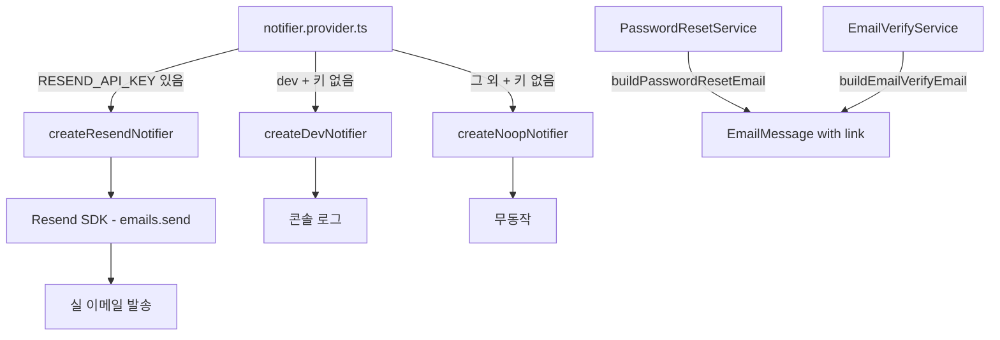

# spec-17-01: 이메일 어댑터 (Resend 실 발송 배선)

## 📋 메타

| 항목 | 값 |
|---|---|
| **Spec ID** | `spec-17-01` |
| **Phase** | `phase-17` |
| **Branch** | `spec-17-01-email-adapter` |
| **상태** | Planning |
| **타입** | Feature |
| **Integration Test Required** | no |
| **작성일** | 2026-06-06 |
| **소유자** | changsik |

## 📋 배경 및 문제 정의

### 현재 상황

`packages/backend/notification` 패키지에 `Notifier` 인터페이스와 두 가지 어댑터(`createDevNotifier` — 콘솔 로그, `createNoopNotifier` — 무동작)가 구현되어 있다. `apps/api/src/notification/notifier.provider.ts` 에서 `NODE_ENV=development` 이면 dev 어댑터, 그 외에는 noop 어댑터를 주입한다. 이메일 본문에는 raw 토큰이 평문으로 포함된다.

### 문제점

1. **실 이메일 미발송**: production/staging 에서 `POST /auth/password/forgot`, `POST /auth/email-verify/request` 호출 시 이메일이 전달되지 않아 기능 불동작.
2. **초대 이메일 미준비**: spec-17-06(초대 흐름)이 이메일 발송을 전제로 하므로 이 spec 이 선행 조건.
3. **이메일 본문에 raw 토큰 노출**: dev 환경에서 콘솔에 토큰이 출력되며, 링크 형태가 아니라 사용성도 나쁨.

### 해결 방안 (요약)

`packages/backend/notification` 에 `createResendNotifier(client, from)` 팩토리와 3종 이메일 템플릿 함수를 추가한다. `apps/api` settings 에 `RESEND_API_KEY` / `EMAIL_FROM` / `FRONTEND_URL` 환경변수를 추가하고, production 기동 시 `RESEND_API_KEY` 미설정 거부 가드를 적용한다. `notifier.provider.ts` 를 업데이트해 API 키가 있을 때 Resend 어댑터를 사용하고, 이메일 본문을 링크 형태로 변경한다.

## 📊 개념도

## 🎯 요구사항

### Functional Requirements

1. `RESEND_API_KEY` 환경변수가 설정된 경우 Resend SDK 로 실 이메일을 발송한다.
2. `EMAIL_FROM` 환경변수로 발신자 주소를 설정한다 (기본값: `noreply@localhost`).
3. `FRONTEND_URL` 환경변수로 이메일 내 링크 base URL 을 설정한다 (기본값: `http://localhost:3000`).
4. password-reset / email-verify / invitation 3종 이메일 템플릿 함수를 제공한다.
5. 이메일 본문에 raw 토큰을 노출하지 않고 `${FRONTEND_URL}/...?token=...` 링크 형태로 전달한다.
6. `NODE_ENV=production` 에서 `RESEND_API_KEY` 미설정 시 앱 기동을 거부한다.

### Non-Functional Requirements

1. `createResendNotifier` 는 framework-agnostic — `packages/backend/notification` 에 위치, NestJS 의존 없음.
2. Resend SDK 클라이언트를 파라미터로 받는 설계로 단위 테스트에서 mock 주입 가능.
3. Resend `emails.send()` 실패 시 에러를 re-throw 한다 (silent fail 금지).
4. 기존 단위 테스트(`password-reset.service.test.ts`, `email-verify.service.test.ts`) 회귀 없음.

## 🚫 Out of Scope

- React Email / MJML 등 고급 이메일 렌더러
- 이메일 전송 큐/재시도 메커니즘
- SES / SendGrid 등 다른 프로바이더 어댑터
- 이메일 발송 감사 로그 (phase-19 scope)
- 실제 수신 end-to-end 검증 (unit test 로 Resend client mock 검증)

## 📑 ADR 후보

- [x] 없음 (Resend 선택 이유는 `backlog/phase-17.md` 결정 기록에 이미 기재됨)

## 🔗 관련 문서

- 관련 ADR: `docs/adr/0022-multi-tenancy-strategy.md` (초대 메일 전제)
- 관련 spec: spec-17-06 (초대 endpoint — 이 spec 완료 후 진행)

## ✅ Definition of Done

- [ ] 모든 단위 테스트 PASS (`pnpm turbo run test --filter=@repo/backend-notification --filter=api`)
- [ ] `NODE_ENV=production` + `RESEND_API_KEY` 미설정 시 `loadSettings` 에러 throw 확인 (단위 테스트)
- [ ] `createResendNotifier` mock 주입으로 `sendEmail` 호출 시 Resend `emails.send` 가 올바른 payload 로 호출됨을 확인 (단위 테스트)
- [ ] `notifier.provider.ts` 가 `RESEND_API_KEY` 유무에 따라 올바른 어댑터를 반환
- [ ] `walkthrough.md` 와 `pr_description.md` 작성 및 ship commit
- [ ] `spec-17-01-email-adapter` 브랜치 push 완료
- [ ] 사용자 검토 요청 알림 완료
