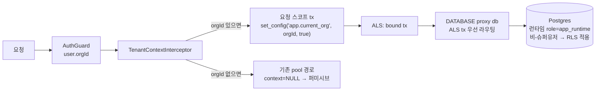

# spec-17-07: 테넌트 격리 실효화 (RLS 강제 배선)

## 📋 메타

| 항목 | 값 |
|---|---|
| **Spec ID** | `spec-17-07` |
| **Phase** | `phase-17` |
| **Branch** | `spec-17-07-tenant-isolation-enforcement` |
| **상태** | Planning |
| **타입** | Fix (security) |
| **Integration Test Required** | yes |
| **작성일** | 2026-06-07 |
| **소유자** | dennis |

## 📋 배경 및 문제 정의

### 현재 상황

phase-17 은 멀티테넌시 spine 으로, 테넌트 격리를 **Postgres RLS** 로 보장하도록 설계됐다(phase.md 성공 기준 3, 통합 시나리오 3, 📌 결정 기록 "AsyncLocalStorage→커넥션 훅"). 배선 의도는:

```
요청 → AuthGuard(user.orgId) → TenantContextInterceptor → ALS(orgId) → DB 커넥션에 SET app.current_org → RLS 가 org 단위 자동 스코프
```

### 문제점

phase-17 ship 전 검증(2026-06-07)에서 **이 체인이 완전히 끊겨 있어 실효적 테넌트 격리가 0** 임을 실 DB 로 확인했다. 3중 결함:

1. **ALS→DB 미연결**: `TenantContextInterceptor`(`apps/api/src/infra/tenant.interceptor.ts`)는 `als.run({orgId}, …)` 로 ALS 에 orgId 를 넣지만, **ALS 를 읽어 DB 커넥션에 `SET app.current_org` 를 발행하는 소비자가 없다.**
2. **`withTenantContext` 사장(dead)**: SET 을 실제로 발행하는 `withTenantContext`(`apps/api/src/infra/tenant.ts`)는 **정의만 되고 프로덕션 경로에서 호출되지 않는다.** → `set_config` 영영 미발행 → RLS 컨텍스트 항상 NULL → 퍼미시브 정책상 **전체 허용**.
3. **슈퍼유저 RLS 우회**: 앱이 `DATABASE_URL` 의 `postgres`(슈퍼유저) 로 접속한다. **슈퍼유저는 `ENABLE` 은 물론 `FORCE ROW LEVEL SECURITY` 를 걸어도 RLS 를 무조건 우회**한다(실측 확인: 두 경우 모두 cross-org row 전부 반환). 따라서 컨텍스트가 설정돼도 격리는 강제되지 않는다.

추가로, 격리를 **실 DB row 로 검증하는 테스트가 없다**(`tenant.test.ts` 는 mock 으로 `set_config` 호출 여부만 검증). CI 도 격리 assertion 이 없어 green 이었다 — 그래서 결함이 ship 직전까지 드러나지 않았다.

→ 현재 임의 인증 사용자가 **타 org 의 모든 데이터(users·sessions·memberships·invitations·audit 등)에 접근 가능**하다. phase-18~21 이 이 격리를 신뢰하고 쌓이므로, spine 머지 전 반드시 닫아야 한다.

### 해결 방안 (요약)

(1) 앱 런타임 접속을 **비-슈퍼유저 전용 role** 로 분리해 RLS 가 실제로 적용되게 하고, (2) ALS 의 orgId 를 **요청 단위로 DB 커넥션에 `SET LOCAL app.current_org` 로 주입**하는 소비자를 배선하며, (3) **실 DB 2-org 격리 e2e 테스트**로 "타 org 읽기 차단"을 증명한다. 본 spec 은 **읽기 경로 격리(성공 기준 3)** 를 닫는 데 집중하고, 쓰기 경로 강제(`WITH CHECK`)는 정당한 cross-org 쓰기 흐름과의 상호작용 때문에 후속으로 분리한다.

## 📊 개념도



## 🎯 요구사항

### Functional Requirements
1. 앱 런타임 DB 접속은 **비-슈퍼유저 role**(`app_runtime`)로 수행되어 RLS 정책이 실제로 적용된다. 마이그레이션은 기존 owner(`postgres`)로 계속 수행된다(이중 connection string).
2. 인증된 요청(`user.orgId` 존재)의 **모든 DB 쿼리**는 `app.current_org = orgId` 컨텍스트에서 실행된다 — 요청 단위 `SET LOCAL`(tx-local), 풀 오염 없음.
3. orgId 없는 요청(미인증/부트스트랩)은 컨텍스트 NULL → 기존 퍼미시브 동작 유지(회귀 없음).
4. 비-슈퍼유저 role + 컨텍스트=org A 상태에서 **org B 의 row 를 SELECT 할 수 없다**(DB-level 차단). 컨텍스트=NULL 이면 전체 허용(기존 무컨텍스트 호환).
5. 사장된 격리 코드(`withTenantContext` 미사용분)는 실제 배선으로 대체되거나 제거되어 dead code 가 남지 않는다.

### Non-Functional Requirements
1. 기존 e2e 전체 GREEN(회귀 없음) — 특히 미인증/부트스트랩 경로.
2. 요청 단위 tx 는 **orgId 있을 때만** 열어 blast radius 를 한정한다(읽기 전용 무-org 요청까지 tx 로 감싸지 않음).
3. CI(`verify.yml`)·로컬 compose·`apps/api` 설정이 런타임/마이그레이션 role 분리를 반영하고 결정적으로 통과한다.

## 🚫 Out of Scope

- **쓰기 경로 RLS 강제(`WITH CHECK`)**: INSERT/UPDATE 의 org_id 변조 차단. invite-accept·프로비저닝 등 **정당한 cross-org 쓰기**(현재 context 와 다른 org 에 membership 삽입)와 충돌하므로, context 승격 seam 설계와 함께 **후속 spec(17-08 후보)** 으로 분리. 본 spec 은 읽기 격리(성공 기준 3)에 집중.
- 애플리케이션 레이어 `WHERE org_id` 명시 필터 추가(RLS 를 SoT 로 유지).
- provider 모드(phase-18) 의 org 컨텍스트 주입 — 본 spec 의 seam 을 재사용할 예정이나 구현은 phase-18.
- 성능 튜닝(요청 tx 오버헤드 측정/최적화).

## 📑 ADR 후보

- [x] ADR 가치 있는 결정 있음 → 후보: `tenant-isolation-runtime-role-and-als-tx` (type: invariant — "앱은 비-슈퍼유저 role 로 접속하며 테넌트 격리는 RLS+요청스코프 SET 으로 강제된다"). phase.md 📌 결정 기록의 "커넥션 훅" 을 실제 메커니즘(요청 tx proxy)으로 확정. 머지 시점 작성.
- [ ] 없음

## 🔗 관련 문서 (Related)

- 관련 ADR: `docs/adr/0022-multi-tenancy-strategy.md` (RLS 전략), [[ADR-0023]] (provider seam 연계)
- 관련 spec: [[spec-17-03]] (org_id retrofit + 퍼미시브 RLS), [[spec-17-05]] (ALS·interceptor·withTenantContext 도입 — 본 spec 이 완성)
- 관련 phase: `backlog/phase-17.md` 성공 기준 3 / 통합 시나리오 3 / 📌 결정 기록

## ✅ Definition of Done

- [ ] 모든 단위 테스트 PASS
- [ ] (Integration Test Required = yes) 실 DB 2-org 격리 e2e PASS + 기존 e2e 전체 GREEN
- [ ] phase.md 성공 기준 3 / 통합 시나리오 3 가 실제로 충족됨(검증 로그 walkthrough 첨부)
- [ ] `walkthrough.md` 와 `pr_description.md` 작성 및 ship commit
- [ ] `spec-17-07-tenant-isolation-enforcement` 브랜치 push 완료(PR base = `phase-17`)
- [ ] 사용자 검토 요청 알림 완료
