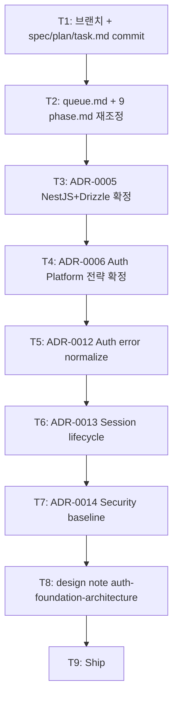

# Implementation Plan: spec-x-auth-foundation-prep

## 📋 Branch Strategy

- 신규 브랜치: `spec-x-auth-foundation-prep`
- 시작 지점: `main` (HEAD `6539c51` phase-02 done 직후)
- 첫 task가 브랜치 생성

## 🛑 사용자 검토 필요 (User Review Required)

> [!IMPORTANT]
> - [ ] **옵션 A (9 phase 완전판) 채택** — 사용자 명시 결정.
> - [ ] **2차안 채택** — "한 앱 한 Provider" + Consistent Wrapped SDK.
> - [ ] **memory 정정**: Prisma+Drizzle 둘 다 → **Drizzle 단일** (ADR-0005 본문에 명시 + memory 파일 갱신).
> - [ ] **`auth-errors` 별 패키지 ❌** — AuthErrorCode를 `@repo/errors` 흡수 (ADR-0012).
> - [ ] **`auth-session` 별 패키지 ✅** — rotation/revocation 응집 (ADR-0013).
> - [ ] **ADR 분할**: ADR-0006 단일 거대 ADR ❌ → 0006(전략) + 0012(error) + 0013(session) + 0014(security) 4분할.

> [!WARNING]
> - [ ] **본 spec-x는 순수 docs**. prototype 코드 0. phase-03 첫 spec에서 NestJS/Drizzle scaffold 진행.
> - [ ] **PR 크기 큼**: 5 ADR (~200줄 each) + 9 phase.md + design note (~600줄) + queue.md = **~3000줄 docs**. 리뷰 부담 인정.
> - [ ] **결정 응집 보존**: ADR과 phase.md가 *cross-ref*. 분리 PR이면 dangling reference — 단일 spec-x 필수.

## 🎯 핵심 전략 (Core Strategy)

### 아키텍처 컨텍스트



### 주요 결정

| 컴포넌트 | 전략 | 이유 |
|:---:|:---|:---|
| 작업 형식 | spec-x (Solo Spec) | active phase 없음 (phase-02 done) + 결정 docs라 chore/docs scope 적합 |
| PR 단위 | **1 PR** | 결정 응집 — ADR ↔ phase.md cross-ref 정합 |
| ADR 수 | **5** (2 확정 + 3 신규) | 각 ADR이 *단일 책임*. 향후 갱신 단위 명확 |
| phase 수 | 본래 6 → **9** | 옵션 A — auth foundation 2차안 완전판 |
| design note 분리 | ADR(결정) + design note(방향성+플로우) | ADR은 *권위*, design note는 *참조* |
| auth-errors 별 패키지 | **❌ (흡수)** | ADR-0009 flat code 일관. `@repo/errors`에 도메인 코드 추가 |
| auth-session 별 패키지 | **✅** | rotation/revocation 응집. jwt와 *별 책임* |
| ORM | **Drizzle 단일** | 2차안 권장 + session storage 강결합 + 두 ORM 운영 비용. memory 정정 |
| Framework | **NestJS** | Decorator-based DI가 Guards/Decorators(auth-nestjs) 패턴에 자연 적합 |

### 📑 ADR 후보

- [x] ADR-0005 (Deferred → Accepted): NestJS + Drizzle → `docs/adr/0005-backend-framework-and-orm-strategy.md` 갱신 (T3)
- [x] ADR-0006 (Deferred → Accepted): Auth Platform 전략 → `docs/adr/0006-auth-strategy.md` 갱신 (T4)
- [x] ADR-0012 (신규, convention): Auth error normalize → `docs/adr/0012-auth-error-normalize.md` (T5)
- [x] ADR-0013 (신규, convention): Session lifecycle → `docs/adr/0013-session-lifecycle.md` (T6)
- [x] ADR-0014 (신규, convention): Security baseline → `docs/adr/0014-auth-security-baseline.md` (T7)

## 📂 Proposed Changes

### backlog/ 갱신

#### `backlog/queue.md`
- 진행 중 phase: phase-02 done 상태 그대로
- spec-x 진행 중에 본 spec-x 표기 (sdd 자동)
- Icebox 정리

#### `backlog/phase-{03~11}.md` — 9개 파일 재조정

**phase-03 갱신** (Backend Primitives → **Backend Foundation**):
- 본래 "10 backend 패키지 + auth" → "NestJS + Drizzle + apps/api scaffold + health/config/observability hooks" (auth 제외)
- 블로커 해소 — ADR-0005 / 0006이 본 spec-x로 *확정*되므로 phase-03 *블록 해제*
- 본문 상태: Planning (블로커 해소 대기) → **Planning (진입 가능)**

**phase-04 갱신** (Apps → **Frontend Foundation**):
- 본래 "apps + login slice" → "Vite/Next + apps/web-* + TanStack + ui/sdk 기본" (auth 제외)
- 본래 phase-04의 "Apps" 역할은 *phase-09로 이동*

**phase-05 신규** (Auth Core + Security):
- 신규 phase.md 작성 — 2차안 §Phase 1+2 통합
- 패키지: auth-contracts 확장 + auth-session + auth-jwt + auth-security + password reset/email verify flow

**phase-06 신규** (Auth Integration):
- 신규 phase.md — 2차안 §Phase 3
- 패키지: auth-nestjs + auth-react + Cookie 전략 + Audit & Events

**phase-07 신규** (Auth Extension):
- 신규 phase.md — 2차안 §Phase 4
- 패키지: auth-oauth + auth-mfa + auth-passkey

**phase-08 신규** (Provider Adapters):
- 신규 phase.md — 2차안 §Phase 5
- 패키지: auth-firebase + auth-supabase + auth-testing

**phase-09 갱신** (Ops & Tooling → **Apps + Admin Tools**):
- 본래 phase-05 "Ops" → *phase-10으로 이동*
- 새 역할: apps/api wire-up + apps/web-* wire-up + apps/admin or auth-admin 패키지 (session 강제 종료 등)

**phase-10 갱신** (CI/CD → **Ops & Tooling**):
- 본래 phase-05 "Ops" 본문 이전 + auth observability dashboards 추가

**phase-11 신규** (CI/CD):
- 본래 phase-06 CI/CD 본문 이전

> 단, 본 spec-x에서 *phase 본문 모두 신규/갱신*하는 게 부담 큼. 실용적 접근:
> - phase-03/04는 *본문 갱신*
> - phase-05~08은 *간단한 stub*(요점 + ADR 참조 + 예정 패키지)
> - phase-09~11은 *본래 본문 이전 + 약간의 조정*

### ADR 갱신 / 신규

#### ADR-0005 (`docs/adr/0005-backend-framework-and-orm-strategy.md`)
- 상태: 보류 → **Accepted (2026-05-18)**
- Decision: NestJS + Drizzle (단일)
- Rationale: 위 spec.md 참조
- Memory 충돌 명시 + 정정 가이드
- Alternatives 4건 비채택

#### ADR-0006 (`docs/adr/0006-auth-strategy.md`)
- 상태: 보류 → **Accepted (2026-05-18)**
- 5 Decision (전략 + Provider SDK 컨벤션 + AuthResult union + Identity/Session 분리 + Engine/Platform 분리)
- Cross-ref: ADR-0012/13/14
- Alternatives 4건

#### ADR-0012 (신규, type: convention)
- 11 AuthErrorCode + 흡수 결정 + provider normalize helper 위치

#### ADR-0013 (신규, type: convention)
- JWT EdDSA + Refresh rotation + Reuse detection + Session model + JWKS endpoint

#### ADR-0014 (신규, type: convention)
- CSRF / Rate limit / Account lockout / OAuth PKCE / argon2 / Cookie 전략 / Step-up auth

### design note 신규

#### `docs/notes/auth-foundation-architecture.md`
- 2차안 *전체 본문* 박음 (~600 줄)
- ADR cross-ref + phase 매핑 표

## 🧪 검증 계획 (Verification Plan)

### 단위 테스트

해당 없음 (docs 작업).

### 통합 테스트

해당 없음.

### 수동 검증 시나리오

1. **모든 ADR이 frontmatter + cross-ref 일관**:
   ```bash
   grep -rE "ADR-001[234]" docs/adr/ docs/notes/ backlog/
   ```
2. **phase-03 블로커 해소 확인**:
   ```bash
   head -30 backlog/phase-03.md
   # "ADR-0005 / 0006 결정 전까지 블록" 문구 제거됨 확인
   ```
3. **memory 정정**: `project_boilerplate_locked_stack.md` Prisma 제거 확인.
4. **회귀 0**: 코드 변경 0건이라 `pnpm lint` / `typecheck` / `test` 그린 그대로.
5. **lefthook 차단**: 본 spec-x는 *.md 파일 중심*이라 typecheck trigger 없음 — 자연스럽게 통과 (보조 검증 가치).

## 🔁 Rollback Plan

- **전체 revert**: `git revert <commit>` — 본 spec-x의 모든 commit revert. 다만 phase 진입 *후*면 ripple 큼.
- **부분 revert**: ADR 1개씩 revert 가능 (각 task = 별 commit). phase.md만 정정도 가능.
- **결정 자체 변경**: ADR을 *superseded* 처리 후 신규 ADR 작성 (예: ADR-0006 Better-auth 채택 결정 시).

## 📦 Deliverables 체크

- [ ] task.md 작성 (다음 단계)
- [ ] 사용자 Plan Accept
- [ ] (실행 후) 9 phase.md 재조정
- [ ] (실행 후) 5 ADR (2 확정 + 3 신규)
- [ ] (실행 후) design note (2차안 본문)
- [ ] (실행 후) memory 갱신 (Drizzle 단일)
- [ ] (실행 후) walkthrough / pr_description ship
